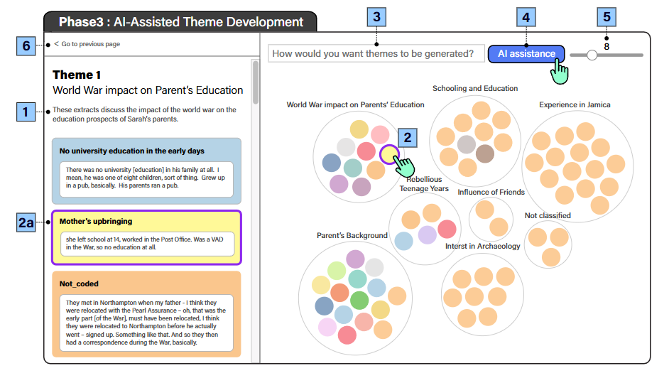
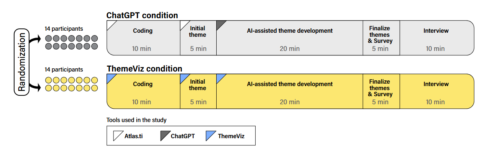

## A Survey of LLM-based Agents: Theories, Technologies, Applications and Suggestions

### 理论基础

早期Agent基于强化学习,认为AI智能体可以基于简单的启发式驱动策略函数行动。然而，基于强化学习的智能体可能面临一些障碍[3]，如训练时间长、采样效率低和学习过程不稳定等。

由于具备卓越的多模态理解与生成能力、无与伦比的知识获取与推理能力，以及大语言模型（LLMs）的灵活性和可扩展性，人工智能Agent将LLMs作为核心大脑，试图实现人类水平的感知、认知和行为[5]。

多模态感知实现自主感知能力,复杂的规划实现自发工作能力,可行的具身化或工具利用实现反应能力,有效的多元化记忆实现交互能力。

- 模态编码器（Modality Encoder）：输入多模态原始数据,编码出其他模态的特征向量。
- 模态连接器（Modality Connector）：将模态数据和文本编码数据融合,实现对齐,输出对齐后的模态特征。
- LLM主干（LLM Backbone）：
- 输出投影器（Output Projector）
- 模态生成器（Modality Generator）

？？？不是一个LLM的主干,像是文生图的workflow

任务目标g、环境e、提示集p及语言模型总体参数Θ后，任务分解可形式化表示为[8]：g₀,g₁,...,gₙ = decp(g,e,p,Θ)

其中"decp"表示分解操作，g₀,g₁,...,gₙ代表子目标。Agent应支持通过CoT实现的单路径和多路径推理能力。

根据内外双重对齐来进行多路径推理的选择：外部对齐需要将人类意图或预期目标转化为基于大语言模型智能体的训练目标，通常采用包含监督微调、奖励建模和策略优化的RLHF方法；内部对齐则要求规划过程确保内部优化目标与智能体训练目标保持一致，具体强调通过安全评估、可解释性验证和人类价值观检验来保障规划的对齐性。

然后就是RAG通过外部知识库增强记忆与知识调用能力。

以及例如API调用、代码解释器乃至具身化工具的工具使用能力。

论文首先回顾了支撑 LLM-based Agent 的几大核心理论：

### 关键技术
论文将 LLM-based Agent 的技术架构归纳为四大模块：

感知（Perception）：处理文本、图像、音频、视频等多模态输入，如 BLIP-2、MiniGPT-4、AudioGPT 等。

规划（Planning）：包括任务分解、单/多路径推理（如 CoT、ToT、GoT）、反思机制（如 Reflexion、CRITIC）等，提升决策合理性。

记忆（Memory）：涵盖交互内记忆、跨交互记忆和外部知识。

- 内部交互记忆指单次交互内的历史信息
- 跨交互记忆指跨越多轮交互积累的长期历史信息
- 或是通过RAG技术获取高质量外部知识

行动（Action）：进行工具理解、工具调用、工具整合的能力。

### 应用与评估

LLM-based Agent 已广泛应用于多个领域：

自然科学：数学（ToRA）、化学（ChemCrow）、生物学（BSDG）；

社会科学：经济学（Alpha-GPT）、法律（LJP-Agent）、心理学（Replika-MWS）；

工程领域：代码生成（GPT-Engineer、AutoGen）、游戏（Voyager、GITM）、工业规划（LLM-Planner）；

评估基准：如 AgentBench（多环境评估）、ToolLLM（工具使用）、SafetyBench（安全性）、AlignBench（中文对齐）等。

### 挑战与建议

作者指出当前 LLM-based Agent 面临的关键挑战，并提出四点建议：

突破内在限制：如幻觉、长上下文处理、多模态推理等；

推动规模化多智能体系统：实现动态调度与高效协作；

强化可控的 AI 对齐：确保遵守法律、伦理与人类价值观；

构建统一综合的评估体系：当前评估分散，亟需标准化平台。

## Survey on evaluation of llm Agent

分为4块。

1. 对agent基本能力的评估（规划和多步推理能力、函数调用和工具使用、自反思、记忆能力）
2. 领域特长能力的评估（web agent、编程Agent、科学推理Agent、对话Agent）
3. Agent在泛用领域的评估
4. 评估Agent 的框架（开发用框架和练习场式环境的框架。）

### 基本能力评估

#### 规划和多步推理能力

大语言模型中的多步推理通常需要执行序列化的逻辑操作（一般涉及3-10个中间步骤）来获得无法通过单步推断得出的解决方案。下列测试用于评价模型在特定领域的推理能力：

- 数学推理：GSM8K,MATH,AQUA-RAT
- 多跳问答：HotpotQA,StrategyQA、MultiRC
- 科学推理：ARC
- 逻辑推理：FOLIO和P-FOLIO
- 约束满足谜题：24点
- 日常尝试：MUSR
- 高难度推理任务:BBH

一些评价规划能力的新基准（2023）：

- ToolEmu:采用基于模拟器的方法评估工具使用型智能体。说明了成功规划需要显式状态追踪和错误恢复能力。
- MINT：针对交互环境中的规划进行评估。发现即使先进的大语言模型也难以应对需要多步骤的长期任务。
- PlanBench：跨领域综合评估框架，表明当前模型擅长短期战术规划但拙于长期战略规划。
- AutoPlanBench：聚焦日常场景的规划评估。证明最前沿的大语言模型智能体仍落后于传统符号规划器。

符号规划任务表现不佳(2024)：

- FlowBench：评估工作流规划能力，重点关注专业知识密集型任务。
- ACPBench：评估大语言模型的核心推理技能。
- NaturalPlan：评估大语言模型如何处理自然语言呈现的现实世界规划任务

这些测试凸显了Agent高效规划所需要的核心能力：

（1）任务分解能力以拆解复杂问题，

（2）状态追踪与信念维护能力以实现精准多步推理，

（3）自我纠错机制以识别并修正错误，

（4）因果理解能力以预测行动结果，

（5）元规划能力以优化决策策略。

#### 函数调用与工具使用

早期研究采用针对性工具，例如通过增强检索能力的语言模型实现检索功能。后续发展则包含更多通用工具，如ToolFormer、Chameleon和MRKL。

一些提供明确参数进行简单交互为内容的评估方法：

- ToolAIpaca 2023
- APIBench 2025
- ToolBench 2023
- BFCL 2024

它们使用合成数据集和基于规则的匹配来建立通过率和结构准确性等基线指标。但在现实应用中有所局限。例如参数可能在多轮对话、对话中未明确提及，或是工具有复杂输入结构和冗长精密输出。

BFCL通过引入组织工具（BFCL v2）和整合多轮多步骤评估逻辑（BFCL v3）来更贴近真实问题复杂性，并强调持续状态管理的重要性。

新的基准测试：

- ToolSandbox：整合有状态工具执行、隐式状态依赖、基于策略的对话评估以及针对任意轨迹中里程碑节点的动态评估策略。
- Seal-Tools：采用自指导方法生成嵌套工具调用，有效建模层级化交互场景。
- API-Bank：通过对话式评估和海量训练数据集强化真实API交互模拟
- ComplexFuncBench：评估隐式参数推理、用户约束遵循及长上下文高效处理等场景。

#### 自我反思

交互式自我反思：

- LLF-Bench
- LLM-Evolve
- Reflection-Bench
- LiveCodeBench：编程基准
- APPS：编程基准

#### 记忆

新的研究引入了记忆机制。如ReadAgent、MemGPT和A-MEM探索了这类方法。

ReadAgent通过内容分组、将事件浓缩为记忆单元并进行段落检索来结构化阅读流程，其有效性已在QUALITY、NarrativeQA和QMSum等数据集上得到验证。类似地，A-MEM提出了一种采用LoCoMo基准评估的高级记忆架构，而MemGPT则采用分层记忆系统，并在NaturalQuestions-Open和多轮对话数据集上进行了测试。

一些新的基准测试：

- LTM-BenchMark
- RAISE
- KARMA

### 特定领域评估

Agent基准测试通过整合三大核心要素，为评估基于大语言模型的Agent提供了系统化框架：首先采用明确定义的任务数据集说明智能体的预期目标；其次构建运行环境（模拟静态/动态场景或真实世界），可集成用户模拟、多样化工具及特定策略；最后运用成功率、效率、精确度等评估指标进行多维度量，支持从单个操作追踪到端到端任务完成的多颗粒度分析。

#### Web Agent

这类AI系统专为网站交互设计，可执行机票预订、商品采购等任务。评估重点包括任务完成效率、网络环境导航能力及安全合规表现。随着Agent进步，评估基准也同步发展，最新成果已能模拟日趋复杂的现实交互场景。

早期研究聚焦基础模拟环境，如MiniWob和MiniWoB++。

后续研究在静态数据集开发上取得突破，支持离线可复现评估。如WebShop。后续的Mind2Web与WebVoyager支持对复杂网站结构导航能力和阶段性目标达成度的综合测评。

近期研究已转向更贴近现实环境的动态在线基准测试。

- WebLinX：提出动态交互模型，要求Agent必须适应网页界面的持续变化，从而检验其决策流程的鲁棒性。
- WebArena/Visual-WebArena:整合了真实用户界面元素与视觉线索，要求Agent不仅能遵循预设流程，还需解读并响应视觉信息。
- ST-WebAgentBench:尝试在静态与动态元素融合的环境中评估网络Agent，揭示其在多变条件下的表现。

#### Code Agent

- SWE-bench基于真实GitHub问题构建，提供端到端评估框架，包括详细的问题描述、完整代码库、执行环境（如Docker）和验证测试。
- SWE-bench Lite聚焦300个涉及缺陷修复的子任务，剔除需复杂多文件修改或无关元素的任务.
- SWE-bench LiteS通过移除存在精确补丁或描述不充分的任务进一步优化数据集.
- SWE-bench Verified仅保留描述清晰且测试用例完备的问题。
- SWE-bench+致力于缓解解决方案泄露和弱测试用例等关键评估缺陷
- SWE-bench Multimodal则针对含可视化元素的JavaScript应用，评估Agent在视觉软件领域的表现。
- SWT-Bench、TDD-Bench Verified专注于评估Agent根据GitHub问题生成测试用例的能力。
- ITBench为评估复杂现实IT自动化任务提供基准。
- SWELancer通过对接自由编程任务，将Agent表现与货币价值挂钩，凸显了在复杂现实场景中实现长期推理与决策的挑战。

#### Science Agent

科学智能体的评估已从早期测试基础推理能力的基准，逐步发展为衡量多样化科研能力的综合框架。

初期基准侧重科学知识记忆与推理能力或是科学文献的整合和情景化分析:

- ARC
- ScienceQA
- ScienceWorld

- QASPER
- QASA
- MS²
- SciRiff进一步拓展评估维度，强调智能体跨科学领域执行用户指令的能力。

当前研究趋势转向开发能加速科研进程的科学智能体，基准已覆盖科研全流程:

1. 科学构思：评估智能体能否自主提出媲美人类专家的创新性研究构想，重点关注科学思维的创造性、相关性与可行性；（Si等，2025）
2. 实验设计：AAAR-1.0数据集等基准测试智能体系统规划实验的能力，包括假设构建、方法选择及符合科学规范的实验流程设计；
3. 实验代码生成：SciCode、ScienceAgentBench、SUPER和CORE-Bench等基准验证智能体生成精准可执行代码的能力，确保代码符合科学协议要求并保持计算准确性；
4. 同行评审生成：测试智能体能否提供超越人类评审质量的深度反馈（Chamoun等，2024）。

整合上列流程的基准：AAAR-1.0、MLGym、DiscoveryWorld、LAB-Bench

#### Chat Agent

略

### 通用能力评估

Agent 正从特定应用场景转向更通用的方向。这些Agent将大语言模型的核心能力与网页浏览、信息检索、代码执行等技能相结合，来解决复杂任务。

- GAIA基准：包含466个人工设计的现实世界问题，用于测试智能体的推理、多模态理解、网页浏览和通用工具使用能力。
- Galileo Agent排行榜：着重评估智能体在数据库查询、在线计算器和网络服务等现实应用中执行函数调用和API调用的能力。
- AgentBench:引入了一套包含操作系统命令、SQL数据库、数字游戏和家务任务的交互环境。

或是聚焦于在全功能计算机操作环境中的表现：

OSWorld、OmniACT和AppWorld等基准测试智能体能否驾驭真实计算机系统、执行复杂任务并协调跨多应用程序的操作。

### Agent 评估框架
略

### 讨论

评估指标正向真实环境和挑战性看齐。

另一方面，新型的方向有

1. 精细化评估推进：缺乏对工具选择、推理质量等中间决策过程的细粒度分析。
2. 成本效率指标：将Token用量、API开销、推理时间等成本效率作为核心指标。
3. 规模化与自动化：采用合成数据生成技术创建多样化任务场景；发展"智能体即评委"的LLM自动化评估。
4. 安全合规性：当前基准对安全性、可信度及政策合规的关注有限。

## Understanding the LLM-ification of CHI: Unpacking the Impact of LLMs at CHI through a Systematic Literature Review

作者对153篇LLM有关的CHI会议的论文集进行研究。专注于LLM在人机交互领域的应用。

### 应用领域

1. 沟通和写作：许多研究将作家视为大型语言模型的目标用户，任务范围从个人日记、电子邮件撰写到故事创作、剧本编写以及一般创意写作。
2. **能力增强**：这一领域包括开发技术以通过改变我们与技术及信息的互动方式来提升人类表现和生产力的论文。
3. 教育：这一领域探索了大型语言模型在提升学生学习体验和改进教育者教学方法方面的潜力。
4. 责任：考虑计算系统对社会、伦理领域的影响，尤其是高风险领域。
5. 编程：聚焦于软件工程和编程领域
6. 语言模型的可靠和有效性：关注于评估和提升llm输出本身
7. 健康：关注于通过llm获取健康相关疾病和病症的管理与预防的知识或是处理健康数据。
8. 设计：用于提供设计有关的帮助，如用户界面设计。
9. 无障碍和老龄化：该领域重点关注残障人士和老年人群体。
10. 创造：该领域涵盖了创意过程及创造力支持工具。

### 应用角色

1. LLM作为系统引擎：在这一角色中，LLM作为系统、原型、算法和编程框架的核心元素发挥作用。
2. LLM作为研究工具：使用LLM执行传统上由研究人员或研究助理完成的任务，包括数据收集、分析或写作。
3. LLM作为参与者或用户：此类研究用大语言模型模拟人类响应和行为。
4. LLM作为研究对象：此类研究探讨大语言模型底层机制与特性的论文，涉及训练数据集、响应输出及问题研究（如幻觉现象）。
5. 用户对LLM的认知：此类包括关于用户如何看待LLMs或LLM驱动工具的研究。

### 不足之处

1. LLM对不同人物存在偏见：大语言模型对不同人群的回复存在差异。
2. LLM训练数据覆盖范围不足：大语言模型的训练数据可能不足或过时。
3. LLM可能输出多种回答：大语言模型的回答具有概率性特征，即使输入相同的提示，其输出仍可能发生不可预测的变化。
4. LLM可能产生幻觉：大语言模型可能产生不准确或完全虚构的信息。
5. LLM的错误或偏差无从查询：由于模型的黑箱性质，大语言模型的输出存在异常时，难以定位出现异常的原因。

6. LLM的计算要求严苛
7. 使用LLM对经济也有要求。
8. LLM缺乏评估标准或度量。

9. 在不同用户和不同情境中，LLM使用过程中的内部效度和外部效度存在差异。
10. 不同的LLM存在效度差异。
11. 提示词也会带来效度差异。

12. LLM可能会带来就业问题。
13. LLM的表示偏差可能会带来认知引导方面的负面效果。
14. LLM的输出可能虚假、带有误导性或是无意义、低质量。
15. LLM可能会用于恶意行为。
16. LLM可能会输出仇恨言论。
17. LLM对电力的消耗引起环境危害。

## Towards AI-Powered Applications: The Development of a Personalised LLM for HRI and HCI

文章使用EEG数据集训练模型,通过外接信息采集设备来捕获人类脑电波数据,从而解析人类情绪,进一步定制化模型。

**LLM的个性化是在线适应(Online Adaption)的子集。**

个性化AI模型意味着使模型适应个体需求、偏好和情境，从而显著提升用户参与度、满意度及整体效果[38,39]。个性化体现了模型适应的核心理念——模型通过持续与环境互动，基于观察反馈更新知识体系以契合主要情境[40]。

PLLMs从持续学习和个性化范式中汲取灵感[50,51]，提供了一种无需全面重训练即可整合新数据集的有效方案。

'PLLMs作为自适应智能体运作，将新数据流分解为离散任务或知识源进行吸收。这种整合丰富了模型的体验知识，使其能对未见场景进行细致推理。与传统重训练方法不同，PLLMs采用特殊设计的提示词动态调整模型行为，确保新数据无缝融入模型推理过程[52,53]。'**实际上就是简单的提示词拼接**。

智能体可定义为一种通过与所处环境交互来达成目标的应用程序[58]。该智能体可能包含多个模块：一个或多个模型、用于数据采集与决策执行/动作实施的交互模块，以及用于处理采集数据的数据转换与聚合模块。该研究设计的智能体整合了这三个核心模块。**Agent的定义有很多种形式，并没有公认的定义。在目前的LLM-based Agent领域中，还会包括工具调用能力。**

总之,这篇文章主要聚焦于用提示词工程和用户反馈将特定领域数据(如采集到的的脑电波数据)预处理后输入大模型,由LLM判断使用者的情绪状态。

核心内容在**基于反馈的改进、持续学习**。

## How Do You Want to View This? Generative AI, Creative Ethos, and TTRPG Hobbyists

三个核心问题：

- TTRPG爱好者对生成式AI的"心智模型"是什么？
- 当TTRPG爱好者面临生成式AI进入TTRPG领域时，他们如何应对复杂的伦理问题？
- 如何让TTRPG爱好者在采用生成式实践时，既能符合他们对有效性的定义，又能与创意工作流程实现伦理融合？

思路不对。不在提出“心智模型”->调研->提出对目标用户有益的做法上。

## Interaction Configurations and Prompt Guidance in Conversational AI for Question Answering in Human-AI Teams

这项工作旨在探索如何帮助人类更好地与LLMs交互以生成文本，特别是在问答的背景下。具体而言，作者模拟并测试了在客户支持环境中可能用到的材料，这是现实世界中具有代表性的问答应用场景。

### Introduction

本文测试了两种为人类Agent提供会话式AI辅助的问答配置方案，并与传统纯人工模式（含无AI辅助和有AI辅助两种情形）进行对比。作者探究了哪些因素与回答质量相关并促成有效人机协作，以及何种回答会被视为成功的高质量响应。

所有配置均包含三个基本要素：待回复的问题、含正确答案所需的参考文档、以及基于GPT-4构建的会话式AIAgent（接收问题与参考文档作为输入）。

结果表明人机协作具有潜在价值，但仅限于交互成功的情况。单纯将人类与AI结合并不能自动保证性能提升。
从整体质量看，各条件间答复质量无显著差异；但选取各条件最优的七份答复时，"引导提示"和"对话"条件下的答复显著优于纯AI生成结果（但仍不及纯人工答复）。

分析得出若干关于问答系统人机协作设计的启示：
首先，有必要鼓励使用者在协作过程中更积极发挥作用；
其次，消息建议能改善交互质量——例如"引导提示"条件比"高亮标记"或"对话"条件产生更多成功的AI答复；
第三，引导人类询问"该向AI提什么问题"具有积极作用，这类元提示与成功AI答复数量呈正相关；
最后，设计应确保人机使用相似术语体系，虽然问题重述与成功AI答复正相关，但有时会导致AI失效。

### 研究背景

当人类与AI协作完成工作时，人们期待双方能力的结合能实现超越各自独立工作时的卓越表现与成就。评估这类人机协作时，往往聚焦于绩效指标或人类参与者的主观满意度[10]。

既有研究揭示了影响人机协作质量的多元因素。Inkpen等[23]通过用户与三种模拟算法模型的交互实验发现，用户专业基础与人机优势互补等潜在因素显著影响团队效能——尽管这些模型准确率相同，但真阳性/真阴性率配置各异。Holstein团队[21]的在线实验则探究了明确传达潜在不可观测变量如何影响人们整合模型输出与不可观测因素进行预测。Xu等[58]在视频匿名化任务中分析了AI建议精度与召回率的权衡，比较专业标注员在不同AI辅助模式下的表现。Munyaka等[39]研究发现人机团队成员的决策风格会显著影响协作成效与团队效能感知，并在AI驱动的协作游戏中揭示了AI身份披露的影响。Cabrera团队[8]提出通过展示AI系统在子群体实例中的行为描述来帮助人们合理依赖AI，发现该方式能通过识别AI失误提升人机协作准确率。

现有研究也涉及帮助用户提示LLM的查询建议[28,62]，这类功能已应用于ChatGPT等主流LLM界面。通过深化对LLM对话场景下人机互动的理解，研究者能制定指南并为用户提供恰当引导，最终提升这些AI系统的可用性与效能[3]。

问答系统是自然语言处理（NLP）领域的一项基础性任务[12,45,46]。抽取式问答（或称阅读理解）是最基本的问答形式，模型需要根据给定上下文来回答问题[30,32]。

众多研究者通过分析Stack Overflow和Stack Exchange等问答平台数据来揭示其运行机制。Chua与Banerjee[13]通过Stack Overflow实证研究验证了"答案追寻"框架，重点关注问题可答性。Kabir等人[26]对ChatGPT回复进行了语言学与人性化维度的综合分析。Tian团队[54]则强调了上下文信息在社区问答服务中的关键作用。

当前AI辅助问答研究致力于提升响应质量与速度，其中一个研究方向探索了AI聊天机器人在数字领域促进积极变革与支持提问者的潜力[55]，重点关注用户与虚拟助手互动时的心理反应。在AI辅助客服领域，最新研究涉及客户视角理解、意图识别、采纳因素及体验优化等主题[40]。

本文的目光聚焦于用户如何通过对话Agent解答潜在咨询,以及何种人机写作配置能产生最被期望的相应。

### 设计问题与初步研究

研究者将一些基础基础问题和有助于解决问题的相关文档交给了受试者。由受试者选择不同程度的支持来尝试解决问题。初步研究表明,多数受试者在与Ai对话、参考文档和一个对问题无参考的ai回复、支持文档相关部分高亮和AI Agent对话、和类似问题和回答的不同程度支持中选择了高亮。由此进一步进行了实验设计。

### 实验设计

研究者在初步研究的基础上修改了部分实验内容,并最终指出了研究问题：

1. 哪些配置总体上能促成问答任务中成功的人机协作？
2. 哪些交互配置有助于提升人机团队生成高质量回答的能力？
3. AI辅助问答中优质回答具有哪些特征？

具体的实验不关注

### 实验结果

#### 问题1

使用皮尔逊相关系数分析，评分与要求AI助手总结文本的消息数量（𝑟=0.310，𝑝<0.1）及总编辑次数（𝑟=0.397，𝑝<0.05）呈正相关。这些相关性表明，人类在协作过程中更积极的参与可能会提升最终输出质量。

两位研究者将AI助手的回复标注为四类：成功回应用户提示、脱离上下文、未能回应、拒绝回应。后三类被归为失败回应。多项变量与AI回复成功与否显著相关。

皮尔逊相关系数显示，当参与者采用复制（𝑟=0.581，𝑝<0.01）或转述问题（𝑟=0.522，𝑝<0.01）的方式提问时，更可能获得成功回应。

此外，成功回应数量与询问AI功能范围的问题数量正相关（𝑟=0.693，𝑝<0.01）。

但AI常无法理解过度转述的提示，例如未能理解"这个问题的最佳解决方案是什么？"，因其使用"problem"而非最初输入AI模型时使用的"question"一词。

#### 问题2

研究表明，在"Nudging"（助推）实验条件下，查询快捷功能显著改善了整体交互效果。数据显示，消息建议切实影响并改变了参与者的行为模式。

例如，在第三种实验条件下，要求AI转述参考文档的用户比例明显高于其他条件。

通过Tukey HSD检验发现，在提供建议的"Nudging"条件下，用户要求AI总结文本的消息数量显著多于"Highlight"条件（p < 0.01）。

同样，请求AI转述文本的消息量在"Nudging"条件下也显著高于"Highlight"（p < 0.01）和"Conversation"条件（p < 0.01）。

此外，询问AI功能用途的消息频率在"Nudging"条件下也明显更高（相较于"Highlight"和"Conversation"条件，p值均<0.01）。

总体而言，"Nudging"条件下用户发送给AI助手的消息总量显著多于"Highlight"条件（p < 0.01）。

这些行为变化在人机协作层面产生了积极影响，促成了更成功的交互。

与"Highlight"（p < 0.01）和"Conversation"条件（p < 0.1）相比，"Nudging"条件下AI助手的成功响应率更高。皮

尔逊相关系数显示，消息建议的点击总量与AI成功响应次数呈显著正相关（r=0.626，p<0.01）。

在问卷调查中，有参与者评价"Nudging"条件："这帮助我理解了AI的功能及其最佳使用方式"；另一参与者指出："它提供了很好的切入点"。这些反馈表明，该设计有效提升了用户对AI能力的认知，并优化了辅助功能的使用引导。

#### 问题3 

最常被提及的是准确性，涉及核对响应事实是否与参考文档一致，以及实际解决问题的有效性。

其次是响应语气，考察是否友好自然、拟人化。

第三大标准是响应长度，关于长短优劣的争议详见8.3节。参与者还提到了清晰度、相关性和语法正确性。

最后，部分评分者关注响应内容的伦理合规性，这与表1中涉及手机越狱的最终问题相关。

## Multi-Agents are Social Groups: Investigating Social Influence of Multiple Agents in Human-Agent Interactions

### introduction

在多Agent系统兴起与虚拟Agent日益普及的背景下，一个有趣的问题浮现：一组AI Agent能否对用户产生集体社会影响力？这个问题源于人际互动中的经典发现：个体更容易受到多数人观点的影响，这种社会影响现象表现为从众行为[24]、同辈压力[47,88]、社会认同渴望[68,80]和社会规范遵从[37,63]等多种形式。

问题：持相同观点的一组AIAgent能否以类似人类群体的方式影响用户决策？

该问题的重要性体现在两方面：其一，多Agent交互日益普遍，在X（原Twitter）等社交平台上，类人社交机器人已被有效用于信息传播和用户参与[110]。
多Agent系统还支持在线讨论[118]、公共信息收集[51]和健康指导[9]，使用户在多场景接触多个Agent的观点。其二，多Agent系统潜在的社会影响力令人担忧。

人机交互领域研究进一步支持了AI智能体产生说服效果的潜力，这些研究强调单个AI智能体对用户态度[49]和行为[89,116]产生的显著社会影响。然而此类研究主要关注单个智能体的设计特征（如被感知为聊天机器人或人类对结果的影响[89]），鲜少探讨智能体数量如何影响系统有效性。相比之下，多智能体系统研究主要聚焦于提升任务绩效[19,42]，无论是帮助用户更高效完成任务还是提升系统技术性能[18,32].

当系统主要目标是明确智能体在讨论中的角色或提升其技术性能时，社会影响的作用较不显著。但在需要同时传递信息并说服用户接受特定观点的场景中，多智能体与单智能体的效果差异亟待探索。

鉴于：1）多智能体系统及与多个社交机器人交互日益普遍；2）AI智能体已知的社会影响力；3）人类群体社会影响的既定效应可能在人机交互中复现；4）AI智能体群体产生的集体社会影响具有显著正负效应潜力。本研究通过以下问题探讨该议题：与多个虚拟智能体交互能否产生改变我们观点的社会影响？具体而言，我们探究多智能体交互是否会导致更强烈的观点改变、引发差异化的社会影响，并识别增加AI影响易感性的群体特征，旨在为多智能体系统制定伦理准则。

定量与定性分析表明：多智能体设置显著影响观点转变。当智能体持反对意见时，受试者表现出更强烈的观点改变；当智能体赞同时则出现更严重的观点极化。但智能体数量从3增至5时，改变强度并未提升——5智能体组反而引发极化现象，更多受试者拒绝智能体论点并远离其立场。此外，多智能体组强化了社会影响感知，尤其是与多数保持一致的标准压力。开放式回答显示受试者在3/5智能体条件下表现出群体归属需求，这促进了社会影响与观点转变。人口统计分析揭示年轻群体更易受多智能体影响。

研究为人机交互（HCI）和计算机支持的协同工作（CSCW）领域的未来研究做出了以下贡献：

1. 我们证明，在讨论中引入多个智能体更容易产生社会影响力并推动观点转变。这填补了关于多智能体系统如何影响人类认知的研究空白，揭示了相较于单智能体系统，多智能体配置能引发更强烈的态度转变。
2. 我们深化了对单智能体与多智能体系统社会影响力差异的理解。通过观察参与者的社会排斥感和参与意愿，我们发现了人类对智能体群体的隐性归属感，从而将现有社会影响理论拓展至人机交互领域。
3. 我们为利用多智能体配置更有效实施说服策略提供了设计建议。通过发挥多智能体产生的规范压力，未来系统可以增强参与者的情感投入，从而促成更持久、更内化的态度与行为改变。

### 研究背景(仅摘取其中有关agent的片段)

AI Agent正日益融入我们的日常生活。这些先进的AI系统能够与用户互动、进行对话并表达自身观点[107]。近期研究和行业应用利用大语言模型（LLMs）的对话推理能力，开发出问题解决工具[40,67,82,108,115]、教育助手[59]和新型搜索界面[62,113]。商业领域中，企业通过社交媒体部署AIAgent进行品牌营销和客户服务[46,50,112]，或将Agent嵌入应用程序辅助写作[31]、头脑风暴[78]和游戏[90]。

然而，基于单一LLM的代理仍难以有效处理诸多任务。独立LLM可能缺乏专业领域知识[35]，推理能力也尚不完善。受心理学理论[92]启发，研究者探索了多代理"辩论"[32]与"调解"[18]等技术，通过观点碰撞提升推理质量。这推动了"多代理协作"研究热潮——通过智能体协同提升任务表现[19,42]。自然语言处理[42]、软件工程[14]和机器人学[20]等领域已运用多代理集体智慧模拟群体动态，优化任务执行[45,76,111]。多代理系统还能模拟人类角色互动，如工作者协作[4,60]或多人交互[72,73]。

在用户中心场景中，同步多代理交互成为新趋势。例如Clarke等人[25]开发了可同时调用Google助手、SoundHound和福特车载助手Adasa的集成界面。Anthropic[26]、谷歌[38]等企业也推出多代理框架，方便开发者部署多代理系统。部分机构更在社交媒体采用多机器人矩阵与用户互动。

现有工作多聚焦通过多代理系统降低信息获取认知负荷[51]，或整合多元信息辅助决策[9,16,71,100]，主要探讨用户面对不同输入时的困惑感[16,71,100]。迄今尚无研究探讨代理群体是否/如何通过社会影响机制作用于用户——这种区别于认知决策的影响机制可能同样重要。

多余内容与问题无关。

## LLM-Based Test-Driven Interactive Code Generation: User Study and Empirical Evaluation

### Introduction

直接代码生成可能存在的问题：

- 因提示词不明确而导致的意图模糊
- 无法确定由自然语言提示词驱动生成的代码是否正确

多项关于开发者与AI交互的研究[9][14]强调，需要建立机制来辅助验证AI生成代码的正确性，例如允许用户通过测试来区分不同代码建议[15]的方案。

本文提出了测试驱动的交互式代码生成（TICODER）的工作流程，以（a）通过生成的测试用例澄清（即部分形式化）用户意图，以及（b）生成与这些测试用例一致的代码排名列表。

并且在基于大语言模型（LLM）的代码生成场景中，自动生成的测试不仅能帮助明确自然语言意图并筛除错误建议，还可作为剩余建议的调试辅助工具及未来代码修改的回归测试[7]。

此外，交互框架的有效与否取决于：(a)LLM生成有效测试的能力，(b)用户交互开销与代码建议筛选排序收益间的权衡。

为此,文章探究：
该工作流如何影响开发者评估AI生成代码的性能？同时该框架应具备扩展性，能提升开源/闭源LLM的代码生成准确率。因此我们还研究：
该工作流能否提升代码生成模型的准确率？

通过(1)混合效应用户研究及(2)两个Python代码生成基准的大规模评估，我们验证了框架有效性。本文贡献如下：

1. 提出TI CODER交互工作流，通过自动生成测试引导用户澄清意图，提升LLM代码生成准确率。该系统利用现成LLM生成代码与测试，并通过用户认可的测试验证AI生成代码。
2. 通过混合方法用户研究对比TI CODER两种变体（含代表现有开发者-AI交互流程的基线条件），发现使用任一变体均能显著降低认知负荷。
3. 通过模拟用户反馈（以参考答案为理想Agent）大规模评估TI CODER性能。在MBPP和HumanEval数据集及四种开源/闭源LLM上的实验表明：该系统能在5次交互内使pass@1准确率平均提升45.73%，仅需1次交互即可让小模型达到GPT-4-32k级别的大模型性能。

### 研究背景

#### 提高代码生成准确度

提到类似的通过生成测试用例来提高准确度的工作,不过类似的工作在交互性上不比本工作好,因此未必能提高用户的满意度。另外的一些研究依赖自动符号引擎（如约束求解器[30]或自动机构造[17]）为程序对生成差异化输入样例，这对Python等通用命令式编程语言并不适用。

#### AI编程助手的可用性

现有研究对AI编程助手的可用性进行了多维度探索。这里重点讨论与意图表达和生成建议控制相关的挑战。Liang等人[8]发现"放弃整合生成代码"和"无法提供反馈"是基于补全的AI编程助手最常见的使用障碍，这通常源于代码未实现预期功能、用户不理解生成逻辑或难以控制输出与意图对齐。McNutt等人[31]构建了代码助手交互设计空间，包括消除候选程序歧义和优化初始规约的方案——这与GitHub Copilot[32]等助手和传统程序合成工具[33]中歧义消除的价值研究相呼应。Xu等人[9]探究了IDE集成AI助手的挑战，包括用户查询的明确程度，发现自然语言查询中经常存在意图表达困难，而规约不足问题多源于变量名省略等模糊指令。

另一方面,Bird等人[14]的最新研究表明，AI工具正使开发者角色发生转变——**代码审查时间已超过实际编写时间**。

### 研究问题

RQ1 TiCoder如何影响Python开发者评估AI生成代码的性能，包括任务正确性、时间和认知负荷？为回答RQ1，我们进行了用户研究，参与者使用结合TiCoder工作流程的AI助手。我们评估了所提方法在开发者评估AI生成代码时的成本效益权衡。

RQ2 TiCoder工作流程是否能提高生成代码建议的准确性？为回答RQ2，我们探索了结合TiCoder工作流程的大语言模型在两个Python代码生成基准测试中的代码生成准确性。

### 交互流程

TiCoder 的交互流程如下：

用户输入：提供函数头（function header）、自然语言描述（NL prompt）以及可选的上下文代码。

模型生成候选：LLM 生成一组候选代码（code suggestions）和一组候选测试（test suggestions）。

执行测试：对每条候选代码，执行所有候选测试，记录哪些测试通过/失败/崩溃。

测试排序：根据“区分能力”对测试进行排序，优先向用户展示最能区分不同代码行为的测试。

用户反馈：用户对测试做出回应：

- PASS：该测试输出符合预期；
- FAIL：不符合预期；
- UNDEFINED：输入违反函数前提条件（如除零、空列表等）；

（在 TICODER-OUTPUT 模式下）若为 FAIL，用户还需提供正确的输出值。

剪枝与重排序：根据用户反馈，剔除与用户意图冲突的代码，并对剩余代码按通过测试数量重新排序。

重复交互：可进行多轮（论文中最多5轮），逐步缩小候选空间。

最终输出：返回用户确认的测试集 + 与之行为一致的排序后代码列表。

设计上提出两种交互变体：

TICODER-PASSFAIL：仅回答 PASS / FAIL / UNDEFINED。

TICODER-OUTPUT：FAIL 时需提供正确输出值。

### RQ1实验结果

- TiCoder如何影响任务正确性？

从机制设计来看，当用户错误评估测试用例时，TiCoder工作流会剪裁所有通过该测试的有效程序。因此错误评估测试的参与者将看不到任何有效的AI生成程序，除非他们声明所有代码建议都不正确。在TiCoder工作流中，用户的噪声响应会确保生成代码不符合其真实意图。因此实践中，跳过测试评估的选项对工作流可用性至关重要，能减少用户噪声输入带来的不确定性。尽管TiCoder能有效辅助用户评估代码建议，但噪声反馈的风险仍需警惕。

- TiCoder如何影响耗时？

结果：TiCoder引入的测试验证时间不会显著增加总耗时。

- TiCoder如何影响认知负荷？

作者认为这种效果的出现可能是因为用户需要评估的代码建议数量减少了，而且测试用例可以作为理解代码的具体机制，同时为更全面地测试候选函数提供了一个起点，从而更容易开始任务。

### RQ2实验结果

就反正是能。

### 讨论和结论

聚焦于代码生成鲁棒性和通用性和模型方面的考虑。无实际交互方面的考量。

## ThemeViz: Understanding the Effect of Human-AI Collaboration in Theme Development with an LLM-enhanced Interactive Visual System

### 背景

Thematic research(**主题研究**):研究者围绕一个明确的“主题（theme）”，从不同角度、领域或数据源收集证据，对该主题相关的现象、规律、关系或趋势进行系统分析的研究方法。

关于AI辅助工具的人机交互研究，主要集中在支持主题分析中耗时费力的编码任务（**即对文本数据进行片段标注，如高亮或重要信息摘出等**）。这类任务更易于AI高效自动化处理。相比之下，编码完成后的主题开发任务涉及更复杂的抽象思维过程，这是一般的辅助工具做不到的。该过程要求研究者寻找编码元素间的内在联系，找到内部规律并串联起结论。因此主题开发更具诠释性，需要高阶思维和主观判断，难以通过计算工具实现自动化[49]。

相比之下，编码完成后的主题开发任务涉及更复杂的概念化任务(定性任务)更难被ai处理。最新研究表明LLMs有望通过提供研究者可能忽略的替代性解读，在主题开发等诠释性任务中与研究者展开协作[38,49,65]。也就是说,**LLMs能生成新颖视角并挑战研究者假设，这正是智力协作的关键特征**[25,34,51]。

这引发我们思考：LLMs能否通过提供数据的替代性解读，在诠释性任务中承担**协作**职能？

但是,我们对两个问题认知有限：(1)如何为主题开发等诠释性任务设计有效的人机协作；(2)研究者如何与AI主题开发辅助工具交互。

计算机支持协同工作（CSCW）领域的研究表明，当**尊重研究者自主权且AI未经许可不干扰分析时，人机协作在定性数据分析中可能取得成功[23,37]**。也就是说定性数据分析的人机协作中给用户自主操作空间十分重要。

除此以外,**视觉辅助工具也很重要,直白的对话式工具(如chatGPT)不能很好地支持主题研究**。

所以文章通过设计"ThemeViz"来填补这一空白。其提供三个支持：

1. 自主性支持：基于CSCW领域关于研究者自主权重要性的研究成果[23,37]，系统采用"AI辅助"而非"全自动化"模式，通过保留人工编码环节来强化研究者在主题开发全程的主导权；
2. 交互可视化支持：通过动态气泡图呈现主题结构，用户既能纵览全局，又能通过气泡隐喻交互查看相关文本摘录与编码；
3. 提示词工程支持：系统将LLM深度集成，通过后台管理元数据（原始文本/编码/摘录）实现提示词的隐性自动化。

为验证效果，做一做个联合实验室实验与半结构化访谈（28位质性研究者），探究三个核心问题：

RQ1 相比ChatGPT等传统问答界面，ThemeViz对主题开发的助力程度？

RQ2 相较传统界面，ThemeViz设计多大程度促使用户将AI视为主题开发的协作伙伴？

RQ3 ThemeViz中AI辅助的局限性？

其中,重点考察：1）优化图形界面与传统文本问答界面的差异；2）LLM深度融入主题开发等诠释性任务的启示。

研究发现：
1. ThemeViz通过支持多轮迭代与多视角数据观察有效助力主题开发，其提示工程与响应可视化功能广受好评。
2. 但研究者并未将ThemeViz的AI助手（或ChatGPT）视为协作伙伴，归因于AI缺乏自主能动性及双向互动讨论能力。
3. 系统在数据隐私和AI偏见方面也存在局限。

### 研究过程

#### 主题分析

理解人机交互用户研究中的定性数据通常涉及主题分析（TA），其目的是识别、分析和解释数据中的意义模式，即主题[6]。

主题包含6个阶段：

TA包含六个阶段[7, 11]，每个阶段：

1. 熟悉数据
2. 生成初始编码
3. 寻找主题
4. 审查潜在主题
5. 定义和命名主题
6. 撰写报告

本文主要聚焦于3、4、5阶段。因为这些阶段与主题开发直接相关。

支持主题开发具有重要意义，因为这是一个耗时费力且需要大量认知投入的过程——研究者需要对数据进行抽象、综合与诠释来提炼主题与意义[4,7,9,45]。

研究表明，**大语言模型(LLMs)为支持主题开发等解释性任务提供了新机遇——通过提供研究者可能未曾考虑的替代性数据解读，LLMs或能协助探索多个主题版本来支持迭代开发过程[38,49,65]**。然而目前尚不清楚：质性研究者是否会认可这种人机协作的价值？如何设计LLM增强工具才能在支持高抽象度任务（如主题开发）的同时保持用户自主性[23,37]？

之后说明,一些文献证明了AI生成的主题与人类创建的主题具有一定相似性[32]、也就是证明了大型语言模型在此场景下的适用性。然而有研究仅考察了未经交互系统支持的原始模型应用，且实验环境局限于Jupyter Notebooks等编程平台。这类平台缺乏用户友好的交互设计来简化模型操作流程（尤其对非程序员从业者而言），还要求用户自行设计提示词处理数据收发——这对不熟悉大型语言模型的新手用户颇具挑战性[63]。

因此以下问题尚待明确：1)相较于系统外单独使用大型语言模型，专为质性研究设计的系统能在多大程度上优化主题开发流程；2)此类系统设计具体能带来何种程度的提升。

之后,作者回顾了一些对主题开发的已有的尝试,指出其不足之处如未通过为研究人员提供在使用AI前自行开发主题的机会来支持其自主性以及未能可视化等。

#### LLM在定性数据分析的应用

近期研究探讨了采用GPT进行定性数据分析的潜力。例如，一篇论文考察了GPT在**叙事分析**中的能力[18]。其他研究方向则探索了GPT在演绎编码任务中的表现。最新研究发现，GPT-3.5通常能执行与人类水平相当的演绎编码（将预定义代码应用于类似数据标注的任务）[16,62]，而GPT-4则展现出较高的编码者间信度[21,39]。一项自我实验研究（第一作者作为研究参与者）调查了GPT3.5-Turbo在归纳主题分析（从数据而非预定义理论中发展主题）中的应用，展示了其潜力[49]。

### 设计目标

1. 通过支持手动编码和手动主题开发来保障用户自主权。
2. 通过大语言模型辅助主题建议提升开发效率。
3. 尊重研究者观点的同时,鼓励通过编写提示词进行数据探索。
4. 通过集中式数据管理减轻提示词编写负担。
5. 通过交互式可视化促进理解。
6. 确保AI生成主题基于真实数据。
7. 支持研究者观点驱动的归纳式主题分析。

### 使用示例

虽然研究主要集中在理解第三阶段人机交互的影响——即**AI通过生成多个主题版本来辅助主题开发**。但作者在实例中仍纳入了前两个阶段（手动编码和手动主题开发），以便为整个过程提供背景信息。

假设有一位名为sam的质性研究员。她正在分析一个包含二战后英国女性学者访谈记录的公开数据集。该数据集记录了她们的生活经历及其对学术生涯的影响。

#### 第一阶段：手动编码

Sam使用ThemeViz开始阅读数据并进行逐行编码。她使用**高亮工具标记文本关键部分**，然后为**高亮文本添加编码以捕捉其含义**。该系统的人工编码功能让Sam在获得AI协助前能独立完成数据阅读和编码，保持了研究自主性（DG1）。编码一段时间后，她决定根据现有编码创建初始主题。点击"完成编码"按钮保存编码结果后进入下一页。

#### 第二阶段：人工主题构建

在此阶段，Sam可以手动分组编码并命名主题。初始页面分为两个主要区域：左侧面板显示尚未归组的编码及其对应文本段落（称为编码-文本对），未编码数据会被系统自动标记为"未编码"。浏览编码-文本对卡片后，Sam构思出一个潜在主题。她点**击"添加主题"按钮在页面右侧生成新主题框**，通过**拖拽将编码-文本对分组并命名主题**。**重复此过程直至准备迭代，最后保存主题版本。**与人工编码阶段类似，这个人工主题构建阶段让她在获得AI协助前能独立思考潜在主题，保持研究自主性。

#### 第三阶段：AI辅助主题开发

在AI辅助主题开发页面,**Sam看到自己创建的主题以气泡图形式呈现**。通过**外围气泡半径可直观查看主题模式和规模（DG5）**。点击大主题气泡内的小气泡时,系统会在左侧面板动态显示相关编码和引文。。色彩编码帮助识别重复出现的编码,使主题审阅过程更直观,这种结合交互性的数据可视化方式使得sam对已开发主题的理解和检验更加直观。

审阅后Sam发现当前主题过于细碎且存在重叠，决定缩减主题数量。他**使用页面顶部的滑块（图6-5）将主题数设为8并点击"AI辅助"按钮。该滑块让她能轻松调整想要探索的主题粒度**，无需在每个提示中指定具体数量（DG4）。

系统很快根据要求生成8个新主题，更新后的气泡图中，Sam发现可以从新视角重组主题——围绕受访者作为二战后第一代大学生面临的挑战。为以新方式重构主题，她在文本输入框（图6-3）输入查询："生成关于二战对受访者教育影响及第一代大学生挑战的主题"，点击"AI辅助"按钮（图6-4）后，AI根据提示生成新主题（DG3）。

#### 系统实现

ThemeViz的前端使用HTML、CSS、JavaScript和D3.js构建。该系统通过FastAPI后端和SQL数据库保存用户更改（如代码和主题）。后端还负责向GPT-4模型发送提示、格式化模型请求的数据结构，并处理其响应。

#### 提示工程

ThemeViz使用OpenAI的GPT-4模型。虽然其性能出色且模型极其灵活，但用户仍可能难以正确构建提示[63]。此外，模型需要提示中包含原始数据和代码来生成主题，若用户需要输入这些数据会非常繁琐。因此当用户进入ThemeViz第三阶段时，后端将通过提示构建和解析承担主要工作。

提示包含以下组件：首先包含初始数据集（根据窗口限制进行必要截断）；其次包含基于当前操作的通用模型指令（经过迭代开发），其中包括要求模型以JSON解析器可理解的格式返回结果的模板；第三会根据用户在滑块上选择的主题数量追加模板；第四包含避免常见数据错误的附加指令（如添加标题）；最后包含用户提供的任何提示。补充材料中提供更多细节。

#### 数据可视化

在数据可视化方面，主要使用D3.js和JavaScript创建气泡图。将代码映射为内部小气泡，主题映射为外围大气泡，使用户能直观识别主题规模及代码归属关系。通过D3.js力导向图算法动态排列气泡，确保间距合理、视觉清晰。系统包含专门解析模型响应的模块以驱动前端可视化。为开发灵活解析器，首先迭代优化提示模板直至获得稳定输出（考虑模型可变性），随后通过原型测试主动触发解析故障，通过改进提示模板、开发通用格式处理逻辑（如JSON前的字符串）、结合重试机制与提示变体等方式进行修正。用户研究表明该方案具有足够鲁棒性。

### 用户研究

#### 提出假设

针对上述研究问题：

1. ThemeViz工具的实用性，
2. 用户对AI作为协作伙伴的认知，
3. ThemeViz中AI支持的局限性。

提出假设：

1. ThemeViz用户在主题开发方面将比传统的基于聊天的LLM更有用。

首先，其应当表现为**主题开发的有效性**。作者假设ThemeViz在自主性、提示和通过交互式可视化进行意义构建方面的支持，将帮助用户比没有此类支持的LLM工具更有效地进行主题开发。这将表现为更多的主题生成和更高的自我报告数据理解。通过以下与H1相关的子假设来三角验证效能的概念：

    1.1 ThemeViz用户将比传统聊天界面用户进行更多的主题生成。
    1.2 ThemeViz用户将自我报告认为它比ChatGPT更能帮助他们从不同角度理解数据。
    1.3 ThemeViz的支架式支持将带来更高的接受度。

其次,其应当表现为**提示支持的有用性。**作者通过集中式数据管理为提示提供支持。ThemeViz的后端处理原始数据和用户生成代码的元数据，在用户提交提示时自动格式化和更新信息，减少手动输入和数据同步的需求。假设，通过管理数据格式化和存储，ThemeViz将减轻从头开始提示的负担。从而提出以下子假设：

    1.4 与聊天界面用户相比，ThemeViz用户将自我报告ThemeViz减少了编写提示词的负担。

最后,其应当表现为**交互式数据可视化支持的有用性。**ThemeViz通过交互式可视化促进对AI生成响应的理解。假设与ChatGPT以文本为主的响应相比，ThemeViz将提高用户对AI生成主题的理解，并更有效地识别数据中的模式。为了评估ThemeViz交互式可视化的有用性，子假设细分如下：

    1.5 与聊天界面用户相比，ThemeViz用户将自我报告ThemeViz帮助他们更有效地理解数据。
    1.6 与聊天界面的基于文本输出相比，ThemeViz用户将认为交互式气泡图更有用。

2. 在主题开发过程中，ThemeViz的AI助手将被视为合作者，而非传统的基于聊天的LLM助手。

在RQ2中，作者研究了与ChatGPT等传统界面相比,ThemeViz的设计在多大程度上鼓励用户将其AI助手视为主题开发的合作者,而非传统的ai助手。但ThemeViz为主题开发提供了定制支持，包括访问手动分析以支持用户自主性[23,37]以及AI生成主题的交互式可视化。作者相信，这种与主题分析方法紧密结合的专业支持，将使研究人员更倾向于将ThemeViz中的AI助手视为比ChatGPT更有效的合作者。因此,提出假设：

    2.1 与ChatGPT相比，ThemeViz用户会更倾向于将ThemeViz的AI助手视为合作者。
    2.2 ThemeViz用户会自我报告称，与ChatGPT相比，ThemeViz作为合作者的能力更强。

#### 研究设计

为了评估ThemeViz的有效性，作者进行了一项组间研究。组间研究的目的是**比较ThemeViz的交互对主题开发的影响与另一种缺乏本文介绍的脚手架和其他支持的LLM工具的影响**。研究的基线模型使用gpt-4,内容是对比ThemeViz的交互和GPT-4的传统提示界面的效果差异。

作者招募了28名定性研究人员。这些参与者被随机分为两组，每组14人。这一研究规模与**其他定性调查工具的研究相当[27,28]**。一组使用ChatGPT进行主题开发，称之为“ChatGPT条件”。另一组使用ThemeViz进行主题开发，称之为“ThemeViz条件”。

图中描述了研究流程。两种实验条件下的参与者均遵循相同的流程,进行约一小时的实验。参与者抵达后,被随机分配使用Reddit数据或访谈转录数据​（数据集详情见第5.6节）。这种随机分配旨在减少仅依赖单一数据类型可能导致的偏差。

**主持人简要说明研究设计后，参与者会基于统一流程接受对应界面的操作培训。**由于所有参与者均熟悉主题分析法，我们未提供额外的质性分析培训。

**在ThemeViz组，参与者直接使用ThemeViz进行编码；在ChatGPT组，因ChatGPT不支持手动编码与主题开发，参与者被要求使用Atlas.ti Web。**每组均需进行10分钟编码，随后用5分钟拟定初始主题。时间结束后，进入"AI辅助主题开发"阶段。

**参与者需使用指定工具（ThemeViz或ChatGPT）进行20分钟AI辅助主题开发。**ThemeViz支持直接保存主题版本，而ChatGPT无此功能。为此，我们采用SingleFile浏览器扩展快速保存页面镜像（含ChatGPT对话记录）至新标签页。在此阶段，参与者可回溯查看原始数据、编码或手动调整主题。

20分钟AI辅助阶段结束后，参与者用5分钟确定最终主题并完成简短问卷。最后，主持人进行10分钟半结构化访谈，了解参与者体验。

#### 问卷设计

我们为两组（ThemeViz与ChatGPT）设计了核心一致、细节微调的问卷。问卷采用"改进版技术接受模型（mTAM）"[41]评估系统有用性与易用性，并设置7级李克特量表（1=极不同意，7=极同意）衡量主题开发效用。参与者需对诸如"输出形式（可视化/文本）通过概览帮助我更有效理解文本数据"及"它使我能够多视角审视数据"等陈述评分。

为评估用户是否将AI视作协作伙伴以及程度，我们要求参与者评价"AI助手像同事/协作者"等陈述。关于AI协作者能力的题项改编自协作研究量表[3,36]，详见补充材料。

#### 参与者

参与者通过大学公告与滚雪球抽样[30]招募，要求为拥有流利英语能力且有过主题分析经验的成年人。

参与者每小时可获得20美元的亚马逊礼品卡作为报酬。本研究已通过大学伦理审查委员会的批准。在28名参与者中，平均年龄为29岁（中位数：29，标准差：5），大多数具有本科及以上学历，性别分布为9名男性、19名女性和0名非二元性别者。参与者在主题分析方面的平均经验为4.75年（中位数：3.75，标准差：3.51）（表1）。由于随机分配，我们观察到各组之间没有差异。

| Occupation                | Field of expertise                                      | Experience   |
|---------------------------|---------------------------------------------------------|--------------|
| P1                        | Graduate Student - PhD                                  | 6 years      |
| P2                        | Undergraduate Student                                   | 2 years      |
| P3                        | Graduate Student - PhD                                  | 8 years      |
| P4                        | Graduate Student - PhD                                  | 6 years      |
| P5                        | Graduate Student - PhD                                  | 2 years      |
| P6                        | Graduate Student - PhD                                  | 3 years      |
| P7                        | Graduate Student - PhD                                  | 2 years      |
| P8                        | Graduate Student - PhD                                  | 7 years      |
| P9                        | Graduate Student - PhD                                  | 10 years     |
| P10                       | Graduate Student - PhD                                  | 4 years      |
| P11                       | Master’s Student                                        | 1 year       |
| P12                       | Undergraduate Student                                   | 3 years      |
| P13                       | Graduate Student - PhD                                  | 3 years      |
| P14                       | Graduate Student - PhD                                  | 4 years      |
| P15                       | Graduate Student - PhD                                  | 3.5 years    |
| P16                       | Graduate Student - PhD                                  | 1 years      |
| P17                       | Graduate Student - PhD                                  | 10 years     |
| P18                       | Graduate Student - PhD                                  | 2 years      |
| P19                       | Graduate Student - PhD                                  | 4 years      |
| P20                       | Undergraduate Student                                   | 2 years      |
| P21                       | Graduate Student - PhD                                  | 7 years      |
| P22                       | Graduate Student - PhD                                  | 15 years     |
| P23                       | Graduate Student - PhD                                  | 1.5 years    |
| P24                       | Graduate Student - PhD                                  | 5 year       |
| P25                       | Graduate Student - PhD                                  | 8 years      |
| P26                       | Undergraduate Student                                   | 2 years      |
| P27                       | Graduate Student - PhD                                  | 1 year       |
| P28                       | Graduate Student - PhD                                  | 10 years     |

#### 数据集

由于主题分析在很大程度上依赖于对文本数据的上下文解释，在我们的研究设计中**仅关注一个数据集可能存在风险**。为了减轻这种潜在的偏见，我们采用了两个数据集进行主题分析：一个来自社交媒体平台Reddit，另一个来自公开的访谈记录[58]。我们选择这些数据集是**因为它们代表了定性分析的两种常见数据来源：社交媒体评论和访谈记录[47]**。这些数据集也符合GPT-4使用的隐私和伦理准则，避免了未经授权的数据访问或使用。两个数据集均经过随机抽样，规模相近，且在初步测试中生成了相似数量的代码和主题。

Reddit数据：

我们的第一个数据集来自Reddit的r/aiwars子版块，该社区成立于2022年12月。通过Reddit API，我们截至2023年5月收集了816篇热门帖子和21,205条评论。我们重点关注评论部分，因为这些评论包含了持不同观点的用户之间的详细讨论。

访谈记录：

第二个数据集包含对英国社会研究先驱的详细生活故事访谈，这些先驱主要活跃于1950年至1990年的战后时期[58]。该数据集提供了研究者学术历程、研究过程及所遇挑战的深入见解。

在分析中，我们从每个数据集中随机选取子集，以保持可管理的数据量并确保内容的多样性。每个子集包含50条文本或行，Reddit数据的平均字数为568（标准差=283）每行，访谈记录的平均字数为549（标准差=202）每行。为遵守GPT-4 API的Token限制（提示和回答共8,000Token）[5]，我们确保每个子集的总字数不超过6,000词。

### 定量分析结果

在本节中，作者给出对参与者反馈和日志数据进行统计分析后获得的量化结果。定性分析结果将在下一章节呈现。这里再次重复作者的所有假设：

    1.1 ThemeViz用户将比传统聊天界面用户进行更多的主题生成。
    1.2 ThemeViz用户将自我报告认为它比ChatGPT更能帮助他们从不同角度理解数据。
    1.3 ThemeViz的支架式支持将带来更高的接受度。
    1.4 与聊天界面用户相比，ThemeViz用户将自我报告ThemeViz减少了编写提示词的负担。
    1.5 与聊天界面用户相比，ThemeViz用户将自我报告ThemeViz帮助他们更有效地理解数据。
    1.6 与聊天界面的基于文本输出相比，ThemeViz用户将认为交互式气泡图更有用。
    2.1 与ChatGPT相比，ThemeViz用户会更倾向于将ThemeViz的AI助手视为合作者。
    2.2 ThemeViz用户会自我报告称，与ChatGPT相比，ThemeViz作为合作者的能力更强。

#### 假设1：ThemeViz在辅助主题开发中的实用性

提出假设：相较于ChatGPT（H1），ThemeViz能更有效地辅助主题开发，并将其分解为若干子假设进行验证。

首先，作者**统计了各组创建的不同主题版本数量**（H1.1）。通过记录用户保存的各主题版本量化迭代次数——若新保存主题与之前版本数据不完全相同，则计为新迭代。t检验显示**ThemeViz用户产生的主题版本数量显著多于ChatGPT用户**，该结果支持H1假设。

其次，我们检验了ThemeViz是否帮助用户多角度审视数据（H1.2）。要求用户采用**7级李克特量表**评价系统在此方面的辅助程度。通过曼-惠特尼U检验,ThemeViz用户表现出更高的认同度，支持了这一子假设（下表）。

最后，我们还在调查中采用了**改进版的技术接受模型（mTAM）**[41]来验证假设H1.3。通过曼-惠特尼U检验分析结果，再次发现ThemeViz用户的技术接受度显著高于对照组用户(下表)。

#### 假设2：ThemeViz在提示词支持方面的有效性

作者假设用户会认为ThemeViz比ChatGPT更易操作（H1.4）。并通过**7级李克特量表**评估参与者对模型提示与响应流程的易用性感受。曼-惠特尼U检验表明，ThemeViz用户反馈其提示操作便捷性优于ChatGPT（下表）。

#### 假设3：ThemeViz的交互式数据可视化支持的价值

作者提出，ThemeViz的交互式数据可视化功能能帮助用户更高效处理AI生成主题并推进主题开发。针对子假设H1.5的第一部分，我们让用户通过**7级李克特量表**评价可视化如何通过概览功能辅助文本理解（下表）。曼-惠特尼U检验显示，ThemeViz用户的评分普遍更高。

对于另一子假设H1.6，作者要求用户以**7级量表**评估系统反馈（包括可视化或文本响应）的有用性。与此前假设一致，曼-惠特尼U检验表明ThemeViz用户反馈的质量更高（下表）。

| Hypothesis | ThemeViz (M, Md, SD, 95% CI)        | ChatGPT (M, Md, SD, 95% CI)         | Test Results (t/U, p)           | Effect Size, 95% CI          |
|------------|--------------------------------------|--------------------------------------|----------------------------------|-------------------------------|
| H1.1       | 4.07, 4.00, 1.69, [3.10, 5.04]      | 1.86, 1.00, 1.29, [1.11, 2.60]      | t(26) = 3.90, p < .001          | *d* = 1.47 [0.60, 2.35]      |
| H1.2       | 5.57, 6.00, 1.28, [4.83, 6.31]      | 3.36, 3.00, 1.65, [2.41, 4.31]      | U = 167.0, p < .001             | *r* = 0.60 [1.12, 3.31]      |
| H1.3       | 4.69, 4.86, 1.19, [4.00, 5.38]      | 3.92, 4.14, 1.08, [3.30, 4.55]      | U = 135.0, p = .046             | *r* = 0.32 [-0.08, 1.62]     |
| H1.4       | 5.36, 6.00, 1.21, [4.83, 5.89]      | 3.07, 3.00, 1.77, [2.30, 3.84]      | U = 166.5, p < .001             | *r* = 0.60 [1.18, 3.40]      |
| H1.5       | 5.43, 5.50, 1.34, [4.86, 6.00]      | 3.64, 3.50, 1.91, [2.78, 4.50]      | U = 150.0, p = .008             | *r* = 0.46 [0.57, 3.01]      |
| H1.6       | 5.57, 6.00, 1.28, [4.83, 6.31]      | 4.21, 5.00, 1.72, [3.22, 5.21]      | U = 144.0, p = .015             | *r* = 0.45 [0.29, 2.43]      |

#### 研究问题2：用户是否认为ThemeViz人工智能助手是协作伙伴

作者调查了参与者是否认为ThemeViz比ChatGPT条件下更像一个协作伙伴（H2.1）。曼-惠特尼U检验显示，ThemeViz的人工智能助手被认为比对照组更像一个合作者/同事。这里说明一个更有效的工具会被视为合作者，而不是一个生硬的工具。

为了更深入地了解这一点，作者专门询问了该工具作为合作者的能力。作者采用了一套关于置信度和感知效度的问卷（详见补充材料）进行交叉验证。曼-惠特尼U检验显示，ThemeViz用户自评的合作能力显著优于ChatGPT用户(见下表)。作者认为，这得益于ThemeViz提供的特定工作流程支持（与繁琐的文本提示形成对比），以及模型在界面中的直观嵌入设计。

| Hypothesis | ThemeViz (M, Md, SD, 95% CI)       | ChatGPT (M, Md, SD, 95% CI)        | Test Results (U, p)           | Effect Size, 95% CI          |
|------------|--------------------------------------|--------------------------------------|--------------------------------|-------------------------------|
| H2.1       | 3.57, 4.00, 1.16, [2.90, 4.24]      | 2.29, 2.0, 1.44, [1.46, 3.12]       | U = 148.5, p = .009           | *r* = 0.44 [0.32, 2.25]      |
| H2.2       | 4.55, 4.83, 0.95, [4.00, 5.10]      | 3.45, 3.58, 1.31, [2.70, 4.21]      | U = 145.5, p = .015           | *r* = 0.41 [0.25, 1.94]      |

### 定性分析结果

在本节中，作者通过定性研究对量化数据进行补充说明，并解答量化数据未能回答的问题。

在定性数据分析阶段，我们采用Braun和Clarke提出的六阶段主题分析法[7,8]对访谈转录文本进行分析。三位研究者共同完成所有访谈的实施与转录工作，并对文本进行开放式编码。在初步编码完成后，我们通过多轮讨论不断修正编码方案，确保其准确捕捉数据核心内容。该过程包括合并相似编码，并解决研究者之间的解读差异。最终我们协同建立了一套能全面反映访谈关键概念的编码体系。

在主题提炼阶段，我们使用数字白板工具开展初步主题识别。每位研究者随后通过交叉核对原始数据与编码独立完善主题框架，确保主题的一致性与数据契合度。经过首轮修正后，我们多次召开共识会议，确认每个主题都能清晰表征数据且彼此区分。通过上述研讨，我们最终确立了三大核心主题，将在下节展开详细阐述。

也就是说,在这一阶段作者正**使用了主题分析的方法**,说明研究采用严格、透明、协作式的定性分析流程，通过 Braun & Clarke 主题分析法，从用户访谈中提炼出三大核心主题。该过程通过多人编码、反复协商、数据回溯等策略，确保研究发现真实、可靠、深入，有效补充了量化结果的不足。 

#### ThemeViz通过可视化拓展视角，辅助理解并借助提示避免AI幻觉（研究问题1）

量化结果证实了ThemeViz在主题开发中的实用性（第6.1节）。本节将深入探讨ThemeViz对主题开发的支持效果，主要围绕三个方面展开：(1) AI辅助在主题开发中的价值，(2) 交互式可视化的作用，(3) 提示支持的有效性。

##### AI辅助在主题开发中的价值

参与者反馈ThemeViz的AI助手能帮助他们拓展视角、精炼问题并提供灵感，尤其是当AI生成的主题与自身想法不同时。例如使用ThemeViz的参与者表示，该系统*帮助他们建立数据的"不同视角"（P10）、"完善研究问题"（P13）和"扩展主题"（P8）。有参与者指出，AI生成的差异化主题促使他们"通过观察不同主题重新思考已聚类数据"（P9）。当AI主题与预期不符时，这些结果反而成为"激发深度研究的灵感来源"（P13）。*如P2举例：

    （分析Reddit数据时）最初我只意识到评论主要涉及AI艺术和法律问题。但当我要求ThemeViz生成更多主题时，它提供了文化和社会影响等视角，这绝对比单纯阅读能获得更广阔的视野。

即便最初对AI辅助持怀疑态度的参与者，在体验AI生成的主题变体后也转变了对人机协作的看法。使用前*许多人"没意识到AI能提升效率"（P12），例如P11曾认为"让AI协助主题分析很愚蠢"，但实际使用后发现了"潜力"。参与者普遍评价该功能"极其有用"（P6,P14）、"高效"（P2）、"省时省力"（P12）*，P6特别指出：

    质性分析需要反复审视数据，而ThemeViz可能将原本数周的迭代过程缩短至几天。

##### 交互式可视化的作用

参与者认为*可视化能以更低认知负荷呈现数据的"整体结构"（P2）和"关联关系"（P10）。P14表示："气泡图简化了复杂数据，让我能聚焦特定部分，比阅读大量文本更轻松。"P6提到可视化有助于判断"某主题包含编码过多或过少"，从而决定是否需要拆分。这种交互式呈现既展示宏观模式，又支持微观聚焦，有效辅助了文本数据的意义建构。*

##### 提示支持的有效性

相比ChatGPT用户频繁遭遇AI"幻觉"（生成无数据支撑的主题），ThemeViz用户仅报告了编码误分类问题（如P5发现"*编码被错分至其他主题*"），但未出现虚构主题或虚构原始数据的情况。

ChatGPT组参与者*常遇到有趣但无数据支持的主题，P17表示无法"判断GPT输出的真实性"，产生"失控感"；P24则发现AI会"拼凑不同引文合成无意义的虚假引用"*。而ThemeViz用户通过交互可视化校验编码分类，有效规避了这些问题。

ThemeViz的参与者没有遇到主题脱离数据基础的问题,因为ThemeViz始终将原始数据和相关元数据嵌入提示中。

参与者仅报告了偶尔的代码分类错误；例如，P5注意到AI“将代码错误地归类到其他主题中”的情况，P3发现了主题分类错误的案例，尽管他们没有观察到由不存在的代码或不存在的原始数据生成的主题。

#### AI作为协作者的不足之处（研究问题2）

定量结果部分（第6.2节）揭示，参与者认为ThemeViz中的AI助手比ChatGPT更具协作性，认为其协作能力更强。

我们认为ThemeViz的设计（通过数据可视化和提示功能支持用户自主性）促使AI助手获得了更高的评价分数。然而，定性结果表明，尽管ThemeViz的评分高于ChatGPT，研究人员仍未完全将AI助手视为协作伙伴。

在访谈中，我们请参与者反思AI模型在其分析会话中的角色：*是他们使用的工具、协助他们的协作者，还是介于两者之间？*总体而言，大多数参与者（28人中的27人）认为从嵌入式大语言模型系统中获得的AI辅助是“工具”而非协作者，无论实验条件如何。

参与者解释这一观点源于两个主要因素：**（1）缺乏自主性；（2）沟通方式未能促进对数据集的深入理解。**

##### AI为何无法胜任质性分析协作中的自主性核心角色？

参与ThemeViz实验的参与者认为AI助手因缺乏自主性而仅是工具。他们认为大语言模型不具备为分析结果负责的自主性，且参与者不信任“AI能在无人监督下独立完成主题开发（P7）”。P10表示，AI助手是工具因为它没有自己的“思维方式”，而人类“协作者拥有自己的思维”。P8认为当前基于大语言模型的AI代理无法理解“数据中的细微差别”以及“协作者应有的哲学反思能力”。ChatGPT组的P24也认同P8的观点，认为GPT“并不真正理解何为能生成知识的解释——仅仅产出主题不应是总结，而应关乎意义”。P24进一步解释了为何期待协作者具备“思考”能力：

    ……GPT擅长解释非常泛化的主题，我认为任何未受训练的本科生都能想到。但如果与研究员助理合作，我会期待他们挑战自我及其思考能力——这个主题有意义吗？我觉得AI缺失了这部分。在这种意义上，AI很难被视为协作者。（P24）

这表明，**若AI助手不具备人类水平的自主性和反思能力，研究者不会将其视为平等协作者**。但ChatGPT组的P19通过提及“人类协作中的权力动态”，对AI是否需扮演平等协作者角色提出质疑：

    “写论文时存在第一作者和第二作者，可能因资历差异形成主次关系。要与AI成功协作，人类需担任第一作者角色并主导AI。”

尽管P19的评论显示协作未必要求能力对等，P23仍主张AI因缺乏担责的自主性而不应被视为协作者：

    ……GPT可能提供错误信息。若它是工具，责任全在我。但作为协作者意味着它具备自主性并能分担责任。然而我认为GPT没有这种责任能力，研究者也不应将自身角色委托给GPT。（P23）

我们的结果表明，尽管先前关于人机协作的研究认为大语言模型可通过提供新视角扮演协作角色，但研究者对AI在解释性任务中的期望更高——真正的协作者需具备**自主性、反思能力及对错误负责的担当**。

##### 超越服从：AI的沟通风格为何无法满足质性研究需求

研究者将AI助手视为工具的另一原因是**与大语言模型的交互遵循指令-响应模式只能形成单向对话**。大语言模型顺从地回应用户请求，而研究者期待双向对话——双方在主题开发中相互挑战。

他们希望与AI建立“双向关系而非单向指令关系（P13）”，因为现实中研究者常通过“讨论（P1）”不同观点并帮助彼此“深入思考（P13）”来协作。例如，参与者希望深入理解数据，而非仅获取AI生成的主题。P4分享使用ThemeViz AI辅助时的体验：

    ……受访者提到‘父亲送我上学，但这不重要’。作为研究者，我想追问‘为什么她觉得不重要？’，但AI仅将其归类为‘家庭背景’而未深挖含义。（P4）

研究者希望AI能突出数据中的关键点以探索深层意义，认为被“挑战（P24）”能增强理解。P24指出：“优秀协作如同两人相互辩论或激发新思考。”P10补充：“AI应能提问以促使用户深度思考。”

部分参与者还指出，真正的协作应使人类研究者也能为AI贡献价值，因为协作本质是双向互惠的。ChatGPT组的P28表示：

    ……协作意味着彼此获益。AI获取我的数据并处理，但我不觉得这使AI直接受益。它可能通过学习我的行为帮助他人，但难称其为协作者。（P28）

定性结果表明，尽管定量数据显示ThemeViz的AI助手比ChatGPT更具协作性，但仍未达到研究者期待的协作水平——他们**期望AI能挑战观点、追问深层意义，并在互动中双向获益，而非仅服从指令。**

#### 应对伦理问题的局限性（研究问题3）

访谈结果显示，ThemeViz的人工智能辅助在解决研究者的伦理关切方面存在局限。总结为：

当前 AI 工具（如 ThemeViz、ChatGPT）在设计上未充分回应质性研究者的伦理关切。未来工具开发必须：

- 保障数据隐私与所有权（如本地化处理、明确数据协议）；
- 增强模型透明度与可解释性，并支持研究者嵌入自身立场，而非取代其批判性角色。

### 讨论和设计启示

#### 主题开发中人机协作的再思考

1. 构建主动提问的AI代理以促进批判性思维
2. 保障研究者在人机协作中的自主权

#### 可信度和透明度

#### ThemeViz的其他应用场景

### 局限性

在研究中，每个实验环节设定为一小时以减少认知负荷和疲劳感。鉴于主题开发需要大量时间，即便通过缩减数据量进行补偿，**一小时可能仍不足以反映真实分析场景**。未来研究可探索嵌入式大语言模型工具在长时间会话或实际部署中的定性数据分析（QDA）效果，这将有助于更全面评估其长期影响与可用性。此外，**GPT-4的token数量限制了超长文本的使用**，探究AI辅助在不同文本长度下的作用能深化相关认知。

研究样本也存在局限：参与者**多为年轻研究者，且通过滚雪球抽样主要来自人机交互领域**，这限制了对多样化定性研究群体的代表性。未来研究可考察不同学科资深研究者对AI辅助主题分析的反应。

系统设计方面，我们**仅针对主题开发阶段提供AI辅助**。这种聚焦设计旨在明确AI对主题开发的影响，同时通过保留手动编码功能维护用户自主权。未来可研究AI全程辅助的效果，探索在更广泛AI支持中平衡用户自主权的方法。

### 结论

通过对28位定性研究者的实验发现：

1. ThemeViz在协助多视角主题迭代方面被普遍认为具有高实用价值；
2. 虽然其AI协作评分高于ChatGPT，但因缺乏自主性和被动沟通模式，研究者并未将其视为真正的协作伙伴。
3. 研究还揭示了隐私与偏见相关的伦理问题。

这些发现为专门设计的主题开发图形界面优于聊天界面提供了实证依据，同时揭示了研究者重视的协作要素及当前大语言模型在主题开发中的局限。最后，作者提出了智能系统中人机协作的设计启示，为定性数据分析领域的未来研究提供参考。

## Can LLM-Powered Multi-Agent Systems Augment Human Creativity? Evidence from Brainstorming Tasks

本文提到,在需要专业知识的领域话题上，Agent的效能似乎大幅下降。选出其中的有关此类的论述做记录。

### 摘要

然而，在**需要专业知识的特定领域话题上，Agent的效能似乎大幅下降**。**人类对代理发帖的回应率显著降低，而创造力指标显示其表现不升反降**。专家评估表明，在专业领域话题中，相当比例的Agent贡献内容被领域知识持有者判定为无关信息，这揭示了当前**大语言模型在专业场景中的局限性——当Agent无法获取组织隐性知识和领域专长时**。研究首次对结构化多智能体系统在人类创造力增强方面进行了系统性评估，既展现了显著潜力，也揭示了系统设计的关键考量。我们的研究结果为开发有效的人机协同创造力系统提供了重要启示：虽然IBIS结构、动态角色扮演和信息建议的组合在通用领域展现出前景，但**未来系统应考虑采用具备专业知识整合能力的领域自适应架构，以优化跨知识领域的效能**。虽然初步研究表明存在显著影响，但仍需更大规模研究来确立统计显著性及在不同人群和情境中的普适性。这些成果为新一代协同智能系统确立了初步设计原则，能够恰当平衡人类专长与人工智能能力。

### 实验设计

选择特定领域的主题：（“改善京都大学伊藤实验室环境”和“伊藤实验室的亮点”）是因为所有参与者均为实验室现任成员，他们熟悉内部运作、研究项目和日常挑战——这些信息是预训练于公开数据的LLM无法获取的。

在特定领域主题中，智能体的引入呈现出明显不同的结果。数据显示，智能体的引入实际上降低了人类的原创性得分（从2.12±0.08降至1.82±0.22），与通用主题的提升形成鲜明对比。阐述得分也略有下降（从1.95±0.09降至1.85±0.16），表明在创意发展方面并无补偿性收益。

## Thematic-LM: A LLM-based Multi-agent System for Large-scale Thematic Analysis

### 研究问题

文章针对基于LLM的主题分析存在的3个问题展开讨论：

1. 人工依赖性强：现有方法通常需要人类编码员全程参与（如提供反馈、监督LLM输出），在大规模数据集上不可行。
2. 视角单一化：LLM在人类反馈下容易“模仿”人类编码员的观点，导致分析结果缺乏多样性，无法体现主题本应具有的主观性和多元解释。
3. 过程缺乏整体性：现有方法多采用顺序处理，即对每个样本独立编码，不回顾或更新已有编码，违背了TA中“代码需在整体数据中保持一致意义”的核心原则。

因此,研究构建了一个全自动、可扩展、能模拟多元视角、且具备整体性反思能力的LLM系统，以支持大规模主题分析。

### 系统设计

1. Coder Agents

    任务：对每条文本生成1–3个编码及对应的引文。

    创新点：被赋予不同身份视角（如“人类驱动气候变化者”、“保守派”、“原住民视角”等），以模拟真实研究中不同背景编码员的主观解读，从而促进观点多样性。

    解决的问题：缓解视角单一化问题。
2. Aggregator Agent

    任务：合并相似编码，保留差异，结构化输出（JSON格式）。

    作用：简化后续处理，提升一致性。
3. Reviewer Agent

    任务：维护一个自适应编码本,其使用Sentence-BERT生成编码嵌入；对新编码，检索编码本中最相似的已有编码并决定是否合并或更新编码,从而实现对历史编码的回溯与动态更新。

    解决的问题：克服顺序处理的局限，确保代码在整个数据集中语义一致，体现主题的整体性。

4. Theme Coder & Theme Aggregator（主题生成与聚合）

    在编码阶段完成后，基于最终编码本整体性地归纳主题。采用多智能体+聚合机制，确保主题提炼的深度与一致性。

### 有效性评估

1. 可信性与可确认性

    使用一个“LLM-as-a-judge”评估器，检查每个主题是否与原始引文一致。
2. 可依赖性/稳定性

    重复运行3次TA，计算主题间的平均ROUGE分数。
3. 可迁移性

    将数据集分为训练集和验证集，分别进行TA，计算主题重叠度。

## HM-RAG: Hierarchical Multi-Agent Multimodal Retrieval Augmented Generation

### 引言

多模态检索目前正面临挑战。其复杂性在于需要协调**查询类型的多样性、数据格式的异构性以及检索任务目标的多变性**，所有这些都需要复杂的解决方案来弥合数据表示与用户意图之间的差距。检索技术的发展历程历来以**单模态架构为核心**，其中查询与检索机制均在预设的单一模态内运作[3,33]。虽然基于文本的检索增强生成(RAG)系统在处理语言信息方面展现出强大性能[43]，但其无法处理视觉内容的特点**催生了基于图像的RAG方法**[7,25,41]。然而当前多模态实现面临关键瓶颈：**图像RAG系统虽擅长视觉内容处理，却往往难以建立视觉元素与文本语境间的连贯跨模态关联。**这一局限在多模态问答场景尤为突出，系统必须整合视觉感知与文本语义才能生成情境相关的响应。

近期提出的基于图的检索框架（以GraphRAG[12]和LightRAG[18]为代表）**通过构建知识图谱增强了文本互依关系建模**。这些方法进一步扩展至多模态输入处理[37]，利用图结构精准捕捉跨模态关联。但图方法存在问题：虽能有效捕获高层级模态交互，却常牺牲**细粒度信息的保真度**。这在需要精确文本片段检索的场景尤为棘手，因为图建模固有的抽象过程会模糊对细致分析至关重要的文本细节。

另一个关键问题在于协调不同模态的互补优势。**文本模态擅长编码细粒度语义细节与概念关系，而视觉模态则善于捕捉空间语境并促进空间关系理解。**当前专用模态系统[33,54]在跨模态合成方面存在严重局限，产生的检索结果**要么过度偏重文本精度，要么局限于视觉模式识别**。这种模态隔离在异构数据环境中形成系统性缺陷，**缺乏跨模态对齐协议**可能导致检索过程中的关键信息丢失。例如文本中心系统中的**视觉查询无法将概念问题映射到图示元素**，而视觉导向框架中的**文本密集型查询则缺少词汇消歧机制**。这些架构缺陷凸显了对能协调细粒度语义细节与跨模态语境连贯性框架的迫切需求。

为应对这些挑战，作者提出分层多智能体检索增强生成(HM-RAG)框架，通过**协同多智能体协作增强多模态检索**。HM-RAG采用三层架构：

- 解构智能体分析查询意图并动态重写请求以确保跨模态兼容性；
- 多源检索智能体通过轻量级多模态检索在向量、图谱和网络数据库等多元数据源中并行获取知识；
- 决策智能体则运用领域专用验证策略综合优化候选响应以确保准确性与连贯性。

这种分层设计通过结构化智能体交互系统整合图文证据，实现层级化推理。与传统方法不同，HM-RAG融合查询解构、并行化信息检索和专家指导的答案优化，最终生成高效且情境相关的响应。

文章的主要贡献如下：

- 提出了一种新颖的模块化分层框架，将查询处理分解为基于智能体的专业组件，从而实现可扩展且高效的多模态检索。
- 实现了多源即插即用检索集成，可无缝连接多样化数据源。通过将查询高效路由至向量检索、图检索和基于网络的检索智能体，我们的方法在异构数据环境中确保了灵活性与效率，简化了复杂的信息检索流程。
- 采用专家指导的优化流程来提升响应质量，通过最低限度的专家监督，确保操作效率与上下文精确性。
- 在基准数据集上通过大量实验验证了HM-RAG的有效性，结果表明该方法在ScienceQA和CrisisMMD基准测试中达到了最先进的性能水平。

### 研究现状

#### RAG

检索增强生成（RAG）系统已显著进化以增强多模态推理能力[16,20,33,47]。早期的文本型RAG系统将大语言模型（LLMs）与外部文本知识库结合，通过检索相关文本片段提升问答性能[4,27,57]。但随着视觉密集型文档的普及，纯文本系统的局限性日益凸显，催生了基于图像的RAG方法[5,6,38,46]。这些方法虽旨在为**大视觉语言模型（VLMs）检索视觉内容，却因文本与图像检索过程相互独立而难以有效融合多模态**，阻碍了对跨模态关联的深度理解。

为应对这些挑战，基于图结构的RAG系统应运而生，利用结构化知识表示来捕捉模态间与模态内的语义关联[9,18,28,44]。这类系统通过向量空间嵌入和拓扑关系建模复杂文档结构，能检索超越简单文本片段的语义连贯上下文[12,42,53]。图式RAG在理解图文关联及文本内部关系方面表现尤为突出[37]。然而当前RAG实现多依赖单源检索，难以处理需要同时调用向量数据库、图数据库和网络数据库的复杂查询[19]。这一局限在需要私有数据检索和实时更新的场景中尤为突出，缺乏多源检索融合能力可能导致信息不完整或过时。要充分发挥各数据模态优势并适应动态异构数据环境，RAG系统需进化至支持协同多源检索与合成。

#### Agents in RAG

传统RAG实现通常依赖静态流程，难以处理多模态查询处理[8,48]。近期基于智能体的RAG架构通过提升系统模块化与操作灵活性，解决了这些局限[11,21,29]。这种面向智能体的方法将查询处理分解为**语义解析、跨模态检索和上下文感知生成等专门组件，在保持整体适应性的同时实现针对性优化**。PaperQA[32]通过利用**学术文献生成基于证据的响应**，减少了科学应用中的幻觉现象，成为典型范例。

在此基础上，诸如FLARE[30]等主动式RAG方法通过预期检索引入时序动态性，提升了长文本生成性能。尽管取得这些进展，多模态整合仍存在挑战。新兴的动态RAG方法[49,50]提出**实体感知增强策略，动态整合检索到的实体表征，在保持语义连贯性的同时突破上下文窗口限制**。HM-RAG框架通过分层多智能体架构，综合运用这些创新并发挥大语言模型的语义理解优势。

### 架构设计与技术实现

#### 多模态知识预处理

系统的“数据准备”阶段，目标是将原始的、异构的多模态数据（文本、图像）转化为两种结构化的知识库，供后续的检索智能体使用。

##### 多模态文本知识生成

此过程分为三个协同阶段：

1. 通过既定架构[10,22,39]进行层次化视觉编码，生成图像块嵌入。
2. 跨模态交互阶段，可学习查询向量𝑄𝑖∈R𝑑𝑞×𝐿𝑞通过缩放点积注意力机制关注视觉特征，动态加权空间语义关联。
3. 上下文感知文本生成阶段，将先前描述𝑇𝑖,𝑡𝑣的潜在文本特征与跨模态表征融合进行自回归解码。该阶段的上下文优化增强了语义对齐，显著降低了最终输出𝑇𝑣的描述模糊性和词汇稀疏性。

##### 多模态知识图谱构建

过程如下：

1. 实体-关系抽取：从文本中抽取出实体 E 和关系三元组 R = {(h, r, t)}。
2. 双重推理增强：LightRAG 的特性，支持全局（主题聚类）和局部（实体连接）的双重检索。

关键创新：在构建图谱时，**嵌入了视觉数据的存储位置**。这意味着，当图谱中的一个节点（如“光合作用”）被检索到时，系统不仅能知道其文本定义，还能回溯到原始的图像证据，实现跨模态的精确锚定。

#### 面向多意图查询的分解智能体

过程如下：

1. 分解必要性判断：智能体首先判断输入问题 Q 是单意图还是多意图。这是一个二分类任务，由 LLM 完成。
2. 意图分解：如果是多意图，智能体会将 Q 分解成 2-3 个逻辑连贯、保留关键词的子问题 q = {q1, ..., qn}。

示例提示词：“将原始问题的推理步骤分解为2到3个简单且逻辑连贯的子问题，同时保留原始问题中的关键词。”

从而将一个复杂的、需要跨模态、多跳推理的问题，转化为多个简单的、可以并行处理的子问题，进而降低了后续检索和推理的难度。

#### 多源即插即用检索智能体

##### 向量检索智能体

进行常规的稠密检索。

##### 图检索智能体

使用 LightRAG 的图遍历能力，动态构建一个与查询相关的子图。

采用分层搜索策略：

- 局部搜索：先找1跳邻居（直接相关实体）。
- 全局扩展：再通过消息传递探索更深层的语义路径。
- 混合检索：结合了向量（用于实体属性匹配）和图结构（用于关系模式匹配）。

##### 网络检索智能体

调用Google Serper API 进行网络搜索。

#### 用于多答案精炼的决策智能体

这里负责将三个检索智能体的结果进行融合，生成最终答案。

##### 一致性投票

这里计算任意两个答案之间的语义相似度。

ROUGE-L：衡量关键信息的重叠度（基于最长公共子序列），关注宏观语义一致性。

BLEU：衡量 n-gram 的精确匹配度，关注微观细节（如术语、数值）的一致性。

如果所有答案对的相似度都超过预设阈值，则认为它们一致，直接用一个轻量级 LLM 进行融合。

##### 专家模型精炼

当答案之间存在显著分歧时使用（相似度低于阈值）。

方法：调用一个强大的“专家模型”（如 GPT-4o），将原始问题和所有检索到的多源证据（向量、图、网页）作为上下文，让专家模型进行综合推理，生成一个既连贯又准确的最终答案 A。

这样不仅能处理一致信息，更能解决冲突、进行高阶推理，从而在复杂场景下依然能给出正确答案。