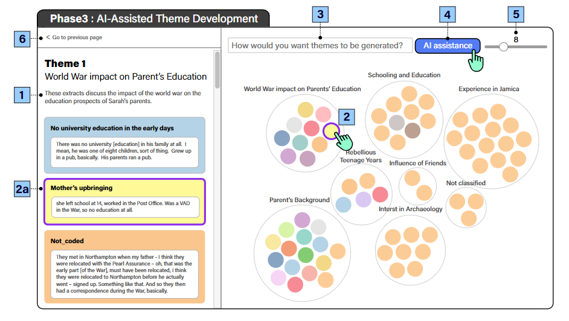
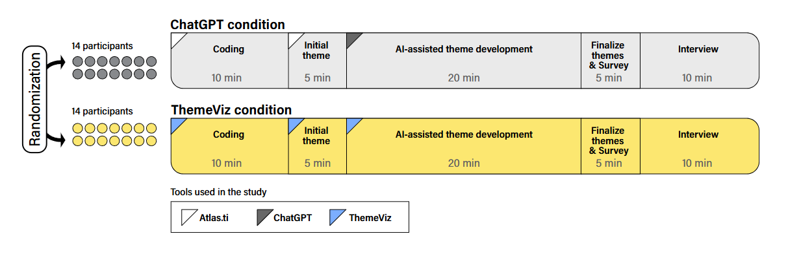

## A Survey of LLM-based Agents: Theories, Technologies, Applications and Suggestions

### 理论基础

早期 Agent 基于强化学习,认为 AI 智能体可以基于简单的启发式驱动策略函数行动。然而，基于强化学习的智能体可能面临一些障碍[3]，如训练时间长、采样效率低和学习过程不稳定等。

由于具备卓越的多模态理解与生成能力、无与伦比的知识获取与推理能力，以及大语言模型（LLMs）的灵活性和可扩展性，人工智能 Agent 将 LLMs 作为核心大脑，试图实现人类水平的感知、认知和行为[5]。

多模态感知实现自主感知能力,复杂的规划实现自发工作能力,可行的具身化或工具利用实现反应能力,有效的多元化记忆实现交互能力。

- 模态编码器（Modality Encoder）：输入多模态原始数据,编码出其他模态的特征向量。
- 模态连接器（Modality Connector）：将模态数据和文本编码数据融合,实现对齐,输出对齐后的模态特征。
- LLM 主干（LLM Backbone）：
- 输出投影器（Output Projector）
- 模态生成器（Modality Generator）

？？？不是一个 LLM 的主干,像是文生图的 workflow

任务目标 g、环境 e、提示集 p 及语言模型总体参数 Θ 后，任务分解可形式化表示为[8]：g₀,g₁,...,gₙ = decp(g,e,p,Θ)

其中"decp"表示分解操作，g₀,g₁,...,gₙ 代表子目标。Agent 应支持通过 CoT 实现的单路径和多路径推理能力。

根据内外双重对齐来进行多路径推理的选择：外部对齐需要将人类意图或预期目标转化为基于大语言模型智能体的训练目标，通常采用包含监督微调、奖励建模和策略优化的 RLHF 方法；内部对齐则要求规划过程确保内部优化目标与智能体训练目标保持一致，具体强调通过安全评估、可解释性验证和人类价值观检验来保障规划的对齐性。

然后就是 RAG 通过外部知识库增强记忆与知识调用能力。

以及例如 API 调用、代码解释器乃至具身化工具的工具使用能力。

论文首先回顾了支撑 LLM-based Agent 的几大核心理论：

### 关键技术

论文将 LLM-based Agent 的技术架构归纳为四大模块：

感知（Perception）：处理文本、图像、音频、视频等多模态输入，如 BLIP-2、MiniGPT-4、AudioGPT 等。

规划（Planning）：包括任务分解、单/多路径推理（如 CoT、ToT、GoT）、反思机制（如 Reflexion、CRITIC）等，提升决策合理性。

记忆（Memory）：涵盖交互内记忆、跨交互记忆和外部知识。

- 内部交互记忆指单次交互内的历史信息
- 跨交互记忆指跨越多轮交互积累的长期历史信息
- 或是通过 RAG 技术获取高质量外部知识

行动（Action）：进行工具理解、工具调用、工具整合的能力。

### 应用与评估

LLM-based Agent 已广泛应用于多个领域：

自然科学：数学（ToRA）、化学（ChemCrow）、生物学（BSDG）；

社会科学：经济学（Alpha-GPT）、法律（LJP-Agent）、心理学（Replika-MWS）；

工程领域：代码生成（GPT-Engineer、AutoGen）、游戏（Voyager、GITM）、工业规划（LLM-Planner）；

评估基准：如 AgentBench（多环境评估）、ToolLLM（工具使用）、SafetyBench（安全性）、AlignBench（中文对齐）等。

### 挑战与建议

作者指出当前 LLM-based Agent 面临的关键挑战，并提出四点建议：

突破内在限制：如幻觉、长上下文处理、多模态推理等；

推动规模化多智能体系统：实现动态调度与高效协作；

强化可控的 AI 对齐：确保遵守法律、伦理与人类价值观；

构建统一综合的评估体系：当前评估分散，亟需标准化平台。

## Survey on evaluation of llm Agent

分为 4 块。

1. 对 agent 基本能力的评估（规划和多步推理能力、函数调用和工具使用、自反思、记忆能力）
2. 领域特长能力的评估（web agent、编程 Agent、科学推理 Agent、对话 Agent）
3. Agent 在泛用领域的评估
4. 评估 Agent 的框架（开发用框架和练习场式环境的框架。）

### 基本能力评估

#### 规划和多步推理能力

大语言模型中的多步推理通常需要执行序列化的逻辑操作（一般涉及 3-10 个中间步骤）来获得无法通过单步推断得出的解决方案。下列测试用于评价模型在特定领域的推理能力：

- 数学推理：GSM8K,MATH,AQUA-RAT
- 多跳问答：HotpotQA,StrategyQA、MultiRC
- 科学推理：ARC
- 逻辑推理：FOLIO 和 P-FOLIO
- 约束满足谜题：24 点
- 日常尝试：MUSR
- 高难度推理任务:BBH

一些评价规划能力的新基准（2023）：

- ToolEmu:采用基于模拟器的方法评估工具使用型智能体。说明了成功规划需要显式状态追踪和错误恢复能力。
- MINT：针对交互环境中的规划进行评估。发现即使先进的大语言模型也难以应对需要多步骤的长期任务。
- PlanBench：跨领域综合评估框架，表明当前模型擅长短期战术规划但拙于长期战略规划。
- AutoPlanBench：聚焦日常场景的规划评估。证明最前沿的大语言模型智能体仍落后于传统符号规划器。

符号规划任务表现不佳(2024)：

- FlowBench：评估工作流规划能力，重点关注专业知识密集型任务。
- ACPBench：评估大语言模型的核心推理技能。
- NaturalPlan：评估大语言模型如何处理自然语言呈现的现实世界规划任务

这些测试凸显了 Agent 高效规划所需要的核心能力：

（1）任务分解能力以拆解复杂问题，

（2）状态追踪与信念维护能力以实现精准多步推理，

（3）自我纠错机制以识别并修正错误，

（4）因果理解能力以预测行动结果，

（5）元规划能力以优化决策策略。

#### 函数调用与工具使用

早期研究采用针对性工具，例如通过增强检索能力的语言模型实现检索功能。后续发展则包含更多通用工具，如 ToolFormer、Chameleon 和 MRKL。

一些提供明确参数进行简单交互为内容的评估方法：

- ToolAIpaca 2023
- APIBench 2025
- ToolBench 2023
- BFCL 2024

它们使用合成数据集和基于规则的匹配来建立通过率和结构准确性等基线指标。但在现实应用中有所局限。例如参数可能在多轮对话、对话中未明确提及，或是工具有复杂输入结构和冗长精密输出。

BFCL 通过引入组织工具（BFCL v2）和整合多轮多步骤评估逻辑（BFCL v3）来更贴近真实问题复杂性，并强调持续状态管理的重要性。

新的基准测试：

- ToolSandbox：整合有状态工具执行、隐式状态依赖、基于策略的对话评估以及针对任意轨迹中里程碑节点的动态评估策略。
- Seal-Tools：采用自指导方法生成嵌套工具调用，有效建模层级化交互场景。
- API-Bank：通过对话式评估和海量训练数据集强化真实 API 交互模拟
- ComplexFuncBench：评估隐式参数推理、用户约束遵循及长上下文高效处理等场景。

#### 自我反思

交互式自我反思：

- LLF-Bench
- LLM-Evolve
- Reflection-Bench
- LiveCodeBench：编程基准
- APPS：编程基准

#### 记忆

新的研究引入了记忆机制。如 ReadAgent、MemGPT 和 A-MEM 探索了这类方法。

ReadAgent 通过内容分组、将事件浓缩为记忆单元并进行段落检索来结构化阅读流程，其有效性已在 QUALITY、NarrativeQA 和 QMSum 等数据集上得到验证。类似地，A-MEM 提出了一种采用 LoCoMo 基准评估的高级记忆架构，而 MemGPT 则采用分层记忆系统，并在 NaturalQuestions-Open 和多轮对话数据集上进行了测试。

一些新的基准测试：

- LTM-BenchMark
- RAISE
- KARMA

### 特定领域评估

Agent 基准测试通过整合三大核心要素，为评估基于大语言模型的 Agent 提供了系统化框架：首先采用明确定义的任务数据集说明智能体的预期目标；其次构建运行环境（模拟静态/动态场景或真实世界），可集成用户模拟、多样化工具及特定策略；最后运用成功率、效率、精确度等评估指标进行多维度量，支持从单个操作追踪到端到端任务完成的多颗粒度分析。

#### Web Agent

这类 AI 系统专为网站交互设计，可执行机票预订、商品采购等任务。评估重点包括任务完成效率、网络环境导航能力及安全合规表现。随着 Agent 进步，评估基准也同步发展，最新成果已能模拟日趋复杂的现实交互场景。

早期研究聚焦基础模拟环境，如 MiniWob 和 MiniWoB++。

后续研究在静态数据集开发上取得突破，支持离线可复现评估。如 WebShop。后续的 Mind2Web 与 WebVoyager 支持对复杂网站结构导航能力和阶段性目标达成度的综合测评。

近期研究已转向更贴近现实环境的动态在线基准测试。

- WebLinX：提出动态交互模型，要求 Agent 必须适应网页界面的持续变化，从而检验其决策流程的鲁棒性。
- WebArena/Visual-WebArena:整合了真实用户界面元素与视觉线索，要求 Agent 不仅能遵循预设流程，还需解读并响应视觉信息。
- ST-WebAgentBench:尝试在静态与动态元素融合的环境中评估网络 Agent，揭示其在多变条件下的表现。

#### Code Agent

- SWE-bench 基于真实 GitHub 问题构建，提供端到端评估框架，包括详细的问题描述、完整代码库、执行环境（如 Docker）和验证测试。
- SWE-bench Lite 聚焦 300 个涉及缺陷修复的子任务，剔除需复杂多文件修改或无关元素的任务.
- SWE-bench LiteS 通过移除存在精确补丁或描述不充分的任务进一步优化数据集.
- SWE-bench Verified 仅保留描述清晰且测试用例完备的问题。
- SWE-bench+致力于缓解解决方案泄露和弱测试用例等关键评估缺陷
- SWE-bench Multimodal 则针对含可视化元素的 JavaScript 应用，评估 Agent 在视觉软件领域的表现。
- SWT-Bench、TDD-Bench Verified 专注于评估 Agent 根据 GitHub 问题生成测试用例的能力。
- ITBench 为评估复杂现实 IT 自动化任务提供基准。
- SWELancer 通过对接自由编程任务，将 Agent 表现与货币价值挂钩，凸显了在复杂现实场景中实现长期推理与决策的挑战。

#### Science Agent

科学智能体的评估已从早期测试基础推理能力的基准，逐步发展为衡量多样化科研能力的综合框架。

初期基准侧重科学知识记忆与推理能力或是科学文献的整合和情景化分析:

- ARC
- ScienceQA
- ScienceWorld

- QASPER
- QASA
- MS²
- SciRiff 进一步拓展评估维度，强调智能体跨科学领域执行用户指令的能力。

当前研究趋势转向开发能加速科研进程的科学智能体，基准已覆盖科研全流程:

1. 科学构思：评估智能体能否自主提出媲美人类专家的创新性研究构想，重点关注科学思维的创造性、相关性与可行性；（Si 等，2025）
2. 实验设计：AAAR-1.0 数据集等基准测试智能体系统规划实验的能力，包括假设构建、方法选择及符合科学规范的实验流程设计；
3. 实验代码生成：SciCode、ScienceAgentBench、SUPER 和 CORE-Bench 等基准验证智能体生成精准可执行代码的能力，确保代码符合科学协议要求并保持计算准确性；
4. 同行评审生成：测试智能体能否提供超越人类评审质量的深度反馈（Chamoun 等，2024）。

整合上列流程的基准：AAAR-1.0、MLGym、DiscoveryWorld、LAB-Bench

#### Chat Agent

略

### 通用能力评估

Agent 正从特定应用场景转向更通用的方向。这些 Agent 将大语言模型的核心能力与网页浏览、信息检索、代码执行等技能相结合，来解决复杂任务。

- GAIA 基准：包含 466 个人工设计的现实世界问题，用于测试智能体的推理、多模态理解、网页浏览和通用工具使用能力。
- Galileo Agent 排行榜：着重评估智能体在数据库查询、在线计算器和网络服务等现实应用中执行函数调用和 API 调用的能力。
- AgentBench:引入了一套包含操作系统命令、SQL 数据库、数字游戏和家务任务的交互环境。

或是聚焦于在全功能计算机操作环境中的表现：

OSWorld、OmniACT 和 AppWorld 等基准测试智能体能否驾驭真实计算机系统、执行复杂任务并协调跨多应用程序的操作。

### Agent 评估框架

略

### 讨论

评估指标正向真实环境和挑战性看齐。

另一方面，新型的方向有

1. 精细化评估推进：缺乏对工具选择、推理质量等中间决策过程的细粒度分析。
2. 成本效率指标：将 Token 用量、API 开销、推理时间等成本效率作为核心指标。
3. 规模化与自动化：采用合成数据生成技术创建多样化任务场景；发展"智能体即评委"的 LLM 自动化评估。
4. 安全合规性：当前基准对安全性、可信度及政策合规的关注有限。

## Understanding the LLM-ification of CHI: Unpacking the Impact of LLMs at CHI through a Systematic Literature Review

作者对 153 篇 LLM 有关的 CHI 会议的论文集进行研究。专注于 LLM 在人机交互领域的应用。

### 应用领域

1. 沟通和写作：许多研究将作家视为大型语言模型的目标用户，任务范围从个人日记、电子邮件撰写到故事创作、剧本编写以及一般创意写作。
2. **能力增强**：这一领域包括开发技术以通过改变我们与技术及信息的互动方式来提升人类表现和生产力的论文。
3. 教育：这一领域探索了大型语言模型在提升学生学习体验和改进教育者教学方法方面的潜力。
4. 责任：考虑计算系统对社会、伦理领域的影响，尤其是高风险领域。
5. 编程：聚焦于软件工程和编程领域
6. 语言模型的可靠和有效性：关注于评估和提升 llm 输出本身
7. 健康：关注于通过 llm 获取健康相关疾病和病症的管理与预防的知识或是处理健康数据。
8. 设计：用于提供设计有关的帮助，如用户界面设计。
9. 无障碍和老龄化：该领域重点关注残障人士和老年人群体。
10. 创造：该领域涵盖了创意过程及创造力支持工具。

### 应用角色

1. LLM 作为系统引擎：在这一角色中，LLM 作为系统、原型、算法和编程框架的核心元素发挥作用。
2. LLM 作为研究工具：使用 LLM 执行传统上由研究人员或研究助理完成的任务，包括数据收集、分析或写作。
3. LLM 作为参与者或用户：此类研究用大语言模型模拟人类响应和行为。
4. LLM 作为研究对象：此类研究探讨大语言模型底层机制与特性的论文，涉及训练数据集、响应输出及问题研究（如幻觉现象）。
5. 用户对 LLM 的认知：此类包括关于用户如何看待 LLMs 或 LLM 驱动工具的研究。

### 不足之处

1. LLM 对不同人物存在偏见：大语言模型对不同人群的回复存在差异。
2. LLM 训练数据覆盖范围不足：大语言模型的训练数据可能不足或过时。
3. LLM 可能输出多种回答：大语言模型的回答具有概率性特征，即使输入相同的提示，其输出仍可能发生不可预测的变化。
4. LLM 可能产生幻觉：大语言模型可能产生不准确或完全虚构的信息。
5. LLM 的错误或偏差无从查询：由于模型的黑箱性质，大语言模型的输出存在异常时，难以定位出现异常的原因。

6. LLM 的计算要求严苛
7. 使用 LLM 对经济也有要求。
8. LLM 缺乏评估标准或度量。

9. 在不同用户和不同情境中，LLM 使用过程中的内部效度和外部效度存在差异。
10. 不同的 LLM 存在效度差异。
11. 提示词也会带来效度差异。

12. LLM 可能会带来就业问题。
13. LLM 的表示偏差可能会带来认知引导方面的负面效果。
14. LLM 的输出可能虚假、带有误导性或是无意义、低质量。
15. LLM 可能会用于恶意行为。
16. LLM 可能会输出仇恨言论。
17. LLM 对电力的消耗引起环境危害。

## Towards AI-Powered Applications: The Development of a Personalised LLM for HRI and HCI

文章使用 EEG 数据集训练模型,通过外接信息采集设备来捕获人类脑电波数据,从而解析人类情绪,进一步定制化模型。

**LLM 的个性化是在线适应(Online Adaption)的子集。**

个性化 AI 模型意味着使模型适应个体需求、偏好和情境，从而显著提升用户参与度、满意度及整体效果[38,39]。个性化体现了模型适应的核心理念——模型通过持续与环境互动，基于观察反馈更新知识体系以契合主要情境[40]。

PLLMs 从持续学习和个性化范式中汲取灵感[50,51]，提供了一种无需全面重训练即可整合新数据集的有效方案。

'PLLMs 作为自适应智能体运作，将新数据流分解为离散任务或知识源进行吸收。这种整合丰富了模型的体验知识，使其能对未见场景进行细致推理。与传统重训练方法不同，PLLMs 采用特殊设计的提示词动态调整模型行为，确保新数据无缝融入模型推理过程[52,53]。'**实际上就是简单的提示词拼接**。

智能体可定义为一种通过与所处环境交互来达成目标的应用程序[58]。该智能体可能包含多个模块：一个或多个模型、用于数据采集与决策执行/动作实施的交互模块，以及用于处理采集数据的数据转换与聚合模块。该研究设计的智能体整合了这三个核心模块。**Agent 的定义有很多种形式，并没有公认的定义。在目前的 LLM-based Agent 领域中，还会包括工具调用能力。**

总之,这篇文章主要聚焦于用提示词工程和用户反馈将特定领域数据(如采集到的的脑电波数据)预处理后输入大模型,由 LLM 判断使用者的情绪状态。

核心内容在**基于反馈的改进、持续学习**。

## How Do You Want to View This? Generative AI, Creative Ethos, and TTRPG Hobbyists

三个核心问题：

- TTRPG 爱好者对生成式 AI 的"心智模型"是什么？
- 当 TTRPG 爱好者面临生成式 AI 进入 TTRPG 领域时，他们如何应对复杂的伦理问题？
- 如何让 TTRPG 爱好者在采用生成式实践时，既能符合他们对有效性的定义，又能与创意工作流程实现伦理融合？

思路不对。不在提出“心智模型”->调研->提出对目标用户有益的做法上。

## Interaction Configurations and Prompt Guidance in Conversational AI for Question Answering in Human-AI Teams

这项工作旨在探索如何帮助人类更好地与 LLMs 交互以生成文本，特别是在问答的背景下。具体而言，作者模拟并测试了在客户支持环境中可能用到的材料，这是现实世界中具有代表性的问答应用场景。

### Introduction

本文测试了两种为人类 Agent 提供会话式 AI 辅助的问答配置方案，并与传统纯人工模式（含无 AI 辅助和有 AI 辅助两种情形）进行对比。作者探究了哪些因素与回答质量相关并促成有效人机协作，以及何种回答会被视为成功的高质量响应。

所有配置均包含三个基本要素：待回复的问题、含正确答案所需的参考文档、以及基于 GPT-4 构建的会话式 AIAgent（接收问题与参考文档作为输入）。

结果表明人机协作具有潜在价值，但仅限于交互成功的情况。单纯将人类与 AI 结合并不能自动保证性能提升。
从整体质量看，各条件间答复质量无显著差异；但选取各条件最优的七份答复时，"引导提示"和"对话"条件下的答复显著优于纯 AI 生成结果（但仍不及纯人工答复）。

分析得出若干关于问答系统人机协作设计的启示：
首先，有必要鼓励使用者在协作过程中更积极发挥作用；
其次，消息建议能改善交互质量——例如"引导提示"条件比"高亮标记"或"对话"条件产生更多成功的 AI 答复；
第三，引导人类询问"该向 AI 提什么问题"具有积极作用，这类元提示与成功 AI 答复数量呈正相关；
最后，设计应确保人机使用相似术语体系，虽然问题重述与成功 AI 答复正相关，但有时会导致 AI 失效。

### 研究背景

当人类与 AI 协作完成工作时，人们期待双方能力的结合能实现超越各自独立工作时的卓越表现与成就。评估这类人机协作时，往往聚焦于绩效指标或人类参与者的主观满意度[10]。

既有研究揭示了影响人机协作质量的多元因素。Inkpen 等[23]通过用户与三种模拟算法模型的交互实验发现，用户专业基础与人机优势互补等潜在因素显著影响团队效能——尽管这些模型准确率相同，但真阳性/真阴性率配置各异。Holstein 团队[21]的在线实验则探究了明确传达潜在不可观测变量如何影响人们整合模型输出与不可观测因素进行预测。Xu 等[58]在视频匿名化任务中分析了 AI 建议精度与召回率的权衡，比较专业标注员在不同 AI 辅助模式下的表现。Munyaka 等[39]研究发现人机团队成员的决策风格会显著影响协作成效与团队效能感知，并在 AI 驱动的协作游戏中揭示了 AI 身份披露的影响。Cabrera 团队[8]提出通过展示 AI 系统在子群体实例中的行为描述来帮助人们合理依赖 AI，发现该方式能通过识别 AI 失误提升人机协作准确率。

现有研究也涉及帮助用户提示 LLM 的查询建议[28,62]，这类功能已应用于 ChatGPT 等主流 LLM 界面。通过深化对 LLM 对话场景下人机互动的理解，研究者能制定指南并为用户提供恰当引导，最终提升这些 AI 系统的可用性与效能[3]。

问答系统是自然语言处理（NLP）领域的一项基础性任务[12,45,46]。抽取式问答（或称阅读理解）是最基本的问答形式，模型需要根据给定上下文来回答问题[30,32]。

众多研究者通过分析 Stack Overflow 和 Stack Exchange 等问答平台数据来揭示其运行机制。Chua 与 Banerjee[13]通过 Stack Overflow 实证研究验证了"答案追寻"框架，重点关注问题可答性。Kabir 等人[26]对 ChatGPT 回复进行了语言学与人性化维度的综合分析。Tian 团队[54]则强调了上下文信息在社区问答服务中的关键作用。

当前 AI 辅助问答研究致力于提升响应质量与速度，其中一个研究方向探索了 AI 聊天机器人在数字领域促进积极变革与支持提问者的潜力[55]，重点关注用户与虚拟助手互动时的心理反应。在 AI 辅助客服领域，最新研究涉及客户视角理解、意图识别、采纳因素及体验优化等主题[40]。

本文的目光聚焦于用户如何通过对话 Agent 解答潜在咨询,以及何种人机写作配置能产生最被期望的相应。

### 设计问题与初步研究

研究者将一些基础基础问题和有助于解决问题的相关文档交给了受试者。由受试者选择不同程度的支持来尝试解决问题。初步研究表明,多数受试者在与 Ai 对话、参考文档和一个对问题无参考的 ai 回复、支持文档相关部分高亮和 AI Agent 对话、和类似问题和回答的不同程度支持中选择了高亮。由此进一步进行了实验设计。

### 实验设计

研究者在初步研究的基础上修改了部分实验内容,并最终指出了研究问题：

1. 哪些配置总体上能促成问答任务中成功的人机协作？
2. 哪些交互配置有助于提升人机团队生成高质量回答的能力？
3. AI 辅助问答中优质回答具有哪些特征？

具体的实验不关注

### 实验结果

#### 问题 1

使用皮尔逊相关系数分析，评分与要求 AI 助手总结文本的消息数量（𝑟=0.310，𝑝<0.1）及总编辑次数（𝑟=0.397，𝑝<0.05）呈正相关。这些相关性表明，人类在协作过程中更积极的参与可能会提升最终输出质量。

两位研究者将 AI 助手的回复标注为四类：成功回应用户提示、脱离上下文、未能回应、拒绝回应。后三类被归为失败回应。多项变量与 AI 回复成功与否显著相关。

皮尔逊相关系数显示，当参与者采用复制（𝑟=0.581，𝑝<0.01）或转述问题（𝑟=0.522，𝑝<0.01）的方式提问时，更可能获得成功回应。

此外，成功回应数量与询问 AI 功能范围的问题数量正相关（𝑟=0.693，𝑝<0.01）。

但 AI 常无法理解过度转述的提示，例如未能理解"这个问题的最佳解决方案是什么？"，因其使用"problem"而非最初输入 AI 模型时使用的"question"一词。

#### 问题 2

研究表明，在"Nudging"（助推）实验条件下，查询快捷功能显著改善了整体交互效果。数据显示，消息建议切实影响并改变了参与者的行为模式。

例如，在第三种实验条件下，要求 AI 转述参考文档的用户比例明显高于其他条件。

通过 Tukey HSD 检验发现，在提供建议的"Nudging"条件下，用户要求 AI 总结文本的消息数量显著多于"Highlight"条件（p < 0.01）。

同样，请求 AI 转述文本的消息量在"Nudging"条件下也显著高于"Highlight"（p < 0.01）和"Conversation"条件（p < 0.01）。

此外，询问 AI 功能用途的消息频率在"Nudging"条件下也明显更高（相较于"Highlight"和"Conversation"条件，p 值均<0.01）。

总体而言，"Nudging"条件下用户发送给 AI 助手的消息总量显著多于"Highlight"条件（p < 0.01）。

这些行为变化在人机协作层面产生了积极影响，促成了更成功的交互。

与"Highlight"（p < 0.01）和"Conversation"条件（p < 0.1）相比，"Nudging"条件下 AI 助手的成功响应率更高。皮

尔逊相关系数显示，消息建议的点击总量与 AI 成功响应次数呈显著正相关（r=0.626，p<0.01）。

在问卷调查中，有参与者评价"Nudging"条件："这帮助我理解了 AI 的功能及其最佳使用方式"；另一参与者指出："它提供了很好的切入点"。这些反馈表明，该设计有效提升了用户对 AI 能力的认知，并优化了辅助功能的使用引导。

#### 问题 3

最常被提及的是准确性，涉及核对响应事实是否与参考文档一致，以及实际解决问题的有效性。

其次是响应语气，考察是否友好自然、拟人化。

第三大标准是响应长度，关于长短优劣的争议详见 8.3 节。参与者还提到了清晰度、相关性和语法正确性。

最后，部分评分者关注响应内容的伦理合规性，这与表 1 中涉及手机越狱的最终问题相关。

## Multi-Agents are Social Groups: Investigating Social Influence of Multiple Agents in Human-Agent Interactions

### introduction

在多 Agent 系统兴起与虚拟 Agent 日益普及的背景下，一个有趣的问题浮现：一组 AI Agent 能否对用户产生集体社会影响力？这个问题源于人际互动中的经典发现：个体更容易受到多数人观点的影响，这种社会影响现象表现为从众行为[24]、同辈压力[47,88]、社会认同渴望[68,80]和社会规范遵从[37,63]等多种形式。

问题：持相同观点的一组 AIAgent 能否以类似人类群体的方式影响用户决策？

该问题的重要性体现在两方面：其一，多 Agent 交互日益普遍，在 X（原 Twitter）等社交平台上，类人社交机器人已被有效用于信息传播和用户参与[110]。
多 Agent 系统还支持在线讨论[118]、公共信息收集[51]和健康指导[9]，使用户在多场景接触多个 Agent 的观点。其二，多 Agent 系统潜在的社会影响力令人担忧。

人机交互领域研究进一步支持了 AI 智能体产生说服效果的潜力，这些研究强调单个 AI 智能体对用户态度[49]和行为[89,116]产生的显著社会影响。然而此类研究主要关注单个智能体的设计特征（如被感知为聊天机器人或人类对结果的影响[89]），鲜少探讨智能体数量如何影响系统有效性。相比之下，多智能体系统研究主要聚焦于提升任务绩效[19,42]，无论是帮助用户更高效完成任务还是提升系统技术性能[18,32].

当系统主要目标是明确智能体在讨论中的角色或提升其技术性能时，社会影响的作用较不显著。但在需要同时传递信息并说服用户接受特定观点的场景中，多智能体与单智能体的效果差异亟待探索。

鉴于：1）多智能体系统及与多个社交机器人交互日益普遍；2）AI 智能体已知的社会影响力；3）人类群体社会影响的既定效应可能在人机交互中复现；4）AI 智能体群体产生的集体社会影响具有显著正负效应潜力。本研究通过以下问题探讨该议题：与多个虚拟智能体交互能否产生改变我们观点的社会影响？具体而言，我们探究多智能体交互是否会导致更强烈的观点改变、引发差异化的社会影响，并识别增加 AI 影响易感性的群体特征，旨在为多智能体系统制定伦理准则。

定量与定性分析表明：多智能体设置显著影响观点转变。当智能体持反对意见时，受试者表现出更强烈的观点改变；当智能体赞同时则出现更严重的观点极化。但智能体数量从 3 增至 5 时，改变强度并未提升——5 智能体组反而引发极化现象，更多受试者拒绝智能体论点并远离其立场。此外，多智能体组强化了社会影响感知，尤其是与多数保持一致的标准压力。开放式回答显示受试者在 3/5 智能体条件下表现出群体归属需求，这促进了社会影响与观点转变。人口统计分析揭示年轻群体更易受多智能体影响。

研究为人机交互（HCI）和计算机支持的协同工作（CSCW）领域的未来研究做出了以下贡献：

1. 我们证明，在讨论中引入多个智能体更容易产生社会影响力并推动观点转变。这填补了关于多智能体系统如何影响人类认知的研究空白，揭示了相较于单智能体系统，多智能体配置能引发更强烈的态度转变。
2. 我们深化了对单智能体与多智能体系统社会影响力差异的理解。通过观察参与者的社会排斥感和参与意愿，我们发现了人类对智能体群体的隐性归属感，从而将现有社会影响理论拓展至人机交互领域。
3. 我们为利用多智能体配置更有效实施说服策略提供了设计建议。通过发挥多智能体产生的规范压力，未来系统可以增强参与者的情感投入，从而促成更持久、更内化的态度与行为改变。

### 研究背景(仅摘取其中有关 agent 的片段)

AI Agent 正日益融入我们的日常生活。这些先进的 AI 系统能够与用户互动、进行对话并表达自身观点[107]。近期研究和行业应用利用大语言模型（LLMs）的对话推理能力，开发出问题解决工具[40,67,82,108,115]、教育助手[59]和新型搜索界面[62,113]。商业领域中，企业通过社交媒体部署 AIAgent 进行品牌营销和客户服务[46,50,112]，或将 Agent 嵌入应用程序辅助写作[31]、头脑风暴[78]和游戏[90]。

然而，基于单一 LLM 的代理仍难以有效处理诸多任务。独立 LLM 可能缺乏专业领域知识[35]，推理能力也尚不完善。受心理学理论[92]启发，研究者探索了多代理"辩论"[32]与"调解"[18]等技术，通过观点碰撞提升推理质量。这推动了"多代理协作"研究热潮——通过智能体协同提升任务表现[19,42]。自然语言处理[42]、软件工程[14]和机器人学[20]等领域已运用多代理集体智慧模拟群体动态，优化任务执行[45,76,111]。多代理系统还能模拟人类角色互动，如工作者协作[4,60]或多人交互[72,73]。

在用户中心场景中，同步多代理交互成为新趋势。例如 Clarke 等人[25]开发了可同时调用 Google 助手、SoundHound 和福特车载助手 Adasa 的集成界面。Anthropic[26]、谷歌[38]等企业也推出多代理框架，方便开发者部署多代理系统。部分机构更在社交媒体采用多机器人矩阵与用户互动。

现有工作多聚焦通过多代理系统降低信息获取认知负荷[51]，或整合多元信息辅助决策[9,16,71,100]，主要探讨用户面对不同输入时的困惑感[16,71,100]。迄今尚无研究探讨代理群体是否/如何通过社会影响机制作用于用户——这种区别于认知决策的影响机制可能同样重要。

多余内容与问题无关。

## LLM-Based Test-Driven Interactive Code Generation: User Study and Empirical Evaluation

### Introduction

直接代码生成可能存在的问题：

- 因提示词不明确而导致的意图模糊
- 无法确定由自然语言提示词驱动生成的代码是否正确

多项关于开发者与 AI 交互的研究[9][14]强调，需要建立机制来辅助验证 AI 生成代码的正确性，例如允许用户通过测试来区分不同代码建议[15]的方案。

本文提出了测试驱动的交互式代码生成（TICODER）的工作流程，以（a）通过生成的测试用例澄清（即部分形式化）用户意图，以及（b）生成与这些测试用例一致的代码排名列表。

并且在基于大语言模型（LLM）的代码生成场景中，自动生成的测试不仅能帮助明确自然语言意图并筛除错误建议，还可作为剩余建议的调试辅助工具及未来代码修改的回归测试[7]。

此外，交互框架的有效与否取决于：(a)LLM 生成有效测试的能力，(b)用户交互开销与代码建议筛选排序收益间的权衡。

为此,文章探究：
该工作流如何影响开发者评估 AI 生成代码的性能？同时该框架应具备扩展性，能提升开源/闭源 LLM 的代码生成准确率。因此我们还研究：
该工作流能否提升代码生成模型的准确率？

通过(1)混合效应用户研究及(2)两个 Python 代码生成基准的大规模评估，我们验证了框架有效性。本文贡献如下：

1. 提出 TI CODER 交互工作流，通过自动生成测试引导用户澄清意图，提升 LLM 代码生成准确率。该系统利用现成 LLM 生成代码与测试，并通过用户认可的测试验证 AI 生成代码。
2. 通过混合方法用户研究对比 TI CODER 两种变体（含代表现有开发者-AI 交互流程的基线条件），发现使用任一变体均能显著降低认知负荷。
3. 通过模拟用户反馈（以参考答案为理想 Agent）大规模评估 TI CODER 性能。在 MBPP 和 HumanEval 数据集及四种开源/闭源 LLM 上的实验表明：该系统能在 5 次交互内使 pass@1 准确率平均提升 45.73%，仅需 1 次交互即可让小模型达到 GPT-4-32k 级别的大模型性能。

### 研究背景

#### 提高代码生成准确度

提到类似的通过生成测试用例来提高准确度的工作,不过类似的工作在交互性上不比本工作好,因此未必能提高用户的满意度。另外的一些研究依赖自动符号引擎（如约束求解器[30]或自动机构造[17]）为程序对生成差异化输入样例，这对 Python 等通用命令式编程语言并不适用。

#### AI 编程助手的可用性

现有研究对 AI 编程助手的可用性进行了多维度探索。这里重点讨论与意图表达和生成建议控制相关的挑战。Liang 等人[8]发现"放弃整合生成代码"和"无法提供反馈"是基于补全的 AI 编程助手最常见的使用障碍，这通常源于代码未实现预期功能、用户不理解生成逻辑或难以控制输出与意图对齐。McNutt 等人[31]构建了代码助手交互设计空间，包括消除候选程序歧义和优化初始规约的方案——这与 GitHub Copilot[32]等助手和传统程序合成工具[33]中歧义消除的价值研究相呼应。Xu 等人[9]探究了 IDE 集成 AI 助手的挑战，包括用户查询的明确程度，发现自然语言查询中经常存在意图表达困难，而规约不足问题多源于变量名省略等模糊指令。

另一方面,Bird 等人[14]的最新研究表明，AI 工具正使开发者角色发生转变——**代码审查时间已超过实际编写时间**。

### 研究问题

RQ1 TiCoder 如何影响 Python 开发者评估 AI 生成代码的性能，包括任务正确性、时间和认知负荷？为回答 RQ1，我们进行了用户研究，参与者使用结合 TiCoder 工作流程的 AI 助手。我们评估了所提方法在开发者评估 AI 生成代码时的成本效益权衡。

RQ2 TiCoder 工作流程是否能提高生成代码建议的准确性？为回答 RQ2，我们探索了结合 TiCoder 工作流程的大语言模型在两个 Python 代码生成基准测试中的代码生成准确性。

### 交互流程

TiCoder 的交互流程如下：

用户输入：提供函数头（function header）、自然语言描述（NL prompt）以及可选的上下文代码。

模型生成候选：LLM 生成一组候选代码（code suggestions）和一组候选测试（test suggestions）。

执行测试：对每条候选代码，执行所有候选测试，记录哪些测试通过/失败/崩溃。

测试排序：根据“区分能力”对测试进行排序，优先向用户展示最能区分不同代码行为的测试。

用户反馈：用户对测试做出回应：

- PASS：该测试输出符合预期；
- FAIL：不符合预期；
- UNDEFINED：输入违反函数前提条件（如除零、空列表等）；

（在 TICODER-OUTPUT 模式下）若为 FAIL，用户还需提供正确的输出值。

剪枝与重排序：根据用户反馈，剔除与用户意图冲突的代码，并对剩余代码按通过测试数量重新排序。

重复交互：可进行多轮（论文中最多 5 轮），逐步缩小候选空间。

最终输出：返回用户确认的测试集 + 与之行为一致的排序后代码列表。

设计上提出两种交互变体：

TICODER-PASSFAIL：仅回答 PASS / FAIL / UNDEFINED。

TICODER-OUTPUT：FAIL 时需提供正确输出值。

### RQ1 实验结果

- TiCoder 如何影响任务正确性？

从机制设计来看，当用户错误评估测试用例时，TiCoder 工作流会剪裁所有通过该测试的有效程序。因此错误评估测试的参与者将看不到任何有效的 AI 生成程序，除非他们声明所有代码建议都不正确。在 TiCoder 工作流中，用户的噪声响应会确保生成代码不符合其真实意图。因此实践中，跳过测试评估的选项对工作流可用性至关重要，能减少用户噪声输入带来的不确定性。尽管 TiCoder 能有效辅助用户评估代码建议，但噪声反馈的风险仍需警惕。

- TiCoder 如何影响耗时？

结果：TiCoder 引入的测试验证时间不会显著增加总耗时。

- TiCoder 如何影响认知负荷？

作者认为这种效果的出现可能是因为用户需要评估的代码建议数量减少了，而且测试用例可以作为理解代码的具体机制，同时为更全面地测试候选函数提供了一个起点，从而更容易开始任务。

### RQ2 实验结果

就反正是能。

### 讨论和结论

聚焦于代码生成鲁棒性和通用性和模型方面的考虑。无实际交互方面的考量。

## ThemeViz: Understanding the Effect of Human-AI Collaboration in Theme Development with an LLM-enhanced Interactive Visual System

### 背景

Thematic research(**主题研究**):研究者围绕一个明确的“主题（theme）”，从不同角度、领域或数据源收集证据，对该主题相关的现象、规律、关系或趋势进行系统分析的研究方法。

关于 AI 辅助工具的人机交互研究，主要集中在支持主题分析中耗时费力的编码任务（**即对文本数据进行片段标注，如高亮或重要信息摘出等**）。这类任务更易于 AI 高效自动化处理。相比之下，编码完成后的主题开发任务涉及更复杂的抽象思维过程，这是一般的辅助工具做不到的。该过程要求研究者寻找编码元素间的内在联系，找到内部规律并串联起结论。因此主题开发更具诠释性，需要高阶思维和主观判断，难以通过计算工具实现自动化[49]。

相比之下，编码完成后的主题开发任务涉及更复杂的概念化任务(定性任务)更难被 ai 处理。最新研究表明 LLMs 有望通过提供研究者可能忽略的替代性解读，在主题开发等诠释性任务中与研究者展开协作[38,49,65]。也就是说,**LLMs 能生成新颖视角并挑战研究者假设，这正是智力协作的关键特征**[25,34,51]。

这引发我们思考：LLMs 能否通过提供数据的替代性解读，在诠释性任务中承担**协作**职能？

但是,我们对两个问题认知有限：(1)如何为主题开发等诠释性任务设计有效的人机协作；(2)研究者如何与 AI 主题开发辅助工具交互。

计算机支持协同工作（CSCW）领域的研究表明，当**尊重研究者自主权且 AI 未经许可不干扰分析时，人机协作在定性数据分析中可能取得成功[23,37]**。也就是说定性数据分析的人机协作中给用户自主操作空间十分重要。

除此以外,**视觉辅助工具也很重要,直白的对话式工具(如 chatGPT)不能很好地支持主题研究**。

所以文章通过设计"ThemeViz"来填补这一空白。其提供三个支持：

1. 自主性支持：基于 CSCW 领域关于研究者自主权重要性的研究成果[23,37]，系统采用"AI 辅助"而非"全自动化"模式，通过保留人工编码环节来强化研究者在主题开发全程的主导权；
2. 交互可视化支持：通过动态气泡图呈现主题结构，用户既能纵览全局，又能通过气泡隐喻交互查看相关文本摘录与编码；
3. 提示词工程支持：系统将 LLM 深度集成，通过后台管理元数据（原始文本/编码/摘录）实现提示词的隐性自动化。

为验证效果，做一做个联合实验室实验与半结构化访谈（28 位质性研究者），探究三个核心问题：

RQ1 相比 ChatGPT 等传统问答界面，ThemeViz 对主题开发的助力程度？

RQ2 相较传统界面，ThemeViz 设计多大程度促使用户将 AI 视为主题开发的协作伙伴？

RQ3 ThemeViz 中 AI 辅助的局限性？

其中,重点考察：1）优化图形界面与传统文本问答界面的差异；2）LLM 深度融入主题开发等诠释性任务的启示。

研究发现：

1. ThemeViz 通过支持多轮迭代与多视角数据观察有效助力主题开发，其提示工程与响应可视化功能广受好评。
2. 但研究者并未将 ThemeViz 的 AI 助手（或 ChatGPT）视为协作伙伴，归因于 AI 缺乏自主能动性及双向互动讨论能力。
3. 系统在数据隐私和 AI 偏见方面也存在局限。

### 研究过程

#### 主题分析

理解人机交互用户研究中的定性数据通常涉及主题分析（TA），其目的是识别、分析和解释数据中的意义模式，即主题[6]。

主题包含 6 个阶段：

TA 包含六个阶段[7, 11]，每个阶段：

1. 熟悉数据
2. 生成初始编码
3. 寻找主题
4. 审查潜在主题
5. 定义和命名主题
6. 撰写报告

本文主要聚焦于 3、4、5 阶段。因为这些阶段与主题开发直接相关。

支持主题开发具有重要意义，因为这是一个耗时费力且需要大量认知投入的过程——研究者需要对数据进行抽象、综合与诠释来提炼主题与意义[4,7,9,45]。

研究表明，**大语言模型(LLMs)为支持主题开发等解释性任务提供了新机遇——通过提供研究者可能未曾考虑的替代性数据解读，LLMs 或能协助探索多个主题版本来支持迭代开发过程[38,49,65]**。然而目前尚不清楚：质性研究者是否会认可这种人机协作的价值？如何设计 LLM 增强工具才能在支持高抽象度任务（如主题开发）的同时保持用户自主性[23,37]？

之后说明,一些文献证明了 AI 生成的主题与人类创建的主题具有一定相似性[32]、也就是证明了大型语言模型在此场景下的适用性。然而有研究仅考察了未经交互系统支持的原始模型应用，且实验环境局限于 Jupyter Notebooks 等编程平台。这类平台缺乏用户友好的交互设计来简化模型操作流程（尤其对非程序员从业者而言），还要求用户自行设计提示词处理数据收发——这对不熟悉大型语言模型的新手用户颇具挑战性[63]。

因此以下问题尚待明确：1)相较于系统外单独使用大型语言模型，专为质性研究设计的系统能在多大程度上优化主题开发流程；2)此类系统设计具体能带来何种程度的提升。

之后,作者回顾了一些对主题开发的已有的尝试,指出其不足之处如未通过为研究人员提供在使用 AI 前自行开发主题的机会来支持其自主性以及未能可视化等。

#### LLM 在定性数据分析的应用

近期研究探讨了采用 GPT 进行定性数据分析的潜力。例如，一篇论文考察了 GPT 在**叙事分析**中的能力[18]。其他研究方向则探索了 GPT 在演绎编码任务中的表现。最新研究发现，GPT-3.5 通常能执行与人类水平相当的演绎编码（将预定义代码应用于类似数据标注的任务）[16,62]，而 GPT-4 则展现出较高的编码者间信度[21,39]。一项自我实验研究（第一作者作为研究参与者）调查了 GPT3.5-Turbo 在归纳主题分析（从数据而非预定义理论中发展主题）中的应用，展示了其潜力[49]。

### 设计目标

1. 通过支持手动编码和手动主题开发来保障用户自主权。
2. 通过大语言模型辅助主题建议提升开发效率。
3. 尊重研究者观点的同时,鼓励通过编写提示词进行数据探索。
4. 通过集中式数据管理减轻提示词编写负担。
5. 通过交互式可视化促进理解。
6. 确保 AI 生成主题基于真实数据。
7. 支持研究者观点驱动的归纳式主题分析。

### 使用示例

虽然研究主要集中在理解第三阶段人机交互的影响——即**AI 通过生成多个主题版本来辅助主题开发**。但作者在实例中仍纳入了前两个阶段（手动编码和手动主题开发），以便为整个过程提供背景信息。

假设有一位名为 sam 的质性研究员。她正在分析一个包含二战后英国女性学者访谈记录的公开数据集。该数据集记录了她们的生活经历及其对学术生涯的影响。

#### 第一阶段：手动编码

Sam 使用 ThemeViz 开始阅读数据并进行逐行编码。她使用**高亮工具标记文本关键部分**，然后为**高亮文本添加编码以捕捉其含义**。该系统的人工编码功能让 Sam 在获得 AI 协助前能独立完成数据阅读和编码，保持了研究自主性（DG1）。编码一段时间后，她决定根据现有编码创建初始主题。点击"完成编码"按钮保存编码结果后进入下一页。

#### 第二阶段：人工主题构建

在此阶段，Sam 可以手动分组编码并命名主题。初始页面分为两个主要区域：左侧面板显示尚未归组的编码及其对应文本段落（称为编码-文本对），未编码数据会被系统自动标记为"未编码"。浏览编码-文本对卡片后，Sam 构思出一个潜在主题。她点**击"添加主题"按钮在页面右侧生成新主题框**，通过**拖拽将编码-文本对分组并命名主题**。**重复此过程直至准备迭代，最后保存主题版本。**与人工编码阶段类似，这个人工主题构建阶段让她在获得 AI 协助前能独立思考潜在主题，保持研究自主性。

#### 第三阶段：AI 辅助主题开发

在 AI 辅助主题开发页面,**Sam 看到自己创建的主题以气泡图形式呈现**。通过**外围气泡半径可直观查看主题模式和规模（DG5）**。点击大主题气泡内的小气泡时,系统会在左侧面板动态显示相关编码和引文。

。

色彩编码帮助识别重复出现的编码,使主题审阅过程更直观,这种结合交互性的数据可视化方式使得 sam 对已开发主题的理解和检验更加直观。

审阅后 Sam 发现当前主题过于细碎且存在重叠，决定缩减主题数量。他**使用页面顶部的滑块（图 6-5）将主题数设为 8 并点击"AI 辅助"按钮。该滑块让她能轻松调整想要探索的主题粒度**，无需在每个提示中指定具体数量（DG4）。

系统很快根据要求生成 8 个新主题，更新后的气泡图中，Sam 发现可以从新视角重组主题——围绕受访者作为二战后第一代大学生面临的挑战。为以新方式重构主题，她在文本输入框（图 6-3）输入查询："生成关于二战对受访者教育影响及第一代大学生挑战的主题"，点击"AI 辅助"按钮（图 6-4）后，AI 根据提示生成新主题（DG3）。

#### 系统实现

ThemeViz 的前端使用 HTML、CSS、JavaScript 和 D3.js 构建。该系统通过 FastAPI 后端和 SQL 数据库保存用户更改（如代码和主题）。后端还负责向 GPT-4 模型发送提示、格式化模型请求的数据结构，并处理其响应。

#### 提示工程

ThemeViz 使用 OpenAI 的 GPT-4 模型。虽然其性能出色且模型极其灵活，但用户仍可能难以正确构建提示[63]。此外，模型需要提示中包含原始数据和代码来生成主题，若用户需要输入这些数据会非常繁琐。因此当用户进入 ThemeViz 第三阶段时，后端将通过提示构建和解析承担主要工作。

提示包含以下组件：首先包含初始数据集（根据窗口限制进行必要截断）；其次包含基于当前操作的通用模型指令（经过迭代开发），其中包括要求模型以 JSON 解析器可理解的格式返回结果的模板；第三会根据用户在滑块上选择的主题数量追加模板；第四包含避免常见数据错误的附加指令（如添加标题）；最后包含用户提供的任何提示。补充材料中提供更多细节。

#### 数据可视化

在数据可视化方面，主要使用 D3.js 和 JavaScript 创建气泡图。将代码映射为内部小气泡，主题映射为外围大气泡，使用户能直观识别主题规模及代码归属关系。通过 D3.js 力导向图算法动态排列气泡，确保间距合理、视觉清晰。系统包含专门解析模型响应的模块以驱动前端可视化。为开发灵活解析器，首先迭代优化提示模板直至获得稳定输出（考虑模型可变性），随后通过原型测试主动触发解析故障，通过改进提示模板、开发通用格式处理逻辑（如 JSON 前的字符串）、结合重试机制与提示变体等方式进行修正。用户研究表明该方案具有足够鲁棒性。

### 用户研究

#### 提出假设

针对上述研究问题：

1. ThemeViz 工具的实用性，
2. 用户对 AI 作为协作伙伴的认知，
3. ThemeViz 中 AI 支持的局限性。

提出假设：

1. ThemeViz 用户在主题开发方面将比传统的基于聊天的 LLM 更有用。

首先，其应当表现为**主题开发的有效性**。作者假设 ThemeViz 在自主性、提示和通过交互式可视化进行意义构建方面的支持，将帮助用户比没有此类支持的 LLM 工具更有效地进行主题开发。这将表现为更多的主题生成和更高的自我报告数据理解。通过以下与 H1 相关的子假设来三角验证效能的概念：

    1.1 ThemeViz用户将比传统聊天界面用户进行更多的主题生成。
    1.2 ThemeViz用户将自我报告认为它比ChatGPT更能帮助他们从不同角度理解数据。
    1.3 ThemeViz的支架式支持将带来更高的接受度。

其次,其应当表现为**提示支持的有用性。**作者通过集中式数据管理为提示提供支持。ThemeViz 的后端处理原始数据和用户生成代码的元数据，在用户提交提示时自动格式化和更新信息，减少手动输入和数据同步的需求。假设，通过管理数据格式化和存储，ThemeViz 将减轻从头开始提示的负担。从而提出以下子假设：

    1.4 与聊天界面用户相比，ThemeViz用户将自我报告ThemeViz减少了编写提示词的负担。

最后,其应当表现为**交互式数据可视化支持的有用性。**ThemeViz 通过交互式可视化促进对 AI 生成响应的理解。假设与 ChatGPT 以文本为主的响应相比，ThemeViz 将提高用户对 AI 生成主题的理解，并更有效地识别数据中的模式。为了评估 ThemeViz 交互式可视化的有用性，子假设细分如下：

    1.5 与聊天界面用户相比，ThemeViz用户将自我报告ThemeViz帮助他们更有效地理解数据。
    1.6 与聊天界面的基于文本输出相比，ThemeViz用户将认为交互式气泡图更有用。

2. 在主题开发过程中，ThemeViz 的 AI 助手将被视为合作者，而非传统的基于聊天的 LLM 助手。

在 RQ2 中，作者研究了与 ChatGPT 等传统界面相比,ThemeViz 的设计在多大程度上鼓励用户将其 AI 助手视为主题开发的合作者,而非传统的 ai 助手。但 ThemeViz 为主题开发提供了定制支持，包括访问手动分析以支持用户自主性[23,37]以及 AI 生成主题的交互式可视化。作者相信，这种与主题分析方法紧密结合的专业支持，将使研究人员更倾向于将 ThemeViz 中的 AI 助手视为比 ChatGPT 更有效的合作者。因此,提出假设：

    2.1 与ChatGPT相比，ThemeViz用户会更倾向于将ThemeViz的AI助手视为合作者。
    2.2 ThemeViz用户会自我报告称，与ChatGPT相比，ThemeViz作为合作者的能力更强。

#### 研究设计

为了评估 ThemeViz 的有效性，作者进行了一项组间研究。组间研究的目的是**比较 ThemeViz 的交互对主题开发的影响与另一种缺乏本文介绍的脚手架和其他支持的 LLM 工具的影响**。研究的基线模型使用 gpt-4,内容是对比 ThemeViz 的交互和 GPT-4 的传统提示界面的效果差异。

作者招募了 28 名定性研究人员。这些参与者被随机分为两组，每组 14 人。这一研究规模与**其他定性调查工具的研究相当[27,28]**。一组使用 ChatGPT 进行主题开发，称之为“ChatGPT 条件”。另一组使用 ThemeViz 进行主题开发，称之为“ThemeViz 条件”。

图中描述了研究流程。两种实验条件下的参与者均遵循相同的流程,进行约一小时的实验。参与者抵达后,被随机分配使用 Reddit 数据或访谈转录数据 ​（数据集详情见第 5.6 节）。这种随机分配旨在减少仅依赖单一数据类型可能导致的偏差。

**主持人简要说明研究设计后，参与者会基于统一流程接受对应界面的操作培训。**由于所有参与者均熟悉主题分析法，我们未提供额外的质性分析培训。

**在 ThemeViz 组，参与者直接使用 ThemeViz 进行编码；在 ChatGPT 组，因 ChatGPT 不支持手动编码与主题开发，参与者被要求使用 Atlas.ti Web。**每组均需进行 10 分钟编码，随后用 5 分钟拟定初始主题。时间结束后，进入"AI 辅助主题开发"阶段。

**参与者需使用指定工具（ThemeViz 或 ChatGPT）进行 20 分钟 AI 辅助主题开发。**ThemeViz 支持直接保存主题版本，而 ChatGPT 无此功能。为此，我们采用 SingleFile 浏览器扩展快速保存页面镜像（含 ChatGPT 对话记录）至新标签页。在此阶段，参与者可回溯查看原始数据、编码或手动调整主题。

20 分钟 AI 辅助阶段结束后，参与者用 5 分钟确定最终主题并完成简短问卷。最后，主持人进行 10 分钟半结构化访谈，了解参与者体验。

#### 问卷设计

我们为两组（ThemeViz 与 ChatGPT）设计了核心一致、细节微调的问卷。问卷采用"改进版技术接受模型（mTAM）"[41]评估系统有用性与易用性，并设置 7 级李克特量表（1=极不同意，7=极同意）衡量主题开发效用。参与者需对诸如"输出形式（可视化/文本）通过概览帮助我更有效理解文本数据"及"它使我能够多视角审视数据"等陈述评分。

为评估用户是否将 AI 视作协作伙伴以及程度，我们要求参与者评价"AI 助手像同事/协作者"等陈述。关于 AI 协作者能力的题项改编自协作研究量表[3,36]，详见补充材料。

#### 参与者

参与者通过大学公告与滚雪球抽样[30]招募，要求为拥有流利英语能力且有过主题分析经验的成年人。

参与者每小时可获得 20 美元的亚马逊礼品卡作为报酬。本研究已通过大学伦理审查委员会的批准。在 28 名参与者中，平均年龄为 29 岁（中位数：29，标准差：5），大多数具有本科及以上学历，性别分布为 9 名男性、19 名女性和 0 名非二元性别者。参与者在主题分析方面的平均经验为 4.75 年（中位数：3.75，标准差：3.51）（表 1）。由于随机分配，我们观察到各组之间没有差异。

| Occupation | Field of expertise     | Experience |
| ---------- | ---------------------- | ---------- |
| P1         | Graduate Student - PhD | 6 years    |
| P2         | Undergraduate Student  | 2 years    |
| P3         | Graduate Student - PhD | 8 years    |
| P4         | Graduate Student - PhD | 6 years    |
| P5         | Graduate Student - PhD | 2 years    |
| P6         | Graduate Student - PhD | 3 years    |
| P7         | Graduate Student - PhD | 2 years    |
| P8         | Graduate Student - PhD | 7 years    |
| P9         | Graduate Student - PhD | 10 years   |
| P10        | Graduate Student - PhD | 4 years    |
| P11        | Master’s Student       | 1 year     |
| P12        | Undergraduate Student  | 3 years    |
| P13        | Graduate Student - PhD | 3 years    |
| P14        | Graduate Student - PhD | 4 years    |
| P15        | Graduate Student - PhD | 3.5 years  |
| P16        | Graduate Student - PhD | 1 years    |
| P17        | Graduate Student - PhD | 10 years   |
| P18        | Graduate Student - PhD | 2 years    |
| P19        | Graduate Student - PhD | 4 years    |
| P20        | Undergraduate Student  | 2 years    |
| P21        | Graduate Student - PhD | 7 years    |
| P22        | Graduate Student - PhD | 15 years   |
| P23        | Graduate Student - PhD | 1.5 years  |
| P24        | Graduate Student - PhD | 5 year     |
| P25        | Graduate Student - PhD | 8 years    |
| P26        | Undergraduate Student  | 2 years    |
| P27        | Graduate Student - PhD | 1 year     |
| P28        | Graduate Student - PhD | 10 years   |

#### 数据集

由于主题分析在很大程度上依赖于对文本数据的上下文解释，在我们的研究设计中**仅关注一个数据集可能存在风险**。为了减轻这种潜在的偏见，我们采用了两个数据集进行主题分析：一个来自社交媒体平台 Reddit，另一个来自公开的访谈记录[58]。我们选择这些数据集是**因为它们代表了定性分析的两种常见数据来源：社交媒体评论和访谈记录[47]**。这些数据集也符合 GPT-4 使用的隐私和伦理准则，避免了未经授权的数据访问或使用。两个数据集均经过随机抽样，规模相近，且在初步测试中生成了相似数量的代码和主题。

Reddit 数据：

我们的第一个数据集来自 Reddit 的 r/aiwars 子版块，该社区成立于 2022 年 12 月。通过 Reddit API，我们截至 2023 年 5 月收集了 816 篇热门帖子和 21,205 条评论。我们重点关注评论部分，因为这些评论包含了持不同观点的用户之间的详细讨论。

访谈记录：

第二个数据集包含对英国社会研究先驱的详细生活故事访谈，这些先驱主要活跃于 1950 年至 1990 年的战后时期[58]。该数据集提供了研究者学术历程、研究过程及所遇挑战的深入见解。

在分析中，我们从每个数据集中随机选取子集，以保持可管理的数据量并确保内容的多样性。每个子集包含 50 条文本或行，Reddit 数据的平均字数为 568（标准差=283）每行，访谈记录的平均字数为 549（标准差=202）每行。为遵守 GPT-4 API 的 Token 限制（提示和回答共 8,000Token）[5]，我们确保每个子集的总字数不超过 6,000 词。

### 定量分析结果

在本节中，作者给出对参与者反馈和日志数据进行统计分析后获得的量化结果。定性分析结果将在下一章节呈现。这里再次重复作者的所有假设：

    1.1 ThemeViz用户将比传统聊天界面用户进行更多的主题生成。
    1.2 ThemeViz用户将自我报告认为它比ChatGPT更能帮助他们从不同角度理解数据。
    1.3 ThemeViz的支架式支持将带来更高的接受度。
    1.4 与聊天界面用户相比，ThemeViz用户将自我报告ThemeViz减少了编写提示词的负担。
    1.5 与聊天界面用户相比，ThemeViz用户将自我报告ThemeViz帮助他们更有效地理解数据。
    1.6 与聊天界面的基于文本输出相比，ThemeViz用户将认为交互式气泡图更有用。
    2.1 与ChatGPT相比，ThemeViz用户会更倾向于将ThemeViz的AI助手视为合作者。
    2.2 ThemeViz用户会自我报告称，与ChatGPT相比，ThemeViz作为合作者的能力更强。

#### 假设 1：ThemeViz 在辅助主题开发中的实用性

提出假设：相较于 ChatGPT（H1），ThemeViz 能更有效地辅助主题开发，并将其分解为若干子假设进行验证。

首先，作者**统计了各组创建的不同主题版本数量**（H1.1）。通过记录用户保存的各主题版本量化迭代次数——若新保存主题与之前版本数据不完全相同，则计为新迭代。t 检验显示**ThemeViz 用户产生的主题版本数量显著多于 ChatGPT 用户**，该结果支持 H1 假设。

其次，我们检验了 ThemeViz 是否帮助用户多角度审视数据（H1.2）。要求用户采用**7 级李克特量表**评价系统在此方面的辅助程度。通过曼-惠特尼 U 检验,ThemeViz 用户表现出更高的认同度，支持了这一子假设（下表）。

最后，我们还在调查中采用了**改进版的技术接受模型（mTAM）**[41]来验证假设 H1.3。通过曼-惠特尼 U 检验分析结果，再次发现 ThemeViz 用户的技术接受度显著高于对照组用户(下表)。

#### 假设 2：ThemeViz 在提示词支持方面的有效性

作者假设用户会认为 ThemeViz 比 ChatGPT 更易操作（H1.4）。并通过**7 级李克特量表**评估参与者对模型提示与响应流程的易用性感受。曼-惠特尼 U 检验表明，ThemeViz 用户反馈其提示操作便捷性优于 ChatGPT（下表）。

#### 假设 3：ThemeViz 的交互式数据可视化支持的价值

作者提出，ThemeViz 的交互式数据可视化功能能帮助用户更高效处理 AI 生成主题并推进主题开发。针对子假设 H1.5 的第一部分，我们让用户通过**7 级李克特量表**评价可视化如何通过概览功能辅助文本理解（下表）。曼-惠特尼 U 检验显示，ThemeViz 用户的评分普遍更高。

对于另一子假设 H1.6，作者要求用户以**7 级量表**评估系统反馈（包括可视化或文本响应）的有用性。与此前假设一致，曼-惠特尼 U 检验表明 ThemeViz 用户反馈的质量更高（下表）。

| Hypothesis | ThemeViz (M, Md, SD, 95% CI)   | ChatGPT (M, Md, SD, 95% CI)    | Test Results (t/U, p)  | Effect Size, 95% CI      |
| ---------- | ------------------------------ | ------------------------------ | ---------------------- | ------------------------ |
| H1.1       | 4.07, 4.00, 1.69, [3.10, 5.04] | 1.86, 1.00, 1.29, [1.11, 2.60] | t(26) = 3.90, p < .001 | _d_ = 1.47 [0.60, 2.35]  |
| H1.2       | 5.57, 6.00, 1.28, [4.83, 6.31] | 3.36, 3.00, 1.65, [2.41, 4.31] | U = 167.0, p < .001    | _r_ = 0.60 [1.12, 3.31]  |
| H1.3       | 4.69, 4.86, 1.19, [4.00, 5.38] | 3.92, 4.14, 1.08, [3.30, 4.55] | U = 135.0, p = .046    | _r_ = 0.32 [-0.08, 1.62] |
| H1.4       | 5.36, 6.00, 1.21, [4.83, 5.89] | 3.07, 3.00, 1.77, [2.30, 3.84] | U = 166.5, p < .001    | _r_ = 0.60 [1.18, 3.40]  |
| H1.5       | 5.43, 5.50, 1.34, [4.86, 6.00] | 3.64, 3.50, 1.91, [2.78, 4.50] | U = 150.0, p = .008    | _r_ = 0.46 [0.57, 3.01]  |
| H1.6       | 5.57, 6.00, 1.28, [4.83, 6.31] | 4.21, 5.00, 1.72, [3.22, 5.21] | U = 144.0, p = .015    | _r_ = 0.45 [0.29, 2.43]  |

#### 研究问题 2：用户是否认为 ThemeViz 人工智能助手是协作伙伴

作者调查了参与者是否认为 ThemeViz 比 ChatGPT 条件下更像一个协作伙伴（H2.1）。曼-惠特尼 U 检验显示，ThemeViz 的人工智能助手被认为比对照组更像一个合作者/同事。这里说明一个更有效的工具会被视为合作者，而不是一个生硬的工具。

为了更深入地了解这一点，作者专门询问了该工具作为合作者的能力。作者采用了一套关于置信度和感知效度的问卷（详见补充材料）进行交叉验证。曼-惠特尼 U 检验显示，ThemeViz 用户自评的合作能力显著优于 ChatGPT 用户(见下表)。作者认为，这得益于 ThemeViz 提供的特定工作流程支持（与繁琐的文本提示形成对比），以及模型在界面中的直观嵌入设计。

| Hypothesis | ThemeViz (M, Md, SD, 95% CI)   | ChatGPT (M, Md, SD, 95% CI)    | Test Results (U, p) | Effect Size, 95% CI     |
| ---------- | ------------------------------ | ------------------------------ | ------------------- | ----------------------- |
| H2.1       | 3.57, 4.00, 1.16, [2.90, 4.24] | 2.29, 2.0, 1.44, [1.46, 3.12]  | U = 148.5, p = .009 | _r_ = 0.44 [0.32, 2.25] |
| H2.2       | 4.55, 4.83, 0.95, [4.00, 5.10] | 3.45, 3.58, 1.31, [2.70, 4.21] | U = 145.5, p = .015 | _r_ = 0.41 [0.25, 1.94] |

### 定性分析结果

在本节中，作者通过定性研究对量化数据进行补充说明，并解答量化数据未能回答的问题。

在定性数据分析阶段，我们采用 Braun 和 Clarke 提出的六阶段主题分析法[7,8]对访谈转录文本进行分析。三位研究者共同完成所有访谈的实施与转录工作，并对文本进行开放式编码。在初步编码完成后，我们通过多轮讨论不断修正编码方案，确保其准确捕捉数据核心内容。该过程包括合并相似编码，并解决研究者之间的解读差异。最终我们协同建立了一套能全面反映访谈关键概念的编码体系。

在主题提炼阶段，我们使用数字白板工具开展初步主题识别。每位研究者随后通过交叉核对原始数据与编码独立完善主题框架，确保主题的一致性与数据契合度。经过首轮修正后，我们多次召开共识会议，确认每个主题都能清晰表征数据且彼此区分。通过上述研讨，我们最终确立了三大核心主题，将在下节展开详细阐述。

也就是说,在这一阶段作者正**使用了主题分析的方法**,说明研究采用严格、透明、协作式的定性分析流程，通过 Braun & Clarke 主题分析法，从用户访谈中提炼出三大核心主题。该过程通过多人编码、反复协商、数据回溯等策略，确保研究发现真实、可靠、深入，有效补充了量化结果的不足。

#### ThemeViz 通过可视化拓展视角，辅助理解并借助提示避免 AI 幻觉（研究问题 1）

量化结果证实了 ThemeViz 在主题开发中的实用性（第 6.1 节）。本节将深入探讨 ThemeViz 对主题开发的支持效果，主要围绕三个方面展开：(1) AI 辅助在主题开发中的价值，(2) 交互式可视化的作用，(3) 提示支持的有效性。

##### AI 辅助在主题开发中的价值

参与者反馈 ThemeViz 的 AI 助手能帮助他们拓展视角、精炼问题并提供灵感，尤其是当 AI 生成的主题与自身想法不同时。例如使用 ThemeViz 的参与者表示，该系统*帮助他们建立数据的"不同视角"（P10）、"完善研究问题"（P13）和"扩展主题"（P8）。有参与者指出，AI 生成的差异化主题促使他们"通过观察不同主题重新思考已聚类数据"（P9）。当 AI 主题与预期不符时，这些结果反而成为"激发深度研究的灵感来源"（P13）。*如 P2 举例：

    （分析Reddit数据时）最初我只意识到评论主要涉及AI艺术和法律问题。但当我要求ThemeViz生成更多主题时，它提供了文化和社会影响等视角，这绝对比单纯阅读能获得更广阔的视野。

即便最初对 AI 辅助持怀疑态度的参与者，在体验 AI 生成的主题变体后也转变了对人机协作的看法。使用前*许多人"没意识到 AI 能提升效率"（P12），例如 P11 曾认为"让 AI 协助主题分析很愚蠢"，但实际使用后发现了"潜力"。参与者普遍评价该功能"极其有用"（P6,P14）、"高效"（P2）、"省时省力"（P12）*，P6 特别指出：

    质性分析需要反复审视数据，而ThemeViz可能将原本数周的迭代过程缩短至几天。

##### 交互式可视化的作用

参与者认为*可视化能以更低认知负荷呈现数据的"整体结构"（P2）和"关联关系"（P10）。P14 表示："气泡图简化了复杂数据，让我能聚焦特定部分，比阅读大量文本更轻松。"P6 提到可视化有助于判断"某主题包含编码过多或过少"，从而决定是否需要拆分。这种交互式呈现既展示宏观模式，又支持微观聚焦，有效辅助了文本数据的意义建构。*

##### 提示支持的有效性

相比 ChatGPT 用户频繁遭遇 AI"幻觉"（生成无数据支撑的主题），ThemeViz 用户仅报告了编码误分类问题（如 P5 发现"_编码被错分至其他主题_"），但未出现虚构主题或虚构原始数据的情况。

ChatGPT 组参与者*常遇到有趣但无数据支持的主题，P17 表示无法"判断 GPT 输出的真实性"，产生"失控感"；P24 则发现 AI 会"拼凑不同引文合成无意义的虚假引用"*。而 ThemeViz 用户通过交互可视化校验编码分类，有效规避了这些问题。

ThemeViz 的参与者没有遇到主题脱离数据基础的问题,因为 ThemeViz 始终将原始数据和相关元数据嵌入提示中。

参与者仅报告了偶尔的代码分类错误；例如，P5 注意到 AI“将代码错误地归类到其他主题中”的情况，P3 发现了主题分类错误的案例，尽管他们没有观察到由不存在的代码或不存在的原始数据生成的主题。

#### AI 作为协作者的不足之处（研究问题 2）

定量结果部分（第 6.2 节）揭示，参与者认为 ThemeViz 中的 AI 助手比 ChatGPT 更具协作性，认为其协作能力更强。

我们认为 ThemeViz 的设计（通过数据可视化和提示功能支持用户自主性）促使 AI 助手获得了更高的评价分数。然而，定性结果表明，尽管 ThemeViz 的评分高于 ChatGPT，研究人员仍未完全将 AI 助手视为协作伙伴。

在访谈中，我们请参与者反思 AI 模型在其分析会话中的角色：*是他们使用的工具、协助他们的协作者，还是介于两者之间？*总体而言，大多数参与者（28 人中的 27 人）认为从嵌入式大语言模型系统中获得的 AI 辅助是“工具”而非协作者，无论实验条件如何。

参与者解释这一观点源于两个主要因素：**（1）缺乏自主性；（2）沟通方式未能促进对数据集的深入理解。**

##### AI 为何无法胜任质性分析协作中的自主性核心角色？

参与 ThemeViz 实验的参与者认为 AI 助手因缺乏自主性而仅是工具。他们认为大语言模型不具备为分析结果负责的自主性，且参与者不信任“AI 能在无人监督下独立完成主题开发（P7）”。P10 表示，AI 助手是工具因为它没有自己的“思维方式”，而人类“协作者拥有自己的思维”。P8 认为当前基于大语言模型的 AI 代理无法理解“数据中的细微差别”以及“协作者应有的哲学反思能力”。ChatGPT 组的 P24 也认同 P8 的观点，认为 GPT“并不真正理解何为能生成知识的解释——仅仅产出主题不应是总结，而应关乎意义”。P24 进一步解释了为何期待协作者具备“思考”能力：

    ……GPT擅长解释非常泛化的主题，我认为任何未受训练的本科生都能想到。但如果与研究员助理合作，我会期待他们挑战自我及其思考能力——这个主题有意义吗？我觉得AI缺失了这部分。在这种意义上，AI很难被视为协作者。（P24）

这表明，**若 AI 助手不具备人类水平的自主性和反思能力，研究者不会将其视为平等协作者**。但 ChatGPT 组的 P19 通过提及“人类协作中的权力动态”，对 AI 是否需扮演平等协作者角色提出质疑：

    “写论文时存在第一作者和第二作者，可能因资历差异形成主次关系。要与AI成功协作，人类需担任第一作者角色并主导AI。”

尽管 P19 的评论显示协作未必要求能力对等，P23 仍主张 AI 因缺乏担责的自主性而不应被视为协作者：

    ……GPT可能提供错误信息。若它是工具，责任全在我。但作为协作者意味着它具备自主性并能分担责任。然而我认为GPT没有这种责任能力，研究者也不应将自身角色委托给GPT。（P23）

我们的结果表明，尽管先前关于人机协作的研究认为大语言模型可通过提供新视角扮演协作角色，但研究者对 AI 在解释性任务中的期望更高——真正的协作者需具备**自主性、反思能力及对错误负责的担当**。

##### 超越服从：AI 的沟通风格为何无法满足质性研究需求

研究者将 AI 助手视为工具的另一原因是**与大语言模型的交互遵循指令-响应模式只能形成单向对话**。大语言模型顺从地回应用户请求，而研究者期待双向对话——双方在主题开发中相互挑战。

他们希望与 AI 建立“双向关系而非单向指令关系（P13）”，因为现实中研究者常通过“讨论（P1）”不同观点并帮助彼此“深入思考（P13）”来协作。例如，参与者希望深入理解数据，而非仅获取 AI 生成的主题。P4 分享使用 ThemeViz AI 辅助时的体验：

    ……受访者提到‘父亲送我上学，但这不重要’。作为研究者，我想追问‘为什么她觉得不重要？’，但AI仅将其归类为‘家庭背景’而未深挖含义。（P4）

研究者希望 AI 能突出数据中的关键点以探索深层意义，认为被“挑战（P24）”能增强理解。P24 指出：“优秀协作如同两人相互辩论或激发新思考。”P10 补充：“AI 应能提问以促使用户深度思考。”

部分参与者还指出，真正的协作应使人类研究者也能为 AI 贡献价值，因为协作本质是双向互惠的。ChatGPT 组的 P28 表示：

    ……协作意味着彼此获益。AI获取我的数据并处理，但我不觉得这使AI直接受益。它可能通过学习我的行为帮助他人，但难称其为协作者。（P28）

定性结果表明，尽管定量数据显示 ThemeViz 的 AI 助手比 ChatGPT 更具协作性，但仍未达到研究者期待的协作水平——他们**期望 AI 能挑战观点、追问深层意义，并在互动中双向获益，而非仅服从指令。**

#### 应对伦理问题的局限性（研究问题 3）

访谈结果显示，ThemeViz 的人工智能辅助在解决研究者的伦理关切方面存在局限。总结为：

当前 AI 工具（如 ThemeViz、ChatGPT）在设计上未充分回应质性研究者的伦理关切。未来工具开发必须：

- 保障数据隐私与所有权（如本地化处理、明确数据协议）；
- 增强模型透明度与可解释性，并支持研究者嵌入自身立场，而非取代其批判性角色。

### 讨论和设计启示

#### 主题开发中人机协作的再思考

1. 构建主动提问的 AI 代理以促进批判性思维
2. 保障研究者在人机协作中的自主权

#### 可信度和透明度

#### ThemeViz 的其他应用场景

### 局限性

在研究中，每个实验环节设定为一小时以减少认知负荷和疲劳感。鉴于主题开发需要大量时间，即便通过缩减数据量进行补偿，**一小时可能仍不足以反映真实分析场景**。未来研究可探索嵌入式大语言模型工具在长时间会话或实际部署中的定性数据分析（QDA）效果，这将有助于更全面评估其长期影响与可用性。此外，**GPT-4 的 token 数量限制了超长文本的使用**，探究 AI 辅助在不同文本长度下的作用能深化相关认知。

研究样本也存在局限：参与者**多为年轻研究者，且通过滚雪球抽样主要来自人机交互领域**，这限制了对多样化定性研究群体的代表性。未来研究可考察不同学科资深研究者对 AI 辅助主题分析的反应。

系统设计方面，我们**仅针对主题开发阶段提供 AI 辅助**。这种聚焦设计旨在明确 AI 对主题开发的影响，同时通过保留手动编码功能维护用户自主权。未来可研究 AI 全程辅助的效果，探索在更广泛 AI 支持中平衡用户自主权的方法。

### 结论

通过对 28 位定性研究者的实验发现：

1. ThemeViz 在协助多视角主题迭代方面被普遍认为具有高实用价值；
2. 虽然其 AI 协作评分高于 ChatGPT，但因缺乏自主性和被动沟通模式，研究者并未将其视为真正的协作伙伴。
3. 研究还揭示了隐私与偏见相关的伦理问题。

这些发现为专门设计的主题开发图形界面优于聊天界面提供了实证依据，同时揭示了研究者重视的协作要素及当前大语言模型在主题开发中的局限。最后，作者提出了智能系统中人机协作的设计启示，为定性数据分析领域的未来研究提供参考。

## Can LLM-Powered Multi-Agent Systems Augment Human Creativity? Evidence from Brainstorming Tasks

本文提到,在需要专业知识的领域话题上，Agent 的效能似乎大幅下降。选出其中的有关此类的论述做记录。

### 摘要

然而，在**需要专业知识的特定领域话题上，Agent 的效能似乎大幅下降**。**人类对代理发帖的回应率显著降低，而创造力指标显示其表现不升反降**。专家评估表明，在专业领域话题中，相当比例的 Agent 贡献内容被领域知识持有者判定为无关信息，这揭示了当前**大语言模型在专业场景中的局限性——当 Agent 无法获取组织隐性知识和领域专长时**。研究首次对结构化多智能体系统在人类创造力增强方面进行了系统性评估，既展现了显著潜力，也揭示了系统设计的关键考量。我们的研究结果为开发有效的人机协同创造力系统提供了重要启示：虽然 IBIS 结构、动态角色扮演和信息建议的组合在通用领域展现出前景，但**未来系统应考虑采用具备专业知识整合能力的领域自适应架构，以优化跨知识领域的效能**。虽然初步研究表明存在显著影响，但仍需更大规模研究来确立统计显著性及在不同人群和情境中的普适性。这些成果为新一代协同智能系统确立了初步设计原则，能够恰当平衡人类专长与人工智能能力。

### 实验设计

选择特定领域的主题：（“改善京都大学伊藤实验室环境”和“伊藤实验室的亮点”）是因为所有参与者均为实验室现任成员，他们熟悉内部运作、研究项目和日常挑战——这些信息是预训练于公开数据的 LLM 无法获取的。

在特定领域主题中，智能体的引入呈现出明显不同的结果。数据显示，智能体的引入实际上降低了人类的原创性得分（从 2.12±0.08 降至 1.82±0.22），与通用主题的提升形成鲜明对比。阐述得分也略有下降（从 1.95±0.09 降至 1.85±0.16），表明在创意发展方面并无补偿性收益。

## Thematic-LM: A LLM-based Multi-agent System for Large-scale Thematic Analysis

### 研究问题

文章针对基于 LLM 的主题分析存在的 3 个问题展开讨论：

1. 人工依赖性强：现有方法通常需要人类编码员全程参与（如提供反馈、监督 LLM 输出），在大规模数据集上不可行。
2. 视角单一化：LLM 在人类反馈下容易“模仿”人类编码员的观点，导致分析结果缺乏多样性，无法体现主题本应具有的主观性和多元解释。
3. 过程缺乏整体性：现有方法多采用顺序处理，即对每个样本独立编码，不回顾或更新已有编码，违背了 TA 中“代码需在整体数据中保持一致意义”的核心原则。

因此,研究构建了一个全自动、可扩展、能模拟多元视角、且具备整体性反思能力的 LLM 系统，以支持大规模主题分析。

### 系统设计

1. Coder Agents

   任务：对每条文本生成 1–3 个编码及对应的引文。

   创新点：被赋予不同身份视角（如“人类驱动气候变化者”、“保守派”、“原住民视角”等），以模拟真实研究中不同背景编码员的主观解读，从而促进观点多样性。

   解决的问题：缓解视角单一化问题。

2. Aggregator Agent

   任务：合并相似编码，保留差异，结构化输出（JSON 格式）。

   作用：简化后续处理，提升一致性。

3. Reviewer Agent

   任务：维护一个自适应编码本,其使用 Sentence-BERT 生成编码嵌入；对新编码，检索编码本中最相似的已有编码并决定是否合并或更新编码,从而实现对历史编码的回溯与动态更新。

   解决的问题：克服顺序处理的局限，确保代码在整个数据集中语义一致，体现主题的整体性。

4. Theme Coder & Theme Aggregator（主题生成与聚合）

   在编码阶段完成后，基于最终编码本整体性地归纳主题。采用多智能体+聚合机制，确保主题提炼的深度与一致性。

### 有效性评估

1. 可信性与可确认性

   使用一个“LLM-as-a-judge”评估器，检查每个主题是否与原始引文一致。

2. 可依赖性/稳定性

   重复运行 3 次 TA，计算主题间的平均 ROUGE 分数。

3. 可迁移性

   将数据集分为训练集和验证集，分别进行 TA，计算主题重叠度。

## HM-RAG: Hierarchical Multi-Agent Multimodal Retrieval Augmented Generation

### 引言

多模态检索目前正面临挑战。其复杂性在于需要协调**查询类型的多样性、数据格式的异构性以及检索任务目标的多变性**，所有这些都需要复杂的解决方案来弥合数据表示与用户意图之间的差距。检索技术的发展历程历来以**单模态架构为核心**，其中查询与检索机制均在预设的单一模态内运作[3,33]。虽然基于文本的检索增强生成(RAG)系统在处理语言信息方面展现出强大性能[43]，但其无法处理视觉内容的特点**催生了基于图像的 RAG 方法**[7,25,41]。然而当前多模态实现面临关键瓶颈：**图像 RAG 系统虽擅长视觉内容处理，却往往难以建立视觉元素与文本语境间的连贯跨模态关联。**这一局限在多模态问答场景尤为突出，系统必须整合视觉感知与文本语义才能生成情境相关的响应。

近期提出的基于图的检索框架（以 GraphRAG[12]和 LightRAG[18]为代表）**通过构建知识图谱增强了文本互依关系建模**。这些方法进一步扩展至多模态输入处理[37]，利用图结构精准捕捉跨模态关联。但图方法存在问题：虽能有效捕获高层级模态交互，却常牺牲**细粒度信息的保真度**。这在需要精确文本片段检索的场景尤为棘手，因为图建模固有的抽象过程会模糊对细致分析至关重要的文本细节。

另一个关键问题在于协调不同模态的互补优势。**文本模态擅长编码细粒度语义细节与概念关系，而视觉模态则善于捕捉空间语境并促进空间关系理解。**当前专用模态系统[33,54]在跨模态合成方面存在严重局限，产生的检索结果**要么过度偏重文本精度，要么局限于视觉模式识别**。这种模态隔离在异构数据环境中形成系统性缺陷，**缺乏跨模态对齐协议**可能导致检索过程中的关键信息丢失。例如文本中心系统中的**视觉查询无法将概念问题映射到图示元素**，而视觉导向框架中的**文本密集型查询则缺少词汇消歧机制**。这些架构缺陷凸显了对能协调细粒度语义细节与跨模态语境连贯性框架的迫切需求。

为应对这些挑战，作者提出分层多智能体检索增强生成(HM-RAG)框架，通过**协同多智能体协作增强多模态检索**。HM-RAG 采用三层架构：

- 解构智能体分析查询意图并动态重写请求以确保跨模态兼容性；
- 多源检索智能体通过轻量级多模态检索在向量、图谱和网络数据库等多元数据源中并行获取知识；
- 决策智能体则运用领域专用验证策略综合优化候选响应以确保准确性与连贯性。

这种分层设计通过结构化智能体交互系统整合图文证据，实现层级化推理。与传统方法不同，HM-RAG 融合查询解构、并行化信息检索和专家指导的答案优化，最终生成高效且情境相关的响应。

文章的主要贡献如下：

- 提出了一种新颖的模块化分层框架，将查询处理分解为基于智能体的专业组件，从而实现可扩展且高效的多模态检索。
- 实现了多源即插即用检索集成，可无缝连接多样化数据源。通过将查询高效路由至向量检索、图检索和基于网络的检索智能体，我们的方法在异构数据环境中确保了灵活性与效率，简化了复杂的信息检索流程。
- 采用专家指导的优化流程来提升响应质量，通过最低限度的专家监督，确保操作效率与上下文精确性。
- 在基准数据集上通过大量实验验证了 HM-RAG 的有效性，结果表明该方法在 ScienceQA 和 CrisisMMD 基准测试中达到了最先进的性能水平。

### 研究现状

#### RAG

检索增强生成（RAG）系统已显著进化以增强多模态推理能力[16,20,33,47]。早期的文本型 RAG 系统将大语言模型（LLMs）与外部文本知识库结合，通过检索相关文本片段提升问答性能[4,27,57]。但随着视觉密集型文档的普及，纯文本系统的局限性日益凸显，催生了基于图像的 RAG 方法[5,6,38,46]。这些方法虽旨在为**大视觉语言模型（VLMs）检索视觉内容，却因文本与图像检索过程相互独立而难以有效融合多模态**，阻碍了对跨模态关联的深度理解。

为应对这些挑战，基于图结构的 RAG 系统应运而生，利用结构化知识表示来捕捉模态间与模态内的语义关联[9,18,28,44]。这类系统通过向量空间嵌入和拓扑关系建模复杂文档结构，能检索超越简单文本片段的语义连贯上下文[12,42,53]。图式 RAG 在理解图文关联及文本内部关系方面表现尤为突出[37]。然而当前 RAG 实现多依赖单源检索，难以处理需要同时调用向量数据库、图数据库和网络数据库的复杂查询[19]。这一局限在需要私有数据检索和实时更新的场景中尤为突出，缺乏多源检索融合能力可能导致信息不完整或过时。要充分发挥各数据模态优势并适应动态异构数据环境，RAG 系统需进化至支持协同多源检索与合成。

#### Agents in RAG

传统 RAG 实现通常依赖静态流程，难以处理多模态查询处理[8,48]。近期基于智能体的 RAG 架构通过提升系统模块化与操作灵活性，解决了这些局限[11,21,29]。这种面向智能体的方法将查询处理分解为**语义解析、跨模态检索和上下文感知生成等专门组件，在保持整体适应性的同时实现针对性优化**。PaperQA[32]通过利用**学术文献生成基于证据的响应**，减少了科学应用中的幻觉现象，成为典型范例。

在此基础上，诸如 FLARE[30]等主动式 RAG 方法通过预期检索引入时序动态性，提升了长文本生成性能。尽管取得这些进展，多模态整合仍存在挑战。新兴的动态 RAG 方法[49,50]提出**实体感知增强策略，动态整合检索到的实体表征，在保持语义连贯性的同时突破上下文窗口限制**。HM-RAG 框架通过分层多智能体架构，综合运用这些创新并发挥大语言模型的语义理解优势。

### 架构设计与技术实现

#### 多模态知识预处理

系统的“数据准备”阶段，目标是将原始的、异构的多模态数据（文本、图像）转化为两种结构化的知识库，供后续的检索智能体使用。

##### 多模态文本知识生成

此过程分为三个协同阶段：

1. 通过既定架构[10,22,39]进行层次化视觉编码，生成图像块嵌入。
2. 跨模态交互阶段，可学习查询向量 𝑄𝑖∈R𝑑𝑞×𝐿𝑞 通过缩放点积注意力机制关注视觉特征，动态加权空间语义关联。
3. 上下文感知文本生成阶段，将先前描述 𝑇𝑖,𝑡𝑣 的潜在文本特征与跨模态表征融合进行自回归解码。该阶段的上下文优化增强了语义对齐，显著降低了最终输出 𝑇𝑣 的描述模糊性和词汇稀疏性。

##### 多模态知识图谱构建

过程如下：

1. 实体-关系抽取：从文本中抽取出实体 E 和关系三元组 R = {(h, r, t)}。
2. 双重推理增强：LightRAG 的特性，支持全局（主题聚类）和局部（实体连接）的双重检索。

关键创新：在构建图谱时，**嵌入了视觉数据的存储位置**。这意味着，当图谱中的一个节点（如“光合作用”）被检索到时，系统不仅能知道其文本定义，还能回溯到原始的图像证据，实现跨模态的精确锚定。

#### 面向多意图查询的分解智能体

过程如下：

1. 分解必要性判断：智能体首先判断输入问题 Q 是单意图还是多意图。这是一个二分类任务，由 LLM 完成。
2. 意图分解：如果是多意图，智能体会将 Q 分解成 2-3 个逻辑连贯、保留关键词的子问题 q = {q1, ..., qn}。

示例提示词：“将原始问题的推理步骤分解为 2 到 3 个简单且逻辑连贯的子问题，同时保留原始问题中的关键词。”

从而将一个复杂的、需要跨模态、多跳推理的问题，转化为多个简单的、可以并行处理的子问题，进而降低了后续检索和推理的难度。

#### 多源即插即用检索智能体

##### 向量检索智能体

进行常规的稠密检索。

##### 图检索智能体

使用 LightRAG 的图遍历能力，动态构建一个与查询相关的子图。

采用分层搜索策略：

- 局部搜索：先找 1 跳邻居（直接相关实体）。
- 全局扩展：再通过消息传递探索更深层的语义路径。
- 混合检索：结合了向量（用于实体属性匹配）和图结构（用于关系模式匹配）。

##### 网络检索智能体

调用 Google Serper API 进行网络搜索。

#### 用于多答案精炼的决策智能体

这里负责将三个检索智能体的结果进行融合，生成最终答案。

##### 一致性投票

这里计算任意两个答案之间的语义相似度。

ROUGE-L：衡量关键信息的重叠度（基于最长公共子序列），关注宏观语义一致性。

BLEU：衡量 n-gram 的精确匹配度，关注微观细节（如术语、数值）的一致性。

如果所有答案对的相似度都超过预设阈值，则认为它们一致，直接用一个轻量级 LLM 进行融合。

##### 专家模型精炼

当答案之间存在显著分歧时使用（相似度低于阈值）。

方法：调用一个强大的“专家模型”（如 GPT-4o），将原始问题和所有检索到的多源证据（向量、图、网页）作为上下文，让专家模型进行综合推理，生成一个既连贯又准确的最终答案 A。

这样不仅能处理一致信息，更能解决冲突、进行高阶推理，从而在复杂场景下依然能给出正确答案。

## REAP: Enhancing RAG with Recursive Evaluation and Adaptive Planning for Multi-Hop Question Answering

### 引言

检索增强生成（RAG）技术通过动态整合外部非参数化知识源（Lewis 等，2020；Gao 等，2023b），已成为提升 LLM 在知识密集型任务中表现的有效方案。

传统 RAG 系统通过**单一检索-生成范式能高效处理简单单跳问答任务**（Ye 等 2024；Roy 等 2024），**但在需要整合多文档分散信息的多跳问答（MHQA）场景中表现欠佳**（He 等 2024；Trivedi 等 2022a；Jiang 等 2023b）。针对 MHQA 的挑战，**最新研究采用多轮检索与迭代优化策略逐步收集筛选信息**，有效融合多源知识显著增强了大语言模型的多跳推理能力（Tang 和 Yang 2024；Yang 等 2024b；Teng 等 2025）。然而**这类方法常存在推理路径规划效率低下与信息挖掘深度不足的问题**。

为寻找最优推理路径，部分研究**引入蒙特卡洛树搜索（MCTS）等复杂算法（Dong 等 2024；Li 等 2024），但伴随显著计算开销。此外模型在解决子查询时倾向提取直接答案，忽视对最终解决方案至关重要的潜在线索（Ye 等 2025；Wang 等 2024a）**。最新研究通过**引入重排序器、决策器等外部组件提升检索精度（Glass 等 2022；Jeong 等 2024），但往往以增加系统复杂度和降低可解释性为代价**（Su 等 2025）。

本文提出了一个迭代框架——递归评估与自适应规划（REAP），旨在提升检索增强生成（RAG）的性能。其核心观点是：**将复杂查询逐步分解为子查询可能导致推理僵局，而缺失或不准确的事实会偏离正确推理轨迹（Zhang 等，2025）。**为保持全程推理的连贯性与可靠性，我们明确维护两个关键知识集：结构化子任务和事实，作为指导推理的基础。具体来说：

- 引入具有全局视角的子任务规划器（SP）模块，负责规划中间推理步骤并动态引导整体推理轨迹。
- 提出事实提取器（FE）模块执行检索操作，将检索内容与结构化事实整合推理，持续提供精准完整的事实并扩展全局上下文。

这两个模块功能解耦但紧密协同，持续推动推理进程。这种模块化协同设计使框架能快速定位复杂场景中的最优推理轨迹，同时确保事实可靠性，从而提升整体性能。

本文的主要贡献包括：

1. 提出双模块框架 REAP：全局感知的 SP 模块动态引导推理轨迹，FE 模块持续用可靠事实丰富知识库，形成增强推理能力的正向循环。
2. 通过多任务微调建立统一任务范式，实现从数据丰富的常规规划到数据稀缺的关键重规划的知识迁移，显著提升框架鲁棒性与策略智能。
3. 将简单与复杂推理分离至 SP 的不同子模块，允许用轻量级模型替换简单子模块以提高效率而不牺牲性能。
4. 在多个多跳问答数据集上的大量实验验证了 REAP 的有效性与鲁棒性。

### 相关工作

**传统 RAG**框架通过引入外部知识源，旨在缓解大语言模型中知识过时和幻觉等问题。早期代表性方法如标准 RAG 采用静态的"检索-生成"范式来提高生成回答的事实准确性。

虽然这些方法在问答任务中保证了准确性，但由于缺乏动态交互和推理机制，其在复杂推理任务（尤其是多跳推理）中的效果仍然有限。

为解决这些问题，研究者从多角度改进单轮 RAG 以更好地支持复杂推理：

- 检索前采用查询增强和重写优化信息对齐（Gao 等人，2023a；Ma 等人，2023；Chan 等人，2024）；
- 检索过程中引入基于置信区间的动态策略以减少冗余计算并提升效率（Jiang 等人，2023b；Su 等人，2024；Deng 等人，2025）；
- 检索后通过端到端训练（Shi 等人，2023）或后处理模块（Glass 等人，2022；Jiang 等人，2023a；Kim 等人，2024）精炼检索内容以提升生成质量。

尽管存在这些改进，传统单轮检索 RAG 在处理复杂多跳推理任务时的固有缺陷，促使学界聚焦迭代式检索-生成架构。

迭代式 RAG 框架通过多轮交替检索与生成，以情境敏感的自适应方式逐步合成证据并构建推理链（Ram 等人，2023；Yang 等人，2024a）。

其核心策略是**问题分解：将复杂问题拆分为子查询，为每个子查询检索支撑证据，最后整合子答案以实现多跳推理**（Xu 等人，2024；Shi 等人，2024）。

为推进推理规划进程，部分研究引入**蒙特卡洛树搜索等算法模拟评估不同推理分支并确定最优策略**（Dong 等人，2024；Li 等人，2024）。

另一类研究将思维链提示与多轮检索结合，逐步构建最终答案（Yao 等人，2023；Press 等人，2022；Wang 等人，2024b）。代表方法如 IRCoT（Trivedi 等人，2022a）和 Iter-RetGen（Shao 等人，2023）会**动态生成子查询、检索相关文档，并在生成过程中迭代优化推理轨迹**。

另一些则依赖**强化学习框架基于交互反馈学习检索与生成策略**（Jin 等人，2025a；Song 等人，2025）。**但这些方法在全局规划和事实提取方面仍存在不足，易导致脆弱且不连贯的推理轨迹**。

相较于现有方法，本文提出的 REAP 框架通过 SP 与 FE 之间的递归反馈循环，显著提升了多跳推理任务中的推理能力与鲁棒性。

### 基础

在多跳场景中，可以将迭代式 RAG 任务定义如下：

给定查询 Q 和一个外部语料库 C，目标是生成一个事实性答案 A。

该任务通常被实现为一个迭代推理过程，其中在每一步 t，会生成一个子查询$q_t$以收集特定信息片段。随后，检索函数$Retriever(·)$基于该子查询获取一组相关文档$D_t ⊂ C$。

$$ Dt = Retriever(q_t; C) $$

一个由 θ 参数化的 LLM（大语言模型）$M_θ$会处理这些文档，通常是基于之前交互的结果$H_{t-1}= \{Q, (q1, A1), . . . , (q_{t−1}, A_{t−1})\}$并生成子回答$A_t$。

$$A_t = M_θ (GenerateSubAnswer | Q, D_t, H_{t−1})$$

之后，历史记录加入新对(q_t,A_t)。并且重复该过程直到满足终止条件。最后，一个合成函数会根据完整的历史交互记录$H_final$生成答案 A。

$$A = M_θ (Synthesize | Q, H_{final})$$

这种迭代模式使模型能够通过将原始复杂查询分解为一系列子查询，逐步构建推理链。

### 框架概述

REAP 框架将多跳推理过程从线性流程重构为动态的、状态驱动的循环。如下图所示，该架构围绕上述核心原则设计，即显式地将规划与事实收集解耦，以增强鲁棒性和可解释性。它主要由两个在递归循环中协同工作的模块组成：子任务规划器（SP）和事实提取器（FE）。

整体工作流程如下：

给定一个复杂查询 Q，初始分解器首先生成一个结构化任务计划$P₀ = {p₁, p₂, ..., p_N}$。每个子任务$pᵢ ∈ P₀$是一个元组$(idᵢ, qᵢ, depsᵢ)$，分别表示其唯一标识符、查询和依赖关系。任务计划$P_0$与初始为空的事实列表$F₀ = ∅$共同定义了框架的初始状态。

REAP 的核心是一个迭代过程，直到满足终止条件为止。在每一步 t：

1. SP 作为策略核心，分析当前状态(Pₜ₋₁, Fₜ₋₁)以确定一组可执行的下一步动作$Actionsₜ$。

2. 对于每个子任务$pᵢ ∈ Actionsₜ$，FE 执行检索和基于事实的推理，生成一个新的事实对象$fᵢ$。

3. 更新事实列表：$Fₜ = Fₜ₋₁ ∪ \{f₁, f₂, ...\}$。随后，SP 接收此反馈以生成后续计划$Pₜ$。

这种递归循环（SP 指导 FE，而 FE 的发现为 SP 的下一个规划周期提供信息）持续进行，直到计划完全解决。最后，合成器通过基于最终全面事实列表 F_final 和原始查询 Q 进行推理，生成结论性答案 A：

$$A = M_θ(Synthesize | Q, F_{final})$$

#### 子任务规划器（SP）

作为 REAP 框架的战略核心，SP 旨在克服短视的逐步推理常导致的局部僵局或死锁问题。通过接收并动态维护完整的初始任务计划 P₀，SP 始终保持着全局视角。其关键创新在于状态感知的模块化设计：根据事实抽取器（FE）返回的新事实 fₜ 的完成度 lₜ，SP 将任务分派至两个专用子模块之一：

- 计划更新器 ​

  处理理想推理场景（如 lₜ 为 DirectAnswer 时），通过确定性规则更新任务计划，主要功能包括：

  - 事实替换：用新获取事实的具体实体替换抽象占位符，系统重写待处理子任务，确保后续查询自洽且完全落地
  - 计划分叉：当子任务产生多个有效子答案时，程序化复制后续依赖子任务为并行分支，穷尽所有有效推理路径

- 重规划器 ​

  应对非理想场景（如 lₜ 为 PartialClue 或 Failed），作为关键推理恢复机制，其分层职责为：

  - 实用充分性评估：首先判断部分完成的子任务是否足以支撑后续推理，通过分析下游计划对终极查询 Q 的依赖性，避免低效的完美主义搜索循环
  - 范围化计划修复：仅当信息不足时启动修复，先诊断故障范围（区分局部问题如错误查询与系统缺陷如无关推理轨迹），对前者微调子任务查询，对后者剪除无效分支并注入新逻辑子任务序列以重建解径

在迭代步骤 t 中，给定前一状态的任务计划 Pₜ₋₁、事实列表 Fₜ₋₁ 及新事实 fₜ，SP 的决策过程形式化为：

$$(Pₜ, Actionsₜ) = SP(Pₜ₋₁, Fₜ₋₁∪{fₜ}, Q) $$

其中 Actionsₜ 为待执行的具体子任务列表。SP 的内部分派逻辑由新事实 fₜ 的完成度 lₜ 决定：

$$
\mathrm{SP} \leftarrow
\begin{cases}
\text{Plan Updater} & \text{if } l_{t} = \text{DirectAnswer} \\
\text{Re-Planner} & \text{otherwise}
\end{cases}
$$

这种双模块设计使 REAP 既能高效处理一般进展，又具备从复杂故障中恢复并实时调整策略的强健智能。

#### 事实提取器(FE)

事实列表 F 作为整个推理过程中不断演进的知识基础，其可靠性与全面性至关重要。事实提取器模块旨在**从检索文档中提取高保真度的结构化事实**。为减少幻觉并增强可追溯性，我们要求大语言模型（LLM）不仅提供结论性陈述，还需阐明其推理过程并引用直接文本证据。

FE 的核心功能在于不仅能识别直接答案，还能发现对后续推理步骤可能至关重要的潜在线索。对于子任务 pₜ∈Actionsₜ 中的子查询 qₜ，FE 的处理流程如下：

首先，检索函数从外部语料库 C 中获取一组相关文档 Dₜ；接着，LLM $M_θ$处理这些文档以生成新的结构化事实对象 fₜ。关键在于，模型的输入不仅包含当前查询和检索文档，还包含历史事实 Fₜ₋₁。这种上下文条件使模型能进行更复杂的推理，例如共指消解及识别新信息与既有事实间的关系。生成过程表述为：

$$fₜ = M_θ(ExtractFact|qₜ, Dₜ, Fₜ₋₁)$$

事实对象 fₜ 采用结构化元组设计，以完整捕获提取信息的丰富性：

$$fₜ = (sₜ, eₜ, rₜ, lₜ)$$

其中：

- sₜ 是核心陈述——简洁自洽的事实断言

- eₜ⊆Dₜ 是支撑陈述 sₜ 的直接文本证据片段集合

- rₜ 是模型的推理过程，即从 eₜ 推导出 sₜ 的思维链解释

- lₜ 是完成度等级，用于分类提取事实质量的标签，该等级对 SP 模块后续决策至关重要

核心陈述 sₜ 和完成度等级 lₜ 将直接指导 SP 模块的下一个规划周期。

#### 多任务微调

为提升 REAP 框架中规划相关模块（尤其是调用频率较低、面临数据稀缺问题的重规划器）的性能，我们设计了多任务微调策略。其核心思路在于：尽管任务分解器、计划更新器和重规划器的执行难度不同，但它们共享关键功能共性——**都需要模型基于现有信息生成或修改结构化任务计划。我们通过合并三者的专属数据集（D*decomp、D_update、D_replan）来联合训练统一规划模型 M*φ**，从而利用这一共性。

训练目标是最小化加权联合损失函数$L_{multi}$：

$$\min_{\phi} \mathcal{L}_{\text{multi}}(\phi) = \sum_{\text{task} \in \mathcal{T}} \lambda_{\text{task}} \mathbb{E}_{(x, y) \sim \mathcal{D}_{\text{task}}} [\mathcal{L}_{\text{task}}(M_{\phi}(x), y)]$$

其中任务集 T={decomp, update, replan}，λ_task 为任务权重（默认设为 1），L_task 为对应损失函数。该范式实现了从数据丰富的任务（分解器、更新器）向数据稀缺的重规划任务的有效知识迁移，显著增强了重规划器在复杂异常场景下的鲁棒性与准确性，从而全面提升 REAP 框架的智能水平。

### 试验

#### 数据集和指标

作者在四个多跳数据集上对方法进行了评估：HotpotQA（Yang 等人，2018 年）、2WikiMultihopQA（Ho 等人，2020 年）、MuSiQue（Trivedi 等人，2022b 年）和 Bamboogle（Press 等人，2022 年）。HotpotQA 和 2WikiMultihopQA 是**领域内基准测试，因为它们的一部分训练集被用于模型训练**，而 MuSiQue 和 Bamboogle 则作为**领域外基准测试，用于评估方法的泛化能力**。对于前三个数据集，作者从每个验证集中随机抽取 500 个样本作为测试集。对于 Bamboogle，由于它仅包含 125 个样本，我们使用整个测试集进行评估。在评估指标方面，我们采用了**Cover Exact Match（CEM）、F1 分数和 ACC†（LLM-as-gudge）**。详细的数据集和指标描述见附录。

#### 基线方法

- Naive 方法直接生成答案而不进行任何检索。
- 标准 RAG 方法（Lewis 等人，2020）执行单步检索，并将检索到的文档与问题拼接后生成答案。
- 此外，使用与本文方法相同的训练数据对标准 RAG 进行微调，并将其命名为 FT-标准 RAG。
- SuRe 方法（Kim 等人，2024）通过生成检索内容的条件摘要来对候选答案进行排序。
- IRCoT（Trivedi 等人，2022a）、Iter-RetGen（Shao 等人，2023）和 SearChain（Xu 等人，2024）将推理链与多轮检索相结合以形成推理轨迹。
- Search-R1（Jin 等人，2025a）和 R1-Searcher（Song 等人，2025）采用模板引导提示、强化学习和摘要机制，实现证据与答案生成的更精细整合。

#### 实现细节

在实验中，REAP 和其他未经微调的基线方法均**采用 Llama-3.1-8B-Instruct 作为生成器**，并通过**FlashRAG 进行评估**。对于涉及微调的方法，使用作者提供的模型 checkpoint。采用**CoRAG（Wang 等人，2024b）提供的语料库**，该语料基于 KILT 提供的英文维基百科，包含约 36 万篇文章段。使用**e5-large-v2（Wang 等人，2022）作为主检索器**，每个查询返回前 5 个结果。对于所有多轮方法，将最大迭代次数设为 5。之后从**HotpotQA 和 WikiMultihopQA 中随机选取 7000 个样本，并使用 GPT-4（Achiam 等人，2023）运行 REAP 来收集训练数据。**经过筛选后，**最终选定 5556 个样本作为训练集，其中 2988 个来自 HotpotQA，2568 个来自 2WikiMultihopQA。**。

#### 主要结果

1. **迭代交互机制带来显著性能提升**。_与标准 RAG 方法相比_，REAP 将 HotpotQA 数据集上的 F1 值从 48.6%提升至 68.0%，证实了迭代方法在多跳问答任务中的优越性。更重要的是，REAP 相较 FT-Standard RAG 仍保持 6.8%的 F1 值优势，表明性能提升不仅源于训练数据，更主要归功于本文提出的迭代推理与证据提取框架。
2. **REAP 显著优于现有多轮次方法**。_在所有数据集上均超越 FlashRAG 系统中的最佳表现方法 R1-Searcher_，其中 HotpotQA 提升 4.6%，2WikiMultihopQA 提升 10.2%。这证明本文的方法有效增强了模型的推理与事实证据提取能力。
3. **模型展示了强大的泛化能力。**REAP 仅在 HotPotQA 和 2WikiMultihopQA 上训练。但它不仅在这些领域内数据集上表现出色，还在领域外数据集上取得了最佳成绩，展现了其强大的泛化能力。这表明训练过程使模型能够学习推理和事实提取的基本技能，而不是简单地记忆生成模式，从而在面对未见数据时表现出稳健的性能。

### 消融实验

#### 模块消融 ​

为评估各独立机制的有效性，作者逐步禁用模块的核心功能。

对于 SP 模块，我们移除了专用于处理复杂场景的 Re-Planner 子模块（w/o replan）；对于 FE 模块，则分别禁用逻辑验证机制（w/o verify）和线索反馈机制（w/o clue）。结果如表 2 所示。

实验表明，完整 REAP 框架始终优于所有消融变体，验证了各机制的正向作用。

性能下降最显著的是 w/o replan 配置：HQA、MQA 和 BQA 的 F1 分数分别降低 3.1%、4.1%和 3.6%。这一大幅下降（尤其在更复杂的 MQA 和 BQA 数据集上）凸显了 Re-Planner 动态修正推理轨迹的关键价值。

移除验证机制（w/o verify）会导致性能持续下降，其中 BQA 的 F1 分数骤降 4.4%。这印证了在迭代过程中确保事实准确性的必要性——缺乏严格验证时，错误或虚构信息会持续传播，最终导致整个推理链崩溃。

禁用线索反馈机制（w/o clue）同样造成显著性能损失，例如 HQA 和 WQA 的 F1 分数分别下降 3.4%和 3.1%。这表明模型识别并利用潜在线索（而非仅依赖直接答案）的能力，对构建最终答案所需的完整事实基础至关重要。

#### 多任务微调消融

为验证多任务微调策略的有效性，作者进行了消融研究：

ft-separate（独立微调）：为每个模块（分解器、计划更新器和重规划器）单独微调专用模型，仅使用对应模块的训练数据；

ft-all（联合微调）：在整合所有模块数据后对单一模型进行联合微调。

结果显示了多任务微调方法的显著优势。ft-separate 设置始终表现最差，在 Bamboogle 数据集上 F1 分数落后 REAP 达 2.5%，在 2Wiki 数据集上落后 2.4%。这表明孤立任务训练阻碍了模型学习规划模块间潜在关联和可泛化推理模式的能力，从而限制了其性能。

关键的是，采用精心设计的多任务微调策略的 REAP 框架，在所有基准测试中均取得最高分：在 2Wiki 上 F1 分数比 ft-all 高 1.2%，在 MuSiQue 上高 0.9%。这一最终改进证明，仅合并训练数据是不够的。我们的多任务微调策略能更有效地将鲁棒的规划能力迁移至数据稀缺但关键的重规划器模块，证实了方法论的有效性和合理性。

### 深入分析

主要说明了该方法在效率方面有更多的提升，并且在大参数模型上仍有提升。

## Q-RAG: LONG CONTEXT MULTI-STEP RETRIEVAL VIA VALUE-BASED EMBEDDER TRAINING

### 引言

大语言模型（LLMs）在各类任务中取得了令人瞩目的成果。然而，它们仍面临若干根本性局限，如静态知识、长上下文计算效率低下、注意力稀释导致的性能下降以及幻觉问题。检索增强生成（RAG）是当前最广泛应用的解决方案之一。

RAG 通过从大型外部语料库或上下文中仅提取最相关部分（如新增知识或长文本）来运作，使 LLMs 能够处理更简短聚焦的输入，从而提升效率与输出质量。当前多数 RAG 方法采用单步检索机制，这种设置在"大海捞针"等相对简单任务中表现良好（Hsieh 等人，2024）。但对于更复杂的问题，需要与上下文进行多步交互。**多步检索可视为基于搜索的推理形式**。

现有多种多步检索推理方法：一类是通过**检索信息构建知识图谱**（Ma 等人，2025；Li 等人，2024），这些方法在推理时往往较慢，因为 LLM 需为每个新输入处理全部上下文来构建图谱；另一类采用**LLM 智能体，将 RAG 查询与 LLM 生成的指令交错执行**（Singh 等人，2025；Anokhin 等人，2024），这类系统对检索段落中的噪声或错误敏感，可能干扰后续查询生成。这表明需要对检索与生成组件进行联合优化。

近期出现的新方法通过**微调 LLMs 来提升与检索工具的交互效率**（Song 等人，2025；Jin 等人，2025；Chen 等人，2025），虽然性能更优，但需要对 LLM 本身进行昂贵的微调，这使得它们难以应用于大型模型，也限制了大多数研究者和实践者的使用可行性。

在这项工作中，我们致力于开发一种基于强化学习的资源高效多步检索增强生成方法。不同于对大型语言模型进行微调，我们训练了一个能在文本块嵌入的潜在空间中直接执行检索的智能体。这使得我们能够利用基于价值的强化学习方法，学习到一个紧凑高效的模型。

本文提出的方法在长上下文常识推理、多跳问答以及需要处理高达 1000 万 Tokens 上下文的 NIAH 任务中取得了最先进的成果。该方法在 Musique 和 HotpotQA（Yang 等人，2018）等开放域问答基准测试中也展现出竞争力，同时与现有多步检索增强生成方法相比，训练和运行速度显著提升，成本大幅降低。主要贡献包括：

- 提出利用时序差分强化学习训练多步检索智能体的新方法。
- 在需要常识推理和超长上下文（高达 1000 万 Tokens）NIAH 任务的基准测试中取得最先进成果。
- 创新性地将时序信息融入多步嵌入器，实现检索过程中的时序推理。我们的时序推理机制在推断时能很好地泛化到长上下文场景。

### 背景

处理长上下文任务中的复杂检索场景主要有几个方向。

一种广受欢迎的方法是构建无需微调的 LLM 智能体，将现成的检索器与 LLM 结合，例如 Search-o1。许多这类工作通过**构建大型知识图谱来进一步提升检索质量，虽然只需少量额外训练，但由于 LLM 需要处理整个上下文，推理速度极慢**，例如 GraphReader、HippoRAG 和 AriGraph。'

另一类工作通过**微调 LRM 实现多步检索，使模型能够在长上下文推理中生成中间搜索查询**。首次应用这一思想的是 IM-RAG，它使用 PPO 对 LLM 进行微调，同时冻结嵌入器。最近的论文如 R1-Searcher、Search-R1、RAG-RL 和 ReSearcher 通过采用 GRPO 扩展了这一方向。与这些冻结嵌入器并微调 LLM 的方法不同，本文的方法仅微调嵌入器，使其能够与任何规模的 LLM（包括专有模型）配对，同时保持微调的高效性和低成本。

另一种方法是**利用 LLM 的反馈直接微调检索器本身**，如 RePlug。这一方向与本文的方法最为相似，但 RePlug 未涉及多步推理或在此场景中使用强化学习。BeamRetriever 通过训练用于 BeamSearch 式规划的重新排序器，在短上下文问答中取得了最先进的结果。相比之下，Q-RAG 通过强化学习训练嵌入器，利用高效的向量相似性而非基于 Transformer 的轨迹评分，实现了更快的推理和更好的长上下文扩展性。

极长序列处理通过结合循环机制与 Transformer 架构的模型得以实现。

- Mamba 系列的状态空间模型用结构化循环动态替代注意力机制，提供了线性时间扩展性和在长序列上的强大性能，尽管通常以较弱的上下文内学习和较不显著的 token 间交互为代价。
- 循环记忆 Transformer（RMT）通过在固定大小的段之间传递记忆 token 引入段级循环，支持长达 1000 万 token 序列的问答。
- Titans 将循环记忆训练视为元学习问题，展示了超过 200 万 token 的扩展能力。基于这一思想，
- ATLAS 增加了记忆容量，取得了优于 RMT 和 Titans 的长上下文性能。
- 关联循环记忆 Transformer（ARMT）在每一层采用准线性关联注意力，成为循环模型中长上下文得分最高的方法。我们的方法在超过 100 万 token 的上下文上优于所有这些模型，同时属于另一类方法。

LongRoPE2 解决了位置编码瓶颈，通过 RoPE 重新缩放和混合窗口训练，将预训练 LLM 的有效上下文窗口扩展到 128K token，同时保持短上下文性能。

## Chain-of-Retrieval Augmented Generation

### 研究背景

背景脉络：传统 RAG->网络搜索增强的 RAG->近来 RAG 研究聚焦于更优的文本嵌入模型->前沿研究已从传统的"单次检索+生成"范式演进至多步迭代检索与生成。

本研究另辟蹊径，不囿于小样本提示或专有模型蒸馏，而是创新性地训练 LLM 执行迭代检索与信息推理。

思维链说明引导模型分步推理能极大提升数学任务表现。思维树通过树状结构扩展 CoT,使模型能更全面探索解空间。STaR 通过自举技术生成中间状态以增强 LLM 推理能力。OpenAI o1[12]虽通过大规模强化学习在高级推理数据集展现优异计算扩展特性，但技术细节未公开。

在 RAG 领域，可通过增加检索文档或检索步骤扩展测试时计算。

### 方法

通过在数据集上运行,引导模型构建包含中间步骤的检索链，将原本的“问 -> 答”增强为“问 -> 子查询 -> 检索结果 -> 子答案 -> ... -> 最终答案”的更丰富的数据，以便训练大模型学会多步推理和检索。

该方法的核心原理是**将复杂的问答过程分解为序列化的决策过程**，并利用**拒绝采样**来筛选出高质量的推理路径。

**链式思维（Chain-of-Thought）：** 它不仅仅是一次性检索，而是生成一系列的“子查询（Sub-queries）”和“子答案（Sub-answers）”。

**拒绝采样（Rejection Sampling）：** 因为模型生成的推理路径可能有好有坏，所以系统会生成多条路径，然后通过计算哪条路径最能推导出正确答案，来保留最好的一条。

#### A. 检索链生成流程

系统通过以下循环步骤生成一条链条：

1.  **生成子查询 ($Q_i$)：**
    利用一个 LLM（大语言模型），根据原始问题 $Q$ 和之前的历史（之前的子查询 $Q_{<i}$ 和子答案 $A_{<i}$），生成当前的子查询。

    - _公式：_ $Q_i = \text{LLM}(Q_{<i}, A_{<i}, Q)$

2.  **检索文档 ($D$)：**
    使用文本检索器（Retriever），用刚才生成的子查询 $Q_i$ 去搜索最相关的 Top-$k$ 个文档。

3.  **生成子答案 ($A_i$)：**
    再次利用 LLM，根据子查询 $Q_i$ 和检索到的文档 $D$，总结出一个子答案。

    - _公式：_ $A_i = \text{LLM}(Q_i, D^{(i)}_{1:k})$

4.  **循环与终止：**
    重复上述步骤，直到达到最大链长度 $L$，或者生成的子答案 $A_i$ 已经包含了最终的正确答案 $A$。

#### B. 筛选最优链 (Rejection Sampling)

对于同一个问题，系统会生成多条不同的检索链（如图左侧所示的 Chain 1, Chain 2, Chain 3）。

- **评分标准：** 计算在给定某条检索链的情况下，生成正确最终答案 $A$ 的**对数似然概率**（Log-likelihood, $\log P(A | \text{Chain})$）。
- **选择：** 选择概率最高的那条链（图中标绿勾的路径），将其作为高质量数据加入到训练集中。

#### C. 训练与推理 (Training & Inference) - 右侧流程图

- **训练 (Training)：** 使用上述筛选出的高质量数据微调（Fine-tune）一个开源 LLM。模型的目标是根据当前状态预测下一个动作（是该生成子查询，还是该输出答案）。
- **推理 (Inference)：** 在测试阶段，模型可以使用不同的解码策略来控制计算成本和性能：
  - **Greedy (贪婪搜索)：** 每次只选概率最高的一步，速度快。
  - **Best-of-N：** 生成 N 条路径选最好的。
  - **Tree Search (树搜索)：** 如图右下角所示，进行更复杂的搜索和回溯（类似 AlphaGo 的蒙特卡洛树搜索思路），通过 rollout 模拟未来结果来决定当前步骤，这能带来最强的性能但计算量最大。

### 思路

CoRAG 的方法为：

1. 使用链式推理的方法,生成多条推理路径。每条推理路径其实是逐步生成子查询(依据该路径的历史)、子回答的过程,并在最后生成最终的问题答案。对于一个问题生成的所有路径,计算最终答案和正确答案的对数似然,选择其中对数似然分数最高的结果,其他的直接“拒绝”。这就是拒绝采样。
2. 使用上一步的结果来增强初始的 QA 数据集。在统一的多任务学习框架下，使用标准的下一个 token 预测目标在增强数据集上对基线模型进行微调。
   该模型同时训练三个任务：下一个子查询预测、子答案预测和最终答案预测。作者采用与检索链生成过程相同的提示模板，唯一区别在于我们还将原始查询 Q 的 top 检索文档 D1:k 作为最终答案预测任务的输入。
   $$
   \begin{aligned}
   L_{\text{sub\_query}} &= -\log \mathrm{P}\left(Q_i \mid Q, Q_{<i}, A_{<i}\right), \quad i \in [1, L] \\
   L_{\text{sub\_answer}} &= -\log \mathrm{P}\left(A_i \mid Q_i, D_{1:k}^{(i)}\right), \quad i \in [1, L] \\
   L_{\text{final\_answer}} &= -\log \mathrm{P}\left(A \mid Q, Q_{1:L}, A_{1:L}, D_{1:k}\right)
   \end{aligned}
   $$
3. 在输出阶段使用 3 个不同的采样方式来平衡结果准确度和性能。

- 贪婪搜索： 每次只选概率最高的一步，速度快。
- Best-of-N： 生成 N 条路径选最好的。
- 树搜索 ： 进行更复杂的搜索和回溯，通过 rollout 模拟未来结果来决定当前步骤，这能带来综合最好的结果但计算量最大。

## Search-R1: Training LLMs to Reason and Leverage Search Engines with Reinforcement Learning

### 引言

LLMs 在面对复杂推理任务和外部信息实时检索需求仍存在明显局限。要突破这些限制，需融合高级推理能力并建立与搜索引擎的高效交互机制。

当前 LLM 与搜索引擎的整合方案主要分为两类：
(1)检索增强生成支持多轮多查询检索，但未在训练中优化搜索引擎交互能力。
(2)工具化调用模式。但是受限于预训练覆盖范围，泛化能力不足。基于训练的方法虽更具适应性，却因依赖大规模标注轨迹和搜索引擎操作的不可微分性，难以实现端到端梯度优化

强化学习（RL）已成为提升 LLM 推理能力的新范式。
OpenAI-o1 和 DeepSeek-R1 等模型通过 PPO、GRPO 等算法习得了逻辑推理与自我修正能力。
但搜索增强推理场景存在三大挑战：
(1)RL 框架稳定性——搜索引擎与 RL 的整合及检索上下文下的优化稳定性问题；

(是因为传统 RL 算法会错误地试图去“学习”或“解释”搜索引擎返回的外部内容，导致数学计算上的梯度爆炸。)

(2)多轮交错推理——需动态调整检索策略的迭代决策能力；
(3)奖励设计——结果导向型奖励能否引导有效搜索行为尚不明确。

为此，提出 SEARCH-R1 强化学习框架，核心创新包括：
(1)将搜索引擎建模为环境组件，支持 PPO/GRPO 等算法，通过检索标记掩码确保优化稳定性；
(2)采用<search></search>触发检索、<information></information>封装结果、<reason></reason>标记推理步骤的结构化多轮交互机制；
(3)简效的结果奖励函数设计。

实验表明，在相同设置下，SEARCH-R1 使两个 LLM 模型相对 RAG 基线平均提升 41%和 20%。该框架可视为 DeepSeek-R1 Zero（专注参数化推理）的检索增强扩展。

本研究主要贡献：

• 首次系统分析 LLM 搜索推理的 RL 应用挑战与实施路径
• 提出支持多轮交错推理的 SEARCH-R1 框架，包含检索标记掩码等稳定化设计(计算稳定函数)

(检索标记掩码就是一个“过滤器”，它在训练时把搜索引擎返回的内容遮住，让算法只针对模型自己的思考和决策进行奖惩，从而实现了训练的稳定。)

• 通过系统实验验证框架有效性，并对 RL 方法选择、LLM 适配等提供实践洞见

### Search-R1

#### 带有搜索引擎的强化学习

带有搜索引擎的强化学习目标函数如下所示：

$$\max_{\pi_\theta}\mathbb{E}_{x\sim\mathcal{D}, y\sim\pi_\theta(\cdot\mid x;\mathcal{R})}\left[r_{\phi}(x,y)\right]-\beta\mathbb{D}_{\text{KL}}\left[\pi_\theta(y\mid x;\mathcal{R})\mid\pi_{\text{ref}}(y\mid x;\mathcal{R})\right]$$

目标是通过训练最大化上述函数。前一项是奖励函数在输入 x+引擎回复 R 生成的结果 y 下的期望值,后一项是 KL 散度惩罚,用来约束训练结果与原模型的距离。

在这个目标函数的基础上引入掩码机制,将与模型无关的搜索内容掩盖,确保策略梯度目标仅针对大语言模型生成的 Token 进行计算。
具体做法是,引入指示函数$I(y_t)$。如果$y_t$是模型自己想出来的词,$I(y_t)=1$。如果$y_t$是包含在\<information\>\</information\>标记中的词,则$I(y_t)=0$。

Search-R1 的优化目标如下：

$$\mathcal{J}_{PPO}(\theta)=\mathbb{E}_{x\sim\mathcal{D},y\sim\pi_{old}(\cdot\mid x;\mathcal{R})}\left[\frac{1}{\sum_{t=1}^{|y|}I(y_t)}\sum_{t=1:I(y_t)=1}^{|y|}\min\left(\frac{\pi_\theta(y_t\mid x,y_{<t};\mathcal{R})}{\pi_{old}(y_t\mid x,y_{<t};\mathcal{R})}A_t,\text{clip}\left(\frac{\pi_\theta(y_t\mid x,y_{<t};\mathcal{R})}{\pi_{old}(y_t\mid x,y_{<t};\mathcal{R})},1-\epsilon,1+\epsilon\right)A_t\right)\right],\quad{(2)}$$

$$
\mathcal{J}_{GRPO}(\theta)=\mathbb{E}_{x\sim\mathcal{D},\{y_{i}\}_{i=1}^{G}\sim\pi_{old}(\cdot\mid x;\mathcal{R})}\left[\frac{1}{G}\sum_{i=1}^{G}\frac{1}{\sum_{t=1}^{\left|y_{i}\right|}I(y_{i,t})}\sum_{t=1:I(y_{i,t})=1}^{\left|y_{i}\right|}\min\left(\frac{\pi_\theta(y_{i,t}\mid x,y_{i,<t};\mathcal{R})}{\pi_{old}(y_{i,t}\mid x,y_{i,<t};\mathcal{R})}\hat{A}_{i,t},\right.\right.

\left.\left.\text{clip}\left(\frac{\pi_\theta(y_{i,t}\mid x,y_{i,<t};\mathcal{R})}{\pi_{old}(y_{i,t}\mid x,y_{i,<t};\mathcal{R})},1-\epsilon,1+\epsilon\right)\hat{A}_{i,t}\right)-\beta\mathbb{D}_{KL}\left[\pi_\theta\mid\pi_{ref}\right]\right],\quad{(3)}
$$

关键点在于,引入了指示函数$I(y_t)$,通过该函数与加权处理保证了训练稳定性,使搜索引擎内容不影响模型训练。

### 运行过程

1. 模型开始根据输入 x 生成文本。此时它是一个普通的生成器。
2. 当模型生成了<search></search>标记时立刻终止,从而提取中间查询词调用查询 api,将返回结果通过<information></information>标记插在中间。
3. 模型根据新的当前上下文继续推理。
4. 如果模型停下来了但没给出结果,额外加一句"My action is not correct. Let me rethink."（我的行为不正确，让我重新思考一下）之后继续思考。
5. 直到到达最大回合数或模型输出<answer>标记,结束任务。

### 奖励函数

奖励函数的选择只看结果：

$$
r_\phi(x,y)=EM(a_{pred},a_{gold})
$$

即是否精确匹配的奖励。理由是

1. 作者认为现在的基座模型已经足够聪明，能遵守 <search> 格式，不需要额外给格式奖励。
2. 不训练神经奖励模型。重新训练这些模型会带来的额外计算成本和复杂性。

也正将复杂格式的奖励的探索留给未来的工作。

## 实验

### 准备

在通用问答 NQ,TriviaQA,PopQA 以及多跳问答 HotpotQA、2WikiMultiHopQA、Musique 和 Bamboogle 上进行了评估。

比较的基线方法包括：

无检索推理：直接推理与思维链（CoT）推理。

检索增强推理：检索增强生成（RAG）、IRCoT 以及 Search-o1。

基于微调的方法：监督微调、无搜索引擎的强化学习微调以及带搜索引擎的拒绝采样。

这些基线方法涵盖了检索增强和模型微调两大技术路线，能全面评估 SEARCH-R1 在零样本学习和检索学习场景下的表现。为确保对比公平性，所有方法均使用相同的检索器、相同数量的检索文档、相同的知识库、相同的训练数据和相同的预训练大语言模型。具体细节详见附录 B。

### 实验条件

采用两种模型进行实验：Qwen-2.5-3B（基础版/指令版）和 Qwen-2.5-7B（基础版/指令版）。

检索方面，作者使用 2018 年维基百科数据快照作为知识源，E5 作为检索器。

训练阶段，作者将 NQ 和 HotpotQA 的训练集合并为统一数据集，用于 SEARCH-R1 及其他基于微调的基线方法。默认使用 PPO 作为强化学习方法。

### 实验表现

1. SEARCH-R1 始终优于强基线方法。
2. SEARCH-R1 超越了无需检索的 LLM 推理强化学习训练方法（Deepseek-R1）。
3. SEARCH-R1 对基础模型和指令调优模型均有效。
4. 大模型更擅长学习搜索策略。

## 分析

### GRPO vs PPO

作者以 PPO 和 GRPO 作为基础强化学习方法对 SEARCH-R1 进行评估，并在 Qwen2.5-3B/7B 模型上开展实验。主要发现如下：

1. 在所有实验场景中，GRPO 的收敛速度均快于 PPO。这是因为 PPO 依赖评判模型，需要经过若干预热步骤才能进入有效训练阶段；
2. PPO 展现出更强的训练稳定性。如图 2(a)所示，GRPO 在长时间训练后会出现奖励崩塌现象，而 PPO 始终保持稳定；
3. 两种方法的最终训练奖励水平相当。尽管在收敛速度和稳定性方面存在差异，但二者最终获得的训练奖励和模型性能相近，说明都适用于 SEARCH-R1 的优化。但 PPO 具有更优的训练稳定性。

### 基础模型和指令调优模型

作者分析了 SEARCH-R1 在基础大语言模型和指令调优模型上的训练情况。指令调优模型的收敛速度更快，初始性能也高于基础模型。但经过训练后，两类模型的最终奖励值高度接近。这一结果表明，尽管常规后训练能加速推理-搜索场景的学习，强化学习最终能弥合差距，使基础模型达到可比性能。

### 响应长度与有效搜索研究

我作者使用 Qwen2.5-7b-base 模型运行 SEARCH-R1 实验，分析训练过程中响应长度和有效搜索引擎调用次数的变化。

关键趋势如下：

(1) 早期阶段（前 100 步）：响应长度急剧下降，训练奖励小幅上升。此时基础模型学会减少冗余词并适应任务需求；

(2) 后期阶段（100 步后）：响应长度与训练奖励同步显著增长。LLM 学会频繁调用搜索引擎，检索结果导致响应变长，同时奖励值因更有效利用搜索结果而提升。图 2(d)显示有效搜索次数随训练逐步增加。

### 检索词元损失掩码

实验表明，使用检索词元掩码能带来更大模型改进，抑制异常优化并提升训练稳定性。

## 总结

通过在七个数据集上的大量实验，作者证明 SEARCH-R1 显著提升了大语言模型处理需要实时外部知识的复杂推理任务的能力。作者的分析还为搜索增强推理的强化学习训练策略提供了关键洞见。未来可进一步扩展 SEARCH-R1 以支持更广泛的搜索策略,包括：

- 设计更精细的奖励机制
- 基于不确定性的动态检索调整
- 与多样化工具组合集成
- 以及超越搜索引擎的多源信息融合
- 该框架在多模态推理任务中的应用也极具探索价值

## R1-Searcher: Incentivizing the Search Capability in LLMs via Reinforcement Learning

### 引言

早期方法强调采用特定的提示策略，引导 LLMs 进行迭代式的问题分解、查询生成和子问题回答。
后续研究尝试通过监督微调（SFT）将这种能力蒸馏到较小的 LLMs 中。然而，近期研究发现，基于 SFT 的蒸馏可能导致模型记忆解题路径，限制其在新场景中的泛化能力[18]。
最新研究提出了一种测试时扩展方法，利用蒙特卡洛树搜索（MCTS）框架在推理时扩展搜索空间以提升解题能力。尽管前景可观，但该方法会带来显著的推理开销，降低了其广泛应用的实用性。

因此，文章提出在训练过程中集成外部检索环境，使模型能够探索并学习如何有效利用检索来解决问题。该方法旨在激励 LLMs 的搜索能力，从而提升其泛化能力并提高推理效率。

本文设计了一种基于结果的两阶段 RL 方法，通过定制化的奖励设计，使模型能够在推理过程中自由探索如何调用外部检索系统以获取相关知识。具体而言，在第一阶段采用检索奖励来激励模型执行检索操作，而不考虑最终答案的准确性。通过这种方式，LLMs 能快速学会正确的检索调用格式。第二阶段进一步引入答案奖励，鼓励模型学习如何有效利用外部检索系统来正确解决问题。

我们的方法仅依赖于**基于结果的 RL**，使模型能够通过探索和学习自主掌握能力，无需任何蒸馏或 SFT 冷启动。为支持训练过程中 LLMs 与外部检索环境之间的探索，我们基于 Reinforce++ [20]提出了一种改进的 RL 训练方法，结合了基于 RAG 的轨迹生成和基于检索掩码的损失计算。

本文贡献如下：

- 提出了 R1-Searcher，它利用两阶段 RL 框架实现在推理过程中自主进行检索。
- 在四个多跳数据集上的大量实验表明，R1-Searcher 持续且显著地超越了现有的 RAG 方法，甚至优于闭源的 GPT-4o-mini。
- 本文的方法完全采用 RL 进行训练，无需任何蒸馏或冷启动，同时在领域外数据集和在线搜索场景中展现出优秀的泛化能力，且对基础模型和指令调优模型均有效。

### 方法

#### 数据选择

使用 Qwen-2.5-7B-Instruct 去尝试回答 HotpotQA 和 2WikiMultiHopQA 里的问题。根据结果将问题分成 3 类：

- Easy ：试了不到 10 次就答对了。
- Medium ：试了 10 到 20 次才能答对一次。
- Difficult ：试了 20 次以上才能答对（或者甚至答不对）。

之后,构建一个两阶段的训练数据集：

1. 由 350 道 Medium 的题目。
2. 3600 道 medium 和 4500 道 difficult 的题目。

#### 奖励设计

在第一阶段,设计检索奖励和格式奖励。这一阶段,只要模型选择检索、回复格式正确就给奖励。也就是说,只要模型学会了“思考 -> 写搜索标签 -> 等结果 -> 写答案”这个流程，它就能拿到满分。这保证了 RL 训练初期能快速收敛，形成稳定的交互模式。

在第二阶段,移除检索奖励,设置答案奖励和格式惩罚。这一阶段,计算预测答案与标准答案的 F1 Score。只有答对了，或者答得沾边了，才能得分。同时格式惩罚权重增加,狠狠地惩罚错误的输出格式。

#### 训练方法

与 search-R1 类似。通过提示词引导函数在检索过程中生成\<begin_of_query\>标记来开始搜索,并在搜索后通过标记包裹加入进去。并且也在检索到的文档的标记包裹的内容中,不对它们计算任何梯度。

#### 实验

抽取 2wikimultihopQA,HotpotQA 作为领域内数据集,Musique 和 Bamboogle 作为领域外基准测试,用以评估泛化能力。使用 ACC_R 和 LLM-as-Judge 方法来评估准确性。

#### 基线方法

以 Qwen-2.5-7B-Base 和 Llama-3.1-8B-Instruct 作为训练的基础模型。将 R1-Searcher 与以下基于 GPT-4o-mini 和 Llama-3.1-8B-Instruct 的基线方法进行对比：

- 原始生成：直接生成答案，不进行检索。
- 标准 RAG：传统的检索增强生成系统。
- 分支方法：SuRe 和 REPLUG，针对单个查询并行执行多条推理路径。
- 基于摘要的方法：LongLLMLingua、RECOMP 和 Selective-Context，使用压缩器对检索到的文档进行摘要。
- 自适应检索方法：SKR，根据生成器的知识自适应检索。
- RAG-CoT 方法：Self-Ask、Iter-RetGen 和 IRCoT，将检索增强生成与思维链推理相结合。
- 测试时扩展方法：CR-Planner 和 ReARTeR，在测试时使用蒙特卡洛树搜索（MCTS）扩展检索增强生成。
- 推理模型：Marco-o1-Qwen-7B 和 Skywork-o1-Llama-3.1-8B，采用标准检索增强生成。

#### 配置

1. 知识库

   使用 KILT dump,即英文维基百科切片。
   检索器使用 BGE-Large-en-v1.5,辅以在线搜索能力(Google Web Search API)。

2. 基座模型

   Llama-3.1-8B-Instruct 和 Qwen-2.5-7B-Base。使用了 base 模型进行强化训练,说明已经可以教会野生基座模型干活。

3. 训练
   如上所示的两阶段训练方法,即先训练搜索需求和格式规范,再训练问题解决能力并加强格式规范。
   每个样本进行 16 次 rollout,train_batch 为 256，rollout_batch 为 64。学习率设置为 2e-6。我们采用 DeepSpeed 的 Zero-2 技术[37]，采样温度为 1.0，最大检索次数为 8。训练周期设为 1 轮，Qwen-2.5-7B-Base 模型的 KL 散度设为 0，Llama-3.1-8B-Instruct 模型设为 1e-4。在累积折扣奖励计算中，折扣因子 γ 设为 1。

#### 主要结果

1. 对比 ReARTeR（一个强基线，使用了 MCTS 蒙特卡洛树搜索,重点在测试时扩展）在 HotpotQA 提升 48.2%、2WikiMultiHopQA 提升 21.7%。
2. 使用 Qwen-2.5-7B-Base 等强大基础模型从头开始进行强化学习训练的结果在大多数领域内和跨领域数据集上取得最佳表现，甚至超越了 GPT-4o-mini 等闭源大语言模型。
3. 模型在域内数据集表现良好,在跨域数据集中也表现出强大泛化能力。这表明模型通过强化学习训练中的探索过程，有效掌握了检索技能并将其与推理能力整合，从而在面对需要检索的新测试数据集时保持稳健性能。

### 深入分析

#### GRPO vs Reinforce++

GRPO 在生成文本长度和检索频率方面均展现出明显优势：更长的文本可能扩展推理范围，而更高的检索频率有望提升模型对自身不确定查询的响应准确率。此外，GRPO 在外域数据集（如 Bamboogle）上表现更优，暗示其可能具备更强的泛化能力。不过 Reinforce++在内域测试集（即 HotpotQA 和 2Wiki）上表现更出色，这似乎表明其对内域数据具有更高的学习效率。

#### RL vs SFT

- SFT 的做法：找个教师模型（Qwen-2.5-7B-instruct）做题，生成 4768 条包含完美搜索路径的数据给 Base 模型学习。
- RL 的做法：给 Base 模型几千道题，不给答案，只告诉它最后对不对，让它自己悟。

qwen-base:
RL: 60.6 分
SFT: 50.1 分

Llama-Instruct:
RL: 58.2 分
SFT: 48.2 分

RL 表现总是更好。原因在于 SFT 倾向于内部知识,并不能真正学习到正确合理的搜索时机和搜索内容。RL 会“在对的时间搜了对的词”导致了“最后答对了”,从而得到奖励。这样的结果表明 RL 在提升模型检索技能方面可能更具实效性。

## HKRAG: Holistic Knowledge Retrieval-Augmented Generation Over Visually-Rich Documents

现有的多模态检索增强生成方法在处理视觉丰富文档时，往往倾向于**检索显著知识（如突出的文本和视觉元素），而很大程度上忽略了关键的细则知识（如小字体文本、上下文细节）**。这一局限导致检索不完整，并损害了生成器产生准确全面答案的能力。为弥补这一不足，我们提出了 HKRAG，一种新的整体 RAG 框架，旨在明确捕获并整合这两种知识类型。

我们的框架包含两个关键组件：（1）基于混合掩码的整体检索器，采用显式掩码策略分别建模显著知识和细则知识，确保检索与查询相关的整体信息；（2）不确定性引导的主动生成器，动态评估初始答案的不确定性，并主动决定如何整合两种不同的知识流以生成最优响应。在开放域视觉问答基准上的大量实验表明，HKRAG 在零样本和监督设置下均持续优于现有方法，证明了整体知识检索对 VRD 理解的关键重要性。

### 引言

当前基于文本的 RAG 做法对实际的包含文本、视觉信息需求的问题存在局限性。认识到这一局限性，多项研究[8,19,39]探索了面向文档视觉问答(DocumentVQA)的多模态检索增强生成(RAG)方案，通常借助大型视觉语言模型[5,31]。这些方法通过将查询和文档图像映射到共享嵌入空间来实现查询-文档对齐。虽然有所进步，但其检索机制仍存在根本性偏差——它们主要擅长捕捉显著性知识（即通过大字体、居中排版或高对比度呈现的视觉突出信息），却往往无法检索细则知识（嵌入小号文本、脚注或密集上下文段落的关键细节）。这种偏差导致检索不完整，当将带有显著性偏见的检索结果输入 LVLM 时，生成器因缺乏必要上下文而难以给出完全准确的答案，特别是涉及微妙细节的查询。

因此,全面理解视觉富集文档(VRDs)需要整合显著性知识与细则知识——前者提供全局语境和要点，后者包含关键限定条件、约束条款和精确细节。但实现这一目标面临双重挑战：从检索角度看，在复杂文档中同时识别稀疏的细则元素和广泛的显著性特征十分困难，因为标准相似性搜索易受显著性信号主导；从生成角度看，简单拼接所有检索信息并非最优解，生成器必须动态评估哪些知识片段（显著性/细则）与查询最相关并实现有机融合。

为此，我们提出 HKRAG 框架，其核心包含两个创新组件：(1)基于混合掩码的整体检索器，通过显式掩码技术分别建模和增强文档中显著性内容与细则内容的嵌入表示，确保检索过程能同时捕获两类知识；(2)不确定性引导的自主生成器，该模块会动态选择最小充分文档集，并根据初始答案的不确定性自适应融合显著性源与细则源的互补信息，最终生成可靠回答。

我们的主要贡献包括：

• 首次系统阐释现有多模态 RAG 方法对 VRDs 处理的根本缺陷——显著性知识偏见导致的细则知识缺失问题
• 提出融合混合掩码检索器与不确定性感知生成器的 HKRAG 框架
• 在开放域 DocumentVQA 基准测试中，HKRAG 在零样本和监督学习场景下均显著超越现有方法

### 背景(摘要)

传统 RAG 方法在自然语言处理任务中取得显著成功，并已有效扩展至图像、视频和音频等多模态领域[18, 26]。然而现有方法多基于学术研究视角，依赖从规范语料库中进行知识检索[2, 23, 37]。本文聚焦现实开放域场景中的视觉富文档检索——这类文档是查询答案的唯一来源[14, 20, 28, 29, 32]，其内容呈现形式多样，既包含显著知识也蕴含精微信息，常需协同整合才能正确响应查询。

视觉文档在现实场景中广泛应用且呈现形式多元[14, 20, 29]。传统 RAG 方法[11, 15, 16, 27, 33, 34]通常依赖文本检测技术（OCR）扫描文档中的文字信息，严重忽视了丰富的视觉信息。结合视觉编码器与大语言模型的视觉大模型（LVLM）[5, 31, 36]因其图像理解能力备受关注。现有视觉文档 RAG 方案如 VisRAG[39]、DSE[19]、ColPali[8]和 VDocRAG[30]均采用 LVLM 对查询和文档进行编码，构建基于图像的知识库，并通过计算外部知识与查询的相似度实现检索[8, 19, 30, 39]。这些方法通常通过查询-文档对齐提升检索性能。但在复杂文档中同时定位稀疏的细粒度元素与显著特征具有难度，因标准相似度搜索易受显著信号主导；其次在生成阶段，简单拼接检索信息并非最优方案，生成器需动态评估显著/精微知识的查询相关性并进行有机整合。

### 方法介绍

一般的多模态 RAG 方法经历以下这些过程：

检索器 R 筛选出与查询相关的文档,并将其提供给生成器 G 以提高答案的可靠性。R 和 G 都是基于具有**双编码器架构的大型视觉语言模型**构建的，能够独立编码查询和文档。但是目前的多模态 RAG 方法的固有问题是其对显著特征的偏好,而忽略了不显著的特征,因此下面提出了一些方法：

#### 基于混合掩码的整体检索器

1. 文档图像首先经过缩放和“动态裁剪”，将复杂的全局信息分解为简单的局部信息。
2. 图像块由 visual encoder 处理,并通过两层 MLP 转为文档特征。
3. 查询和文档特征被输入到一个 LLM 中,提取出最后一层的嵌入表示$v_q$和$v_d$(查询向量和文档向量)。
4. 计算其逐元素相关性(向量每个值的接近程度,最终得到一个新的向量),保存其均值(度量文档和查询的相关性)、方差(不同特征维度的波动程度),并根据这两个数据它们将其归一化。
5. 根据式子

$$
\begin{equation}
    \mathbf{M}_{\mathbf{H}} = \frac{
        \mathbb{1}\bigl(\mathbf{C}_{q, d}^{n} > (\mu_{\mathbf{C}_{q, d}^{n}} - \alpha \cdot \sigma_{\mathbf{C}_{q, d}^{n}})\bigr) +
        \mathbb{1}\bigl(\mathbf{C}_{q, d}^{n} > (\mu_{\mathbf{C}_{q, d}^{n}} + \alpha \cdot \sigma_{\mathbf{C}_{q, d}^{n}})\bigr)
    }{2},
\end{equation}
$$

计算掩码。该掩码为高相关度特征维度提供 1,为相关度不显著的特征维度提供 0.5,为低于相关度阈值的特征维度提供 0。

6. 定义损失函数。

$$
\begin{equation}
    \mathcal{L}_{\mathrm{IN}}\left(\mathbf{v}_{q}, \mathbf{v}_{d^{+}}\right)=-\log \frac{\exp \left(\operatorname{sim}\left(\mathbf{v}_{q}, \mathbf{v}_{d^{+}}\right) / \tau\right)}{\sum_{i=1}^{\mathcal{B}} \exp \left(\operatorname{sim}\left(\mathbf{v}_{q}, \mathbf{v}_{d_{i}}\right) / \tau\right)}.
    \tag{3}
\end{equation}
$$

    使用InfoNCE作为基础损失函数,在这之上定义：

$$
\begin{equation}
    \mathcal{L}_{\mathrm{DIN}} = \frac{1}{2}\left(\mathcal{L}_{\mathrm{IN}}\left(\mathbf{v}_{q}, \mathbf{v}_{d^{+}} \cdot \mathbf{M}_{\mathrm{H}}\right) + \mathcal{L}_{\mathrm{IN}}\left(\mathbf{v}_{d^{+}} \cdot \mathbf{M}_{\mathrm{H}}, \mathbf{v}_{q}\right)\right).
    \tag{4}
\end{equation}
$$

$$
\begin{equation}
    \mathcal{L}_{\mathrm{SIN}} = \frac{1}{\mathcal{N}} \sum_{i=1}^{\mathcal{N}} \mathcal{L}_{\mathrm{IN}}\left(\mathbf{v}_{q}, \mathbf{v}_{d^{+}} \cdot \mathbf{M}_{\mathrm{H}}^{i}\right).
    \tag{5}
\end{equation}
$$

    对查询和正文档对分别应用损失掩码并求和而定义的稠密匹配损失和对正文档向量的每一维度应用掩码并求和而定义的稀疏匹配损失。最终使用的损失函数为

$$
\begin{equation}
    \mathcal{L} = \mathcal{L}_{\mathrm{DIN}} + \beta \cdot \mathcal{L}_{\mathrm{SIN}}
\end{equation}
$$

#### 不确定性指导的 Agentic 生成器

定义不确定性：模型采样针对每一词生成一个序列。如果每个词的概率都很高,就叫 LQP（低不确定性查询文档对）。如果词的概率分布很散,就叫 HQP（高不确定性查询文档对）。

之后,根据这一点来确定是否正在推理的问题需要进行更深的测试时计算。

除此之外,定义一个由 4Agent 构成的推理系统。

- Pruner: 动态文档子集选择。该 Agent 迭代查询对回答有帮助的文档,直到信息足够满足或达到最大次数终止。
- Judger：基于不确定性的问题路由。Judger 先让模型试着生成一个初步答案，并计算这个过程的不确定性。如果不确定性低,则直接交给 Summarizer 出结果。如果不确定性高,就交给 Decoupler 挖掘。
- Decoupler：迭代式的细微知识挖掘。该 Agent 在 Judger 传来的显著知识上通过 LVLM 进行迭代发掘,探索细则知识。当探索到的细则知识能够回答查询或达到最大迭代次数时，就将解耦后的显著信息和细节信息一并输入至 Summarizer。
- Summarizer：忠实的答案生成。该 Agent 将这些信息整合成通顺、准确的自然语言，生成最终回复给用户的答案。
